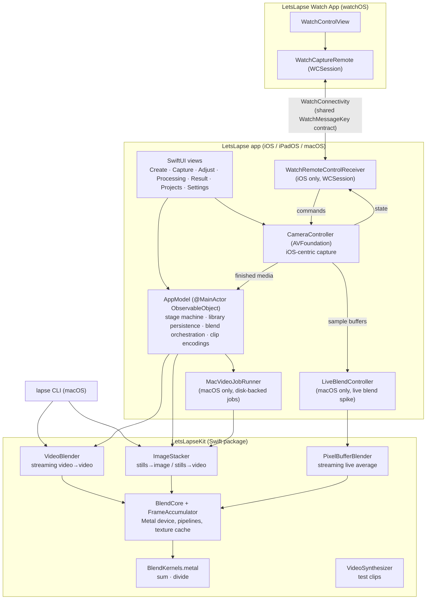
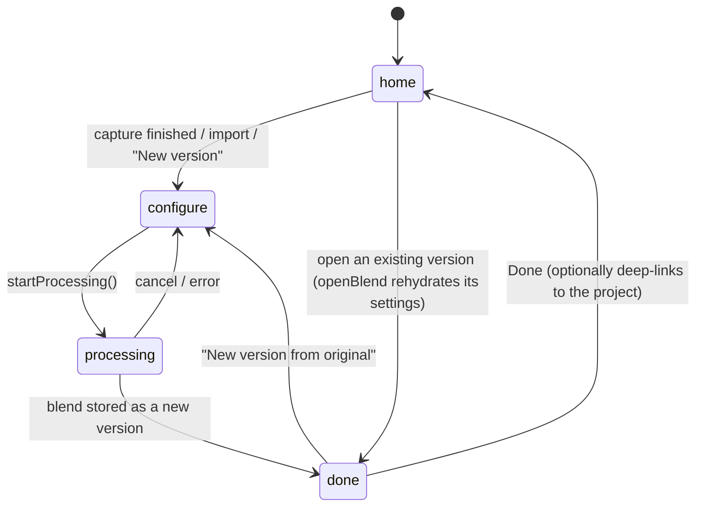
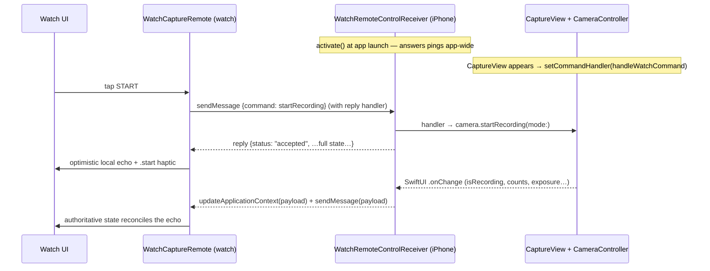

# LetsLapse — App Overview & Architecture

A handover document for developers, designers, and agents. It explains what LetsLapse is, how the iPhone app, macOS app, and Apple Watch companion work, the frame-blending techniques at the core of the product, and the architecture that ties it all together.

File references are relative to the `LetsLapse/` directory of the repository (e.g. `App/AppModel.swift`) unless noted. The Swift app lives on the `ios-app` branch; the repository's `main` branch holds the original Raspberry Pi LetsLapse project (Python capture/blend scripts and a web UI), which is preserved untouched. The Swift app is a fresh native implementation of the same blending idea with the CPU pipeline replaced by a Metal compute kernel.

---

## 1. What LetsLapse is

LetsLapse is a capture-and-blend app. It shoots video or interval photos (or imports them), then performs GPU-accelerated frame blending to produce three kinds of output:

1. **Motion-blurred timelapses** — many source frames averaged into each output frame. Hours become seconds and motion melts into streaks, because the averaging itself *is* physically plausible motion blur.
2. **Speed ramps** — the number of frames averaged per output frame changes across the clip, so playback speed (and blur) rises or falls smoothly. Combined with live "moments" captured at a high hardware frame rate, a single recording can rush past at 100× and dive into slow motion for the parts that matter.
3. **Synthetic long exposures** — N stills stacked into one low-noise image (noise falls by roughly √N), the classic "silky water / light trails" look without an ND filter.

Every original capture is preserved as a **project**; every generated output is a **version** of that project. Nothing is a dead end — any version can be regenerated from the original with different settings.

### Platforms and targets

| Piece | Target / product | Platforms | Notes |
|---|---|---|---|
| Universal app | `LetsLapse` (Xcode target) | iOS 16+, iPadOS 16+, macOS 13+ | One multiplatform target, bundle ID `com.regularsteven.letslapse` |
| Watch companion | `LetsLapse Watch App` | watchOS 9+ | Embedded in the iOS build only; requires the iPhone app (`WKRunsIndependentlyOfCompanionApp = NO`) |
| Blend engine | `LetsLapseKit` (local Swift package in `Kit/`) | iOS 16+, macOS 13+ | UI-free; the app, the CLI, and any future caller drive the same library |
| Command line | `lapse` (executable product of the Kit package) | macOS | Blend/stack/synth/info from the shell |

The Xcode project uses Xcode 16 folder-synchronized groups: target membership follows the folders `App/`, `Watch/`, and `Shared/`. `Shared/WatchMessageKey.swift` is the only file compiled into both the app and the watch target.

---

## 2. The core technique: frame blending

Everything the app makes comes from one operation: **average a window of frames, in the right color space, with a window size that can change over time.**

### 2.1 Uniform window averaging

For each output frame, the engine sums N consecutive input frames pixel-by-pixel into a float32 accumulator and divides by N. That is the entire GPU surface — three Metal compute kernels in `Kit/Sources/LetsLapseKit/Metal/BlendKernels.metal`:

- `clearAccumulator` — zero the `rgba32Float` accumulator texture.
- `accumulateFrame` — `accumulator += source` (per pixel).
- `finalizeAverage` — `destination = accumulator / frameCount`, alpha forced to 1.

Averaging N frames of a moving subject produces motion blur identical in character to a longer shutter; averaging N frames of a static subject reduces sensor noise by ~√N. One kernel, two products (blurred timelapse and long exposure), shared verbatim by iOS, iPadOS, and macOS.

### 2.2 Time compression and the "speed" vocabulary

If each output frame consumes N input frames, the clip is compressed by roughly N×. The UI calls the window size **speed**: "100×" means "100 real frames become one output frame." Precisely (see `SpeedMath` in `App/DesignSystem.swift`):

```
output seconds = input frames / speed / output fps
actual time compression = speed × (output fps / source fps)
```

At matched frame rates, speed N× is exactly N× compression. Blur strength and playback speed are the same dial — faster automatically means blurrier, which is what makes the results look natural rather than stroboscopic (the classic "skipped frames" timelapse artifact is precisely what averaging removes).

### 2.3 Ramps: variable time compression

`BlendRamp` (`Kit/Sources/LetsLapseKit/BlendRamp.swift`) describes a window that changes across the clip: `startWindow`, `endWindow`, and a `BlendCurve` easing (`linear`, `ease-in` = t², `ease-out` = t(2−t), `ease-in-out` = t²(3−2t)).

`WindowSchedule.make(totalInputFrames:ramp:)` walks the **input** timeline: at each step, the ramp evaluated at current input progress decides how many of the next input frames merge into one output frame. Key properties, all verified by tests:

- Windows are **consecutive and non-overlapping** — every input frame contributes to exactly one output frame; the schedule always sums to the input frame count.
- Progress is measured over the input timeline, so the ramp spans the whole source clip regardless of how many output frames result.
- Window size is clamped to ≥ 1; the final window may be short (clamped to remaining frames).

A ramp from 1 → 40 starts as an unblended (potentially slow-motion, if from high-fps source) sequence and accelerates into a heavily motion-blurred hyperlapse — blur growing exactly as speed does, because they are the same number.

### 2.4 Linear-light averaging

Blending averages in **linear light** by default — the physically correct simulation of a long exposure, since camera sensors count photons linearly while video/JPEG pixels are gamma-encoded. Averaging gamma-encoded values darkens and dulls highlights (a bright light streaking across a dark scene should stay bright).

Implementation is elegant: **there is no conversion code in the shaders.** The engine simply tags textures with sRGB pixel formats (`bgra8Unorm_srgb`) when `linearLight == true`, so Metal's sampling hardware decodes sRGB → linear on read and re-encodes linear → sRGB on write; the kernels do plain float math either way. With `linearLight == false`, plain `bgra8Unorm` textures are used and gamma-encoded bytes are averaged directly (a stylistic option; `--gamma` in the CLI, "True-light blending" toggle off in the app).

### 2.5 Photo stacking

Stills follow the same math with two shapes (`Kit/Sources/LetsLapseKit/ImageStacker.swift`):

- **Stack to one image** — all stills averaged into one `CGImage` (synthetic long exposure). Streams one image at a time inside an autorelease pool, so hundreds of stills never sit in memory together. EXIF orientation is baked at load (`kCGImageSourceCreateThumbnailWithTransform`), so portrait shots stack upright. Export as PNG/JPEG/HEIC.
- **Stack to a sequence** — a `WindowSchedule` over the stills produces a blended timelapse video (always H.264/.mp4). Window depth 1 gives a crisp timelapse; deeper windows add motion blur; depth ≥ photo count collapses to the single-image case (the UI presents this as one continuous "Blend depth" slider from "Crisp" to "Long exposure").

### 2.6 Why this approach — the benefits

- **Physically-motivated results.** Averaging in linear light is the actual math of exposure. Blur looks like shutter blur, not a post effect; long exposures have correct highlight behavior; noise falls predictably.
- **One tiny GPU kernel, three products.** Timelapse, speed ramp, and long exposure are one code path with different window schedules. Fixing or tuning the engine improves everything at once.
- **Blur and speed cannot disagree.** Because window size *is* the speed, users can't produce the jittery skipped-frame look; the tool's "wrong settings" still look intentional.
- **Streaming with flat memory.** Each output frame depends only on its own window, so the pipeline streams decode → accumulate → divide → encode with a small in-flight cap. Arbitrarily long clips process in constant memory; a float32 accumulator avoids 8-bit rounding drift across large windows.
- **Deterministic and testable.** The schedule is a pure function; tests assert exact pixel values through the GPU (e.g. (40+200)/2 = 120 ± 1) and that schedules always partition the input.
- **No editing timeline required.** The ramp is a simple parametric function (start, end, curve) rather than a keyframe UI — by design. It keeps the product approachable while covering the useful creative space.
- **Re-blendability.** Because originals are preserved and parameters are recorded per version, every result is reproducible and every project invites iteration.

---

## 3. System architecture

### 3.1 Layering



The engine is UI-free: frames in → blend schedule → frames out. The GUI, the CLI, and any future caller drive the same `LetsLapseKit` library.

### 3.2 Which engine path runs when

`AppModel.blendVideo(...)` (`App/AppModel.swift`) is the fork:

| Situation | Path | Character |
|---|---|---|
| iOS/iPadOS, any blend; macOS with a **ramp** | `VideoBlender` (Kit) | In-memory streaming GPU pipeline; flat memory; cancellable; output forced to H.264/.mp4 in the app |
| macOS with a **constant** window | `MacVideoJobRunner` (App) | Disk-backed, resumable job with a visible job folder, manifest, and logs (see §5.2) |
| Interval/imported photos, depth ≥ count | `ImageStacker.stack` | One long-exposure image (PNG) |
| Interval/imported photos, depth < count | `ImageStacker.stackSequence` | Blended timelapse video (H.264/.mp4) |
| Live capture sequence (ramp/marker "moments") | `blendLiveSequence` / `blendMarkerSequence` in AppModel | Per-segment/per-slice blends stitched with `AVMutableComposition` (see §4.3) |

`OutputCodec` (`Kit/Sources/LetsLapseKit/VideoBlender.swift`) supports `h264`, `hevc`, `prores` (ProRes 422), `jpeg` — `.mp4` for the first two, `.mov` for the rest. The CLI exposes all four for blends; the app currently pins blend output to H.264 and uses HEVC/ProRes in the *source conversion* feature (§4.6) instead.

### 3.3 The streaming pipeline in detail (`VideoBlender`)

1. **Reader** — `AVAssetReader` decodes the source track to `32BGRA`, Metal-compatible, zero-copy (`alwaysCopiesSampleData = false`). Optional head/tail trim becomes a reader `timeRange`. Estimated frame count = duration × nominal fps (fallback 30).
2. **First-frame peek** — a one-slot lookahead reads true buffer dimensions before configuring the writer, so odd sources can't mismatch.
3. **Writer** — `AVAssetWriter` with the codec's settings and the source's `preferredTransform` (orientation survives blending). Output timestamps use timescale 60000.
4. **Accumulate loop** — for each window in the `WindowSchedule`: wrap each decoded `CVPixelBuffer` as a Metal texture via `CVMetalTextureCache` (zero-copy), `reset → accumulate×N → finalize` on the `FrameAccumulator`, then append the averaged frame from a pixel-buffer pool. An in-flight semaphore (3) caps buffers queued on the GPU; completed-handlers retain buffers until the GPU has read them; the texture cache is flushed per output frame. Memory stays flat regardless of clip length.
5. **VFR resilience** — if the source outlives the frame-count estimate (variable frame rate), the blender keeps consuming at the final window size; a partial last window still finalizes.
6. **Progress & cancellation** — progress fires every 10 input frames (monotonic, capped at 0.99 until the writer finishes); `cancel()` sets a lock-guarded flag checked each window and throws `LapseError.cancelled`.

`BlendCore` compiles the Metal source **at runtime** from the package resource (with an embedded-string fallback), sidestepping SwiftPM-vs-Xcode `.metallib` differences — the same source works under `swift build` and Xcode.

### 3.4 Verification

`Kit/Tests/LetsLapseKitTests/` (run with `swift test` inside `Kit/`; five suites plus a synthesizer helper):

- `AccumulatorTests` — exact averaged values through the real GPU and blit readback.
- `PixelBufferBlenderTests` — the live streaming average (§5.4): byte-space and linear-light averages checked against reference transfer functions; parity with `ImageStacker.stack` within one 8-bit step; window reuse, discard, and single-frame fallback.
- `StackerTests` — ~√N noise reduction on synthetic noise; linear-light identity round-trip; size-mismatch and empty-input errors.
- `VideoBlenderTests` — frame counts for constant and ramped blends against the schedule; linear-light output values (±0.06 tolerance for H.264/BT.709-vs-sRGB); trim; monotonic progress ending at 1.0.
- `WindowScheduleTests` — schedules always sum exactly to input frames; monotonic ramp growth; clamping; curve shapes.
- `VideoSynthesizer` provides deterministic inputs: a `ramp` pattern (gray level 0.1→0.9 across the clip, for numeric checks) and a `box` pattern (white box sweeping over gray, for eyeballing motion blur). Tests skip gracefully on machines without Metal.

Not currently covered: HEVC/ProRes/JPEG output paths, `stackSequence`, the CLI, `MacVideoJobRunner`, and `LiveBlendController` (its Kit blender is tested; the frame-selection/watchdog/logging layer is not).

---

## 4. The iPhone app

### 4.1 Navigation shell

`App/LetsLapseApp.swift` builds a three-tab `TabView` (enum `LLTab`) with a custom floating tab bar, plus a full-screen **flow overlay** for the creation pipeline:

- **Create** — effect-first home; entry to capture and import.
- **Projects** — originals grouped with their generated versions.
- **Settings** — creative defaults, storage, advanced/diagnostics.

The linear flow is a state machine on `AppModel.Stage`:



Whenever `stage != .home`, `FlowView` overlays the tabs with `AdjustView` (configure), `ProcessingView`, or `ResultView`; the floating tab bar hides. iOS suppresses the system tab bar in favor of the floating pill; on macOS the native tab chrome is kept. A cross-tab deep-link (`requestedProjectDetailID`) lets Result and Settings jump straight to a project's detail page.

### 4.2 Create: effect-first

`App/CreateView.swift` presents four effect cards before any mechanics — each pre-seeds blend settings and a capture intent:

| Effect | Pitch | Seeds |
|---|---|---|
| Smooth timelapse | "Hours become seconds, motion melts into streaks" | constant speed ≥ 50× |
| Long exposure | "Interval photos into a timelapse, or one long exposure" | interval capture, linear light on |
| Speed ramp | "Speed rises or falls across the clip" | live "moments" capture (ramp mode) |
| Custom blend | "Every dial, no presets" | nothing forced |

Below the cards: **Record now**, **Import a video**, **Import photos to stack** (up to 500, minimum 2). iOS imports use `PhotosPicker` (movies copied to a temp file via a `Transferable` so the engine reads without holding photo-library scope); capture presents as a full-screen cover.

### 4.3 Capture

`App/CameraController.swift` (~1,400 lines) owns a single `AVCaptureSession` driven on a serial queue; `App/CaptureView.swift` is the full-screen dark UI. Highlights:

- **Formats.** Available resolutions (4K/1080p/720p…) and frame rates are discovered from the device's real formats, filtered to preferred rates `[24, 25, 30, 50, 60, 100, 120, 240]` plus each range's maximum — genuine high-frame-rate capture up to 240 fps where hardware allows. Stabilization filters the format list when enabled.
- **ProRes awareness.** ProRes-capable formats (detected by FourCC: `apcn/apch/apcs/apco/ap4h/ap4x`) appear as separate entries marked `*` with the footer "* ProRes — very large files", so users understand the trade before shooting. Recording itself uses `AVCaptureMovieFileOutput` with system codec defaults; ProRes arises when the active format is a ProRes format.
- **Exposure/ISO lock.** "Lock AE/AF" captures the current ISO/shutter/focus as a manual custom exposure (iOS), unlocking sliders for ISO (within the format's real range) and focus. Critically, the lock is **re-asserted after every format switch** (`reassertExposureLock`) because setting `activeFormat` resets exposure to auto — this keeps multi-format "moments" captures flicker-free. White balance locks alongside.
- **Orientation.** Deliberately avoids `AVCaptureDeviceRotationCoordinator` and device motion. The window's `interfaceOrientation` is the single source of truth: the preview layer's rotation is applied in the SwiftUI representable's `updateUIView`, and output connections are oriented **at capture start** rather than continuously — reconfiguring a live session mid-rotation stalled the source. A manual "Flip 180°" toggle supports upside-down mounts (rotates chrome and feed together).
- **Two capture modes.**
  - **Video** records *live capture sequences* with two "moments" behaviors (`LiveCaptureSequence.Mode`):
    - **Marker mode** — one continuous recording; tapping the moment button (phone or watch) marks intervals. At blend time the marked slices are extracted and kept at real speed (window 1) while everything else gets the user's speed; the pieces are stitched with `AVMutableComposition`.
    - **Ramp mode** — the moment button toggles a hardware **frame-rate burst** (base rate → e.g. 120/240 fps), recording separate segments per rate (`segment-%03d.mov` + a `sequence.json` sidecar describing segments, markers, and ramp intervals). At blend time, high-rate segments play every frame — a 240 fps burst rendered at 25 fps is ~9.6× slow motion — while base-rate segments get the timelapse blend, then all are stitched. One recording session yields a hyperlapse that dives into slow motion on demand.
  - **Interval** captures JPEG stills (`frame-%05d.jpg`) on a dispatch timer (0.5 s–10 s presets, floor 0.5 s), feeding the photo-stacking paths.
  - A third `CaptureMode` case, **Live Blend**, exists in the shared enum so switches stay exhaustive, but it is surfaced only on macOS (§5.4).
- **Capture UI.** Persistent aspect-fit preview; speed chips with live output-length estimates per speed; a segment strip visualizing burst spans during recording; a target sheet (auto-stop with countdown ring); zoom as discrete lens chips (.5×/1×/3× where hardware exists); grid overlay; format pill (locked while recording); idle timer disabled during capture. Last-used lens/resolution/rate/burst-rate/stabilization persist via `RecordingSettingsStore` (opt-out in Settings).

Finished media hands off to `AppModel.setSource(...)` / `setSequenceSource(...)`, which registers a project on disk and enters the flow at `configure`.

### 4.4 Adjust ("New version")

`App/AdjustView.swift` is where the human vocabulary meets engine parameters:

| UI concept | Engine parameter |
|---|---|
| **Speed** chips 10×/25×/50×/100× (+ custom 1–240×), with character words *gentle → trails* | `BlendRamp.constant(window)` — the window size |
| **Speed ramp** (Advanced): start ×, end ×, curve | `BlendRamp(startWindow:endWindow:curve:)` |
| **Your clip will be** estimate card + before/after bar | `SpeedMath.outputSeconds` (single source of truth for length math) |
| Output frame rate menu (24/25/30/50/60) | `outputFPS` |
| **True-light blending** toggle | `linearLight` |
| **Trim video ends** (0.1–30 s from both ends) | reader `timeRange` trim (removes grab-and-stop shake) |
| **Blend depth** slider for photos (Crisp ↔ Long exposure) | window over stills; depth ≥ count → single image |
| **Blend from** codec chips (Auto/ProRes/HEVC/H.264) | which stored source encoding feeds the blend (§4.6) |

The estimate card explains the technique in one sentence ("Each output frame averages N real frames — that's where the blur comes from") and the CTA is outcome-named: "Create 12s clip" / "Create long exposure". Advanced options live behind a sheet so the default path stays simple — the design principle is *outcome first, mechanics on request*.

### 4.5 Processing and Result

- `App/ProcessingView.swift` — circular progress ring over a blurred source thumbnail, a four-stage checklist (Preparing / Blending — with a live *processed/total* frame counter — / Encoding / Saving; stages are derived from progress thresholds), an ETA, and Cancel ("Cancelling discards this version. Your original is safe."). Blend work runs in a single cancellable `Task`; Kit progress callbacks hop to the main actor.
- `App/ResultView.swift` — inline `AVPlayer` (or still image), a green "Saved as **vN** in *project*" banner with "View project", Save to Photos, `ShareLink`, and next steps: "New version from original" (with a suggested alternate speed) and "Compare with original". Results are written to temp, then copied into the project's `blends/` folder and recorded in the manifest before the user ever sees them.

### 4.6 Projects, versions, and per-clip encodings

`App/ProjectsView.swift` lists one card per original — thumbnail, format line, a horizontal strip of version thumbnails (tap to open, "+" for a new version), swipe-to-delete. `App/ProjectDetailView.swift` is the management layer:

- Hero player for the original; a **Source Clips** section when a capture has multiple clips (ramp-mode segments), each individually playable and saveable.
- **Versions** list — "v3 · 100× · 8s", open, delete, and **"New version from these settings"** (rehydrates that version's parameters into Adjust).
- Rename, storage totals, delete project.
- **Per-clip encoding management.** ProRes originals are wonderful capture masters and terrible distribution files, so each source clip can hold multiple codec variants (`ClipEncoding` in `App/AppModel.swift`, persisted per clip in the manifest):
  - A **Manage** sheet per ProRes clip lists existing formats with sizes, offers **Convert to H.264 / Convert to HEVC** (HEVC is encoded 10-bit Main10; bitrate heuristics ≈ 0.24 bits/pixel/s for H.264, 0.18 for HEVC; audio passthrough), per-format Save to Photos, and deletion — deleting the ProRes original asks for confirmation, and the last remaining encoding can never be deleted.
  - A project-level **"Convert ProRes → H.264, delete originals"** action reclaims storage in one tap.
  - The **"Blend from"** chooser in Adjust (§4.4) appears only when a real choice exists; "Auto" prefers quality (`ProRes → HEVC → H.264`). A converted clip survives deletion of its ProRes master.

### 4.7 Settings

`App/SettingsView.swift`: creative defaults (default speed, output fps, true-light), "Remember recording settings", a storage card with a segmented bar (Originals / Versions / Cache) plus **Review large originals** (sorted list, deep-links into project detail) and **Clear cache**; Advanced holds **Performance** (CPU worker budget, concurrent blend batches — used by the macOS job runner) and **Diagnostics** (latest job folder path and processing log). Debug/technical detail is deliberately quarantined here, away from the creative path.

### 4.8 Persistence

Everything lives in Application Support, JSON-manifested, human-inspectable:

```
Application Support/LetsLapse/
└── Projects/
    ├── library.json                 # LibraryManifest: [CaptureProject] + [BlendProject]
    └── <captureUUID>/
        ├── source/                  # the preserved original
        │   ├── original.mov         #   imported/recorded video, or
        │   ├── frame-00001.jpg …    #   interval stills, or
        │   ├── segment-000.mov …    #   live-sequence segments
        │   ├── sequence.json        #   live-sequence metadata (modes, segments, markers)
        │   └── clip-h264.mp4 …      #   additional ClipEncoding variants after conversion
        └── blends/
            └── <blendUUID>.mp4|.png # one file per version
```

Key model types (all `Codable`, in `App/AppModel.swift` unless noted):

- `CaptureProject` — id, kind (video/photos), created date, original name, mode string, source file names, fps/duration/dimensions, optional custom name, and `clipEncodings: [String: [ClipEncoding]]?`.
- `BlendProject` — id, `captureID` (the link back to its original), kind, output file name, and the **full recipe**: speed/ramp/curve, output fps, linear light, trim, source codec, plus result stats (frames in/out, dimensions). This is what makes every version reproducible and re-editable.
- `LiveCaptureSequence` (`App/LiveCaptureSequence.swift`) — mode (ramp/marker), locked resolution, base and burst frame rates, segments with per-segment frame rate and time range, markers, ramp intervals.

Preferences use `UserDefaults` under `letslapse.*` keys (defaults, performance knobs) and `letslapse.capture.*` (remembered recording settings). Deletion is guarded (can't delete the project that's mid-blend; blend files are path-validated to live inside their project before removal), and cache cleanup recognizes temp prefixes (`live-capture`, `picked-`, `import-`, …).

---

## 5. The macOS app

The Mac app is the **same target and the same screens** — Create/Projects/Settings, the same flow overlay, the same engine — with platform-appropriate differences rather than a separate codebase:

- **Import-first.** Imports use `.fileImporter` and **drag-and-drop onto the Create screen**; capture exists but is reduced (single default camera, coarse exposure lock, fixed landscape orientation, no lens/stabilization chrome) — though it is also where the experimental **Live Blend** mode lives (§5.4). A Settings card surfaces camera authorization with a deep link to System Settings' privacy pane.
- **Window & chrome.** Default window 760×680; native tab styling instead of the floating pill; capture presents as a sheet instead of a full-screen cover.
- **No Watch layer.** `WatchRemoteControlReceiver` is compiled out (`#if os(iOS)`), and the Watch app embeds only into iOS builds.

### 5.2 MacVideoJobRunner: the disk-backed pipeline

For constant-window video blends, macOS routes through `App/MacVideoJobRunner.swift` instead of the streaming engine — a deliberately different set of trade-offs for desktop-scale footage:

- Creates a visible job folder next to the source: `<name>.letslapse/` containing `manifest.json`, `logs/job.log`, `frames/extracted…/`, `passes/blend-NNN-to-001…/`, and `output/`.
- Stages are checkpointed in the manifest (`created → extracting → extracted → blending → encoding → completed`). Every source frame is extracted to PNG; windows of N PNGs are averaged via `ImageStacker`; blended PNGs are encoded to H.264/.mp4 at 12 Mbps with the source's orientation transform.
- **Resumable**: a re-run reuses extracted frames and skips any window whose output already exists — an interrupted hour-long job continues instead of restarting.
- **Parallel**: extraction is pipelined with blending; blend batches run concurrently (each with its own `BlendCore`), throttled by the user's Settings → Performance knobs (CPU worker budget, concurrent blend batches).
- **Observable**: progress messages, the job folder path, and rolling log lines feed Settings → Diagnostics. Sources are accessed through security-scoped bookmarks (App Sandbox).

Ramped blends on macOS use the same streaming `VideoBlender` as iOS. The runner is the "big footage on a Mac" path: more disk in exchange for resumability and inspectability.

### 5.3 The `lapse` CLI

For automation and engine development (also the reference for how thin a LetsLapseKit caller can be):

```sh
cd LetsLapse/Kit
swift build -c release

.build/release/lapse synth -o test.mov --frames 240 --fps 60 --pattern box
.build/release/lapse blend test.mov -o ramped.mp4 --ramp 1:40 --curve ease-in-out
.build/release/lapse blend test.mov -o timelapse.mp4 --window 20 --codec prores
.build/release/lapse stack shots/*.jpg -o stacked.png
.build/release/lapse info test.mov
```

`blend` takes `--window` or `--ramp A:B` (mutually exclusive), `--curve`, `--fps`, `--codec h264|hevc|prores|jpeg`, `--gamma`; `stack` takes `--format png|jpeg|heic` and `--gamma`; progress prints to stderr.

### 5.4 Live Blend capture (experimental spike)

A macOS-only experiment (July 2026) that moves blending to **capture time**: instead of recording video and averaging afterwards, frames tapped from the webcam stream are averaged into one JPEG per interval while the capture runs — a long-exposure timelapse assembling itself live. Same math as everything else in §2 (equal-weight linear-light average), applied to a live buffer stream.

- **Pipeline.** `CameraController.startLiveBlend(every:framesPerBlend:)` lazily attaches an `AVCaptureVideoDataOutput` (BGRA, Metal-compatible) to the existing session and points its sample-buffer delegate at a per-run `App/LiveBlendController.swift`. The controller selects frames on an evenly spaced grid across each interval window (e.g. 5 frames spread over 2 s), streams them into a `PixelBufferBlender`, and writes `frame-%05d.jpg` to a temp directory. A finished run hands its JPEGs over exactly like interval capture does — into `AppModel.setSource(.photos)` and the photo-stacking flow (§2.5), so live-blended frames can themselves be stacked or sequenced.
- **`PixelBufferBlender`** (`Kit/Sources/LetsLapseKit/PixelBufferBlender.swift`) is the reusable Kit piece: an equal-weight streaming average of live `CVPixelBuffer`s into one `CGImage`, built on the same `BlendCore`/`FrameAccumulator` as offline blending. Tests pin its output to within one 8-bit step of `ImageStacker.stack` on identical input. One instance serves a whole session: `finalizeImage()` closes a window and the next `accumulate` opens a fresh one; an in-flight semaphore caps how many camera buffers wait on the GPU.
- **Resilience.** Two serial queues (frame selection vs blend/write) with a backpressure cap, so a slow writer drops frames rather than queuing unboundedly; a watchdog keeps interval windows ticking when the camera goes quiet (unplugged/covered); a single-frame window still produces a fallback output; three consecutive processing failures stop the run; mid-run teardown (window closed) discards cleanly via a generation counter that invalidates queued work.
- **Instrumentation.** The capture screen shows a live diagnostics readout — frames selected, last blend ms, actual output spacing, and a health status (healthy / reduced frame count / camera rate limited / processing behind / thermal pressure / capture failed). Every run also writes a JSON experiment log to `Application Support/LetsLapse/Logs/liveblend-<timestamp>.json`: a machine/camera/format header, one entry per output (timings, frame spacing, drop counts, memory footprint, thermal state), and a summary — rewritten atomically after every output so a crash loses nothing.
- **UI.** A LIVE BLEND mode button beside VIDEO/INTERVAL (macOS only), interval presets 0.5–10 s, and frames-per-blend presets 3 (Light) / 5 (Standard) / 10 (High) / 20 (Experimental). Settings are deliberately un-persisted while the feature is a spike.

---

## 6. The Apple Watch companion

### 6.1 What it is and why

A deliberately narrow remote for the iPhone capture screen: **start/stop recording, trigger a "moment", and control exposure — without touching (and shaking) the phone.** The phone is always the camera and the brain; the watch is a thin remote/display with giant no-look controls. There are no complications and no independent watch features — the watch app requires the companion iPhone app.

### 6.2 Integration architecture

Three pieces, one shared contract:

- **Shared** — `Shared/WatchMessageKey.swift`, the only file compiled into both targets: string keys for every field in the message dictionaries.
- **Watch side** — `Watch/WatchCaptureRemote.swift` (`WCSessionDelegate`): sends commands, receives state, and keeps a published mirror of phone state for `Watch/WatchControlView.swift`.
- **iPhone side** — `App/WatchRemoteControlReceiver.swift` (singleton, iOS-only): receives commands and forwards them to whatever handler is registered; publishes state back.



Protocol details worth knowing:

- **Commands (watch → phone)**: `state` (ping), `startRecording`, `stopRecording`, `triggerMoment`, `lockExposure`, `unlockExposure`, `setISO` (value), `setLensPosition` (value; no watch UI uses it yet). Replies carry a status: `accepted`, `ok`, `unavailable` (+ "Capture screen is not active"), or `error`.
- **State (phone → watch)** rides **both channels at once**: `updateApplicationContext` (durable latest-state, survives backgrounding/relaunch) plus a fire-and-forget `sendMessage` when reachable (low latency). Both funnel into the same apply path on the watch. Payloads carry recording state and start time, sequence mode, marker/burst/segment counts, format line, capture fps, planned speed, output fps, and the full exposure-lock state including the real ISO range.
- **Push triggers are state-changes, not timers** — a cluster of SwiftUI `.onChange` observers in `CaptureView`, deduped by change-detection guards in the receiver. The watch runs its own 1 Hz clock for elapsed time from `recordingStartedAt`, so no periodic traffic is needed.
- **The availability gate is `commandHandler != nil`.** The receiver activates at app launch and always answers, but only `CaptureView` registers a handler (cleared on disappear). Off the capture screen, commands return `unavailable` and the payload's `cameraActive` goes false — which is exactly what the watch UI keys off.

### 6.3 The watch experience

`WatchControlView` switches between three screens:

- **Ready** (reachable + camera open): green status, format + planned speed line, a 92 pt red START button, and a one-tap exposure lock showing ISO · shutter when locked.
- **Recording**: REC + elapsed time, an amber live estimate ("@100× → 8s" — clip length computed on-watch from elapsed × capture fps ÷ speed ÷ output fps), the exposure lock, and a mode-dependent second button — **burst toggle** (base fps vs "⚡ burst") in ramp mode, **Marker / End marker** in marker mode. Amber dots show captured moments (the active one pulses). **Digital Crown adjusts ISO** (in steps of 50 within the phone-reported range) while exposure is locked. STOP below.
- **Unreachable / camera closed**: "Open the camera on iPhone" with a Ping iPhone button.

Feedback is haptic-first (`.start` / `.stop` / `.click` on accepted commands) with **optimistic local echo**: the watch flips to Recording immediately on `accepted` and reconciles when the authoritative state arrives — the remote feels instant even over WatchConnectivity latency. Edge cases degrade gracefully: unreachable sends short-circuit into a status line; application context replays the last known state after relaunch; the phone re-activates its session on watch-swap; both sides zero sequence counters when idle.

---

## 7. Design language

Defined centrally in `App/DesignSystem.swift` (`enum LL`, `SpeedMath`, shared components):

- **Palette.** Accent burnt orange `rgb(195, 106, 0)` (primary actions, tint), deep accent `rgb(138, 74, 0)`, **amber** `rgb(255, 179, 64)` for highlights — selected values, progress, version badges, and everything "moment"-related on both phone and watch. `ink` `rgb(28, 28, 30)` for dark stat cards. Surfaces track system grouped-background colors so light/dark both work; hairlines are `primary @ 8%`.
- **Typography.** System font only. 34 pt bold screen titles; ~16 pt rows and buttons; 13 pt semibold uppercase section headers (kerned 0.5); ~12 pt secondary captions; monospaced digits for counts, times, and sizes.
- **Components.** `LLPrimaryButtonStyle` (accent fill, 50 pt min height, radius 14), `LLSecondaryButtonStyle` (card fill, tinted label), `.llCard()` (radius 16–18, soft shadow), `LLRow` (settings-style rows), `MediaBadge` (translucent capsule over imagery), `FloatingTabBar` (material pill; re-tap pops to root), `FlowHeader`/`FlowChromeButton` for the overlay flow, shared async thumbnails and a media preview sheet.
- **Vocabulary system.** The app never says "blend window" in the primary path. **Speed** (N×) with character words (*gentle, subtle, smooth, flowing, streaks, trails*), **True-light blending** (linear light), **Blend depth** (photo window), **Moments** (markers/bursts), **versions** (outputs), **projects** (originals + versions). All length math and speed language route through `SpeedMath` so every screen agrees. Technical detail is progressively disclosed: Advanced sheet → Settings → Diagnostics.
- **Capture & watch are dark-first**, chrome kept away from the image; the watch uses red/green/amber state colors and oversized controls for no-look use.

The design history is documented in the repo-root `docs/letslapse-ios-ux-brief.md` (the brief that led to the current effect-first, three-tab design).

---

## 8. Developer quickstart

**App:** open `LetsLapse/LetsLapse.xcodeproj`. Two targets: `LetsLapse` (iPhone/iPad/Mac) and `LetsLapse Watch App` (embedded into iOS builds automatically). Select your development team under Signing & Capabilities — no team is checked in.

**Engine:** `cd LetsLapse/Kit && swift build -c release` for the CLI, `swift test` for the suite (GPU tests skip without Metal). No external dependencies anywhere.

**Screenshot / demo hooks** (DEBUG builds read environment variables, handy for simulators and UI review):

| Variable | Effect |
|---|---|
| `LL_TAB` = `create` \| `projects` \| `settings` | select a tab at launch |
| `LL_OPEN` = `latest` | open the newest capture in Adjust |
| `LL_SEED` = *path* | load a video file as the active source |
| `LL_DETAIL` = `latest` | open the newest project's detail page |
| `LL_PUSH` = *SettingsDestination* | push a Settings sub-screen |
| `LL_SPEED` = *N* | force constant speed N× |
| `LL_AUTO` = `process` | auto-start processing 1.5 s after configure |
| `LL_CAPTURE` = `1` | auto-open the capture screen |

**Where to start reading, by task:**

| Task | Files |
|---|---|
| Blend math / engine | `Kit/Sources/LetsLapseKit/BlendRamp.swift`, `FrameAccumulator.swift`, `VideoBlender.swift`, `Metal/BlendKernels.metal` |
| App state, persistence, jobs | `App/AppModel.swift` (single ~2,100-line source of truth) |
| Camera behavior | `App/CameraController.swift`, `App/CaptureView.swift`, `App/LiveCaptureSequence.swift` |
| UI / design changes | `App/DesignSystem.swift`, then the relevant view file |
| Watch protocol | `Shared/WatchMessageKey.swift`, `Watch/WatchCaptureRemote.swift`, `App/WatchRemoteControlReceiver.swift` |
| macOS batch pipeline | `App/MacVideoJobRunner.swift` |
| Live Blend (macOS spike) | `App/LiveBlendController.swift`, `Kit/Sources/LetsLapseKit/PixelBufferBlender.swift` |

---

## 9. Current limits and sharp edges

Honest notes for whoever picks this up:

- **Audio is dropped by design** — time compression makes it meaningless; capture adds no audio input and blends write video-only.
- **App blend output is pinned to H.264**; HEVC/ProRes output exists in the engine and CLI but isn't user-selectable at blend time in the app (per-clip *source* conversion is where HEVC/ProRes live today). Blend-quality controls are a known pending stage of the clip-encodings feature.
- **VFR sources** are estimated from nominal fps; the blender adapts if the estimate is off, but the schedule (and therefore the exact ramp shape) is built from the estimate.
- **HDR input** is tone-mapped to 8-bit SDR by the decoder before blending.
- **Rotation** is driven from the window's interface orientation by design (see §4.3); it is functional but still being refined on edge cases (recent commits note "not perfect").
- **ProRes format matching**: the format matcher filters on dimensions/fps/stabilization but does not re-check the ProRes flag, so selecting a ProRes entry can, in principle, land on a same-dimension non-ProRes format if one also matches.
- **`WatchRecordingState` is defined twice** (once per side of the WatchConnectivity bridge, since only the key names are shared) — the two enums must be kept in sync manually.
- **No thermal/battery throttling** anywhere; the only performance knobs are the macOS job runner's worker/batch budgets. (Live Blend *reports* thermal state in its diagnostics and experiment log but doesn't throttle either.)
- **Processing checklist stages are cosmetic** — derived from progress thresholds, not real pipeline phases.
- **Interval capture silently discards** sessions with fewer than 2 photos.
- **Live Blend is a macOS-only experimental spike** (§5.4) — JPEG output only, settings un-persisted, and the on-screen diagnostics readout is expected to disappear if the feature graduates. Whether it comes to iOS (and at what battery cost) is an open question.
- **Test gaps**: HEVC/ProRes/JPEG output paths, `ImageStacker.stackSequence`, the CLI, `MacVideoJobRunner`, and `LiveBlendController` are untested.
- The whole app is a strong proof-of-concept moving toward production: no onboarding, no iCloud/sync, no keyframe editing (deliberate), and store-readiness items (privacy strings, App Store assets) are not addressed in this document.
