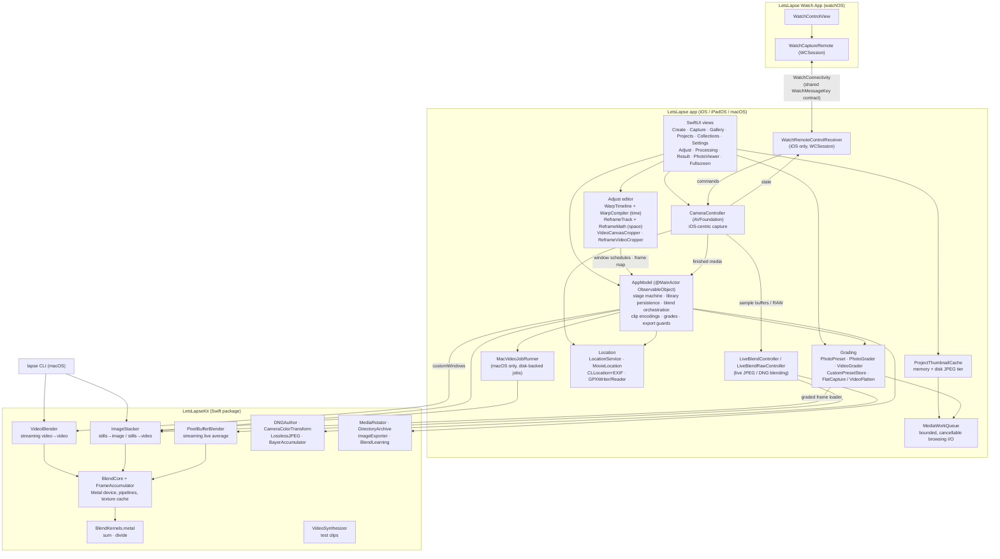
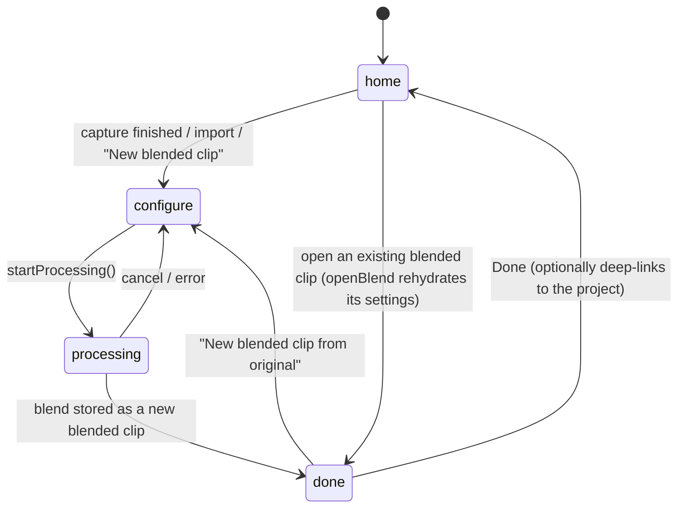
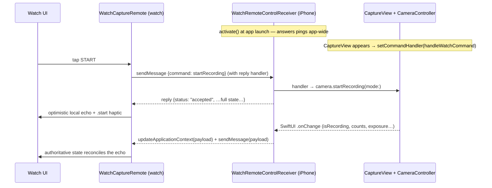

# LetsLapse — App Overview & Architecture

A handover document for developers, designers, and agents. It explains what LetsLapse is, how the iPhone app, macOS app, and Apple Watch companion work, the frame-blending techniques at the core of the product, and the architecture that ties it all together.

File references are relative to the `LetsLapse/` directory of the repository (e.g. `App/AppModel.swift`) unless noted. The Swift app lives on the `ios-app` branch; the repository's `main` branch holds the original Raspberry Pi LetsLapse project (Python capture/blend scripts and a web UI), which is preserved untouched. The Swift app is a fresh native implementation of the same blending idea with the CPU pipeline replaced by a Metal compute kernel.

Every screen in the app is mirrored by an SVG design spec under `docs/design/<platform>/`. Those specs are the contract for UI work — see `docs/design/README.md` and the per-platform `INDEX.md` before changing layout, copy, colours or controls. Where this document and an `INDEX.md` row disagree, the `INDEX.md` is the more current of the two.

`docs/overview-audit-2026-08-10.md` is the standing audit of this document against the code: what it covers, what it doesn't, and — in Part C — the known UX problems of Punch-in reframe (§4.4a) with a triage table and the use-cases the feature is meant to serve. Read it alongside §4.4 before touching the Adjust screen.

---

## 1. What LetsLapse is

LetsLapse is a capture-and-blend app. It shoots video, interval photos, or single photos (or imports them), then performs GPU-accelerated frame blending to produce three kinds of output:

1. **Motion-blurred timelapses** — many source frames averaged into each output frame. Hours become seconds and motion melts into streaks, because the averaging itself *is* physically plausible motion blur.
2. **Speed ramps** — the number of frames averaged per output frame changes across the clip, so playback speed (and blur) rises or falls smoothly. Combined with live "moments" captured at a high hardware frame rate, a single recording can rush past at 100× and dive into slow motion for the parts that matter.
3. **Synthetic long exposures** — N stills stacked into one low-noise image (noise falls by roughly √N), the classic "silky water / light trails" look without an ND filter.

Every original capture is preserved as a **project**; every generated output is a **blended clip** of that project (internally `BlendProject`; the UI called these "versions" until 2026-08). Nothing is a dead end — any blended clip can be regenerated from the original with different settings. Colour grades and geotags ride along as *metadata* on the project, so neither ever rewrites a captured file.

### Platforms and targets

| Piece | Target / product | Platforms | Notes |
|---|---|---|---|
| Universal app | `LetsLapse` (Xcode target) | iOS 16+, iPadOS 16+, macOS 13+ | One multiplatform target, bundle ID `com.regularsteven.letslapse` |
| Watch companion | `LetsLapse Watch App` | watchOS 9+ | Embedded in the iOS build only; requires the iPhone app (`WKRunsIndependentlyOfCompanionApp = NO`) |
| Blend engine | `LetsLapseKit` (local Swift package in `Kit/`) | iOS 16+, macOS 13+ | UI-free; the app, the CLI, and any future caller drive the same library |
| Command line | `lapse` (executable product of the Kit package) | macOS | Blend/stack/synth/info from the shell |

The Xcode project uses Xcode 16 folder-synchronized groups: target membership follows the folders `App/`, `Watch/`, and `Shared/`. The `Shared/` folder is compiled into both the app and the watch target:

- `WatchMessageKey.swift` — the WatchConnectivity wire contract (string keys only).
- `CaptureMode.swift` — the three capture modes, scheduled-stop units, and Interval output formats.
- `BlendDepth.swift` — the blend-depth dial vocabulary, including the adaptive depths.
- `SteadinessMonitor.swift` — the device-motion primitive behind Photo mode's capture-when-steady gate and Interval's tail-frame detection. `CMMotionManager` only exists on iOS/watchOS, so the motion internals are compiled out on macOS and the monitor degrades to an inert stand-in that never blocks.

---

## 2. The core technique: frame blending

Everything the app makes comes from one operation: **average a window of frames, in the right color space, with a window size that can change over time.**

### 2.1 Uniform window averaging

For each output frame, the engine sums N consecutive input frames pixel-by-pixel into a float32 accumulator and divides by N. That is the entire GPU surface — three Metal compute kernels in `Kit/Sources/LetsLapseKit/Metal/BlendKernels.metal`:

- `clearAccumulator` — zero the `rgba32Float` accumulator texture.
- `accumulateFrame` — `accumulator += source` (per pixel).
- `finalizeAverage` — `destination = accumulator / frameCount`, alpha forced to 1.

Averaging N frames of a moving subject produces motion blur identical in character to a longer shutter; averaging N frames of a static subject reduces sensor noise by ~√N. One kernel, two products (blurred timelapse and long exposure), shared verbatim by iOS, iPadOS, and macOS.

### 2.2 Time compression and the "speed" vocabulary

If each output frame consumes N input frames, the clip is compressed by roughly N×. The UI calls the window size **speed**: "100×" means "100 real frames become one output frame." Precisely (see `SpeedMath` in `App/DesignSystem.swift`):

```
output seconds = input frames / speed / output fps
actual time compression = speed × (output fps / source fps)
```

At matched frame rates, speed N× is exactly N× compression. Blur strength and playback speed are the same dial — faster automatically means blurrier, which is what makes the results look natural rather than stroboscopic (the classic "skipped frames" timelapse artifact is precisely what averaging removes).

### 2.3 Ramps: variable time compression

`BlendRamp` (`Kit/Sources/LetsLapseKit/BlendRamp.swift`) describes a window that changes across the clip: `startWindow`, `endWindow`, and a `BlendCurve` easing (`linear`, `ease-in` = t², `ease-out` = t(2−t), `ease-in-out` = t²(3−2t)).

`WindowSchedule.make(totalInputFrames:ramp:)` walks the **input** timeline: at each step, the ramp evaluated at current input progress decides how many of the next input frames merge into one output frame. Key properties, all verified by tests:

- Windows are **consecutive and non-overlapping** — every input frame contributes to exactly one output frame; the schedule always sums to the input frame count.
- Progress is measured over the input timeline, so the ramp spans the whole source clip regardless of how many output frames result.
- Window size is clamped to ≥ 1; the final window may be short (clamped to remaining frames).

A ramp from 1 → 40 starts as an unblended (potentially slow-motion, if from high-fps source) sequence and accelerates into a heavily motion-blurred hyperlapse — blur growing exactly as speed does, because they are the same number.

This is the *blend* ramp, and it is a separate mechanism from the **burst slow-motion ramp** (§4.4b), which retimes an already-slow-motion burst clip inside the stitch rather than changing how many frames get averaged.

### 2.4 Linear-light averaging

Blending averages in **linear light** by default — the physically correct simulation of a long exposure, since camera sensors count photons linearly while video/JPEG pixels are gamma-encoded. Averaging gamma-encoded values darkens and dulls highlights (a bright light streaking across a dark scene should stay bright).

Implementation is elegant: **there is no conversion code in the shaders.** The engine simply tags textures with sRGB pixel formats (`bgra8Unorm_srgb`) when `linearLight == true`, so Metal's sampling hardware decodes sRGB → linear on read and re-encodes linear → sRGB on write; the kernels do plain float math either way. With `linearLight == false`, plain `bgra8Unorm` textures are used and gamma-encoded bytes are averaged directly (a stylistic option; `--gamma` in the CLI, "True-light blending" toggle off in the app).

### 2.5 Photo stacking

Stills follow the same math with two shapes (`Kit/Sources/LetsLapseKit/ImageStacker.swift`):

- **Stack to one image** — all stills averaged into one `CGImage` (synthetic long exposure). Streams one image at a time inside an autorelease pool, so hundreds of stills never sit in memory together. EXIF orientation is baked at load (`kCGImageSourceCreateThumbnailWithTransform`), so portrait shots stack upright. Export as PNG/JPEG/HEIC. Derived images keep their provenance: `ImageExporter.carryoverMetadata` lifts the source frame's EXIF/GPS/TIFF blocks (minus orientation, already baked into the pixels) into the output, so a stacked shot keeps its capture time and geotag.
- **Stack to a sequence** — a `WindowSchedule` over the stills produces a blended timelapse video (always H.264/.mp4). Window depth 1 gives a crisp timelapse; deeper windows add motion blur; depth ≥ photo count collapses to the single-image case (the UI presents this as one continuous "Blend depth" slider from "Crisp" to "Long exposure").

Both shapes accept an injected `loadFrame` closure, which is how the colour grade reaches the engine: `AppModel.gradedFrameLoader(_:)` hands `ImageStacker` a loader that runs each still through `PhotoGrader.renderForBlend` on its way into the accumulator (§4.5). An identity grade passes nil and the plain loader runs, so an ungraded blend costs exactly what it always did.

### 2.6 Why this approach — the benefits

- **Physically-motivated results.** Averaging in linear light is the actual math of exposure. Blur looks like shutter blur, not a post effect; long exposures have correct highlight behavior; noise falls predictably.
- **One tiny GPU kernel, three products.** Timelapse, speed ramp, and long exposure are one code path with different window schedules. Fixing or tuning the engine improves everything at once.
- **Blur and speed cannot disagree.** Because window size *is* the speed, users can't produce the jittery skipped-frame look; the tool's "wrong settings" still look intentional.
- **Streaming with flat memory.** Each output frame depends only on its own window, so the pipeline streams decode → accumulate → divide → encode with a small in-flight cap. Arbitrarily long clips process in constant memory; a float32 accumulator avoids 8-bit rounding drift across large windows.
- **Deterministic and testable.** The schedule is a pure function; tests assert exact pixel values through the GPU (e.g. (40+200)/2 = 120 ± 1) and that schedules always partition the input.
- **The timeline is the vocabulary, not a keyframe editor bolted on.** The original design deliberately had no timeline at all — one parametric ramp (start, end, curve). That held until shoots with recorded structure arrived, and since 2026-08 video editing goes through the **warp timeline** (§4.4): stretches with speeds in ×-real-time, seams that own the ramps, and an optional spatial **reframe** track beside them. Both compile down to the same window schedule, so the engine gained nothing to maintain, and the parametric ramp survives as the legacy path. Every stretch is still one number, and the invariant — a monotonic warp, never a trim — is what keeps it approachable.
- **Re-blendability.** Because originals are preserved and parameters are recorded per blended clip, every result is reproducible and every project invites iteration.

---

## 3. System architecture

### 3.1 Layering



The engine is UI-free: frames in → blend schedule → frames out. The GUI, the CLI, and any future caller drive the same `LetsLapseKit` library. Grading, geotagging, thumbnails and the work queue all live in the app layer — they are product concerns, not engine concerns, and the one place they reach into the Kit is the injected frame loader.

### 3.2 Which engine path runs when

`AppModel.blendVideo(...)` (`App/AppModel.swift`) is the fork:

| Situation | Path | Character |
|---|---|---|
| iOS/iPadOS, any blend; macOS with a **ramp or a warp timeline** | `VideoBlender` (Kit) | In-memory streaming GPU pipeline; flat memory; cancellable; output forced to H.264/.mp4 in the app |
| macOS with a **constant** window and no warp | `MacVideoJobRunner` (App) | Disk-backed, resumable job with a visible job folder, manifest, and logs (see §5.2). The runner only speaks constant windows, so a warped blend bypasses it |
| Interval/imported photos, depth ≥ count | `ImageStacker.stack` | One long-exposure image (PNG) |
| Interval/imported photos, depth < count | `ImageStacker.stackSequence` | Blended timelapse video (H.264/.mp4) |
| Live capture sequence (ramp/marker "moments") | `blendLiveSequence` / `blendMarkerSequence` in AppModel | Per-segment/per-slice blends stitched with `AVMutableComposition`, then burst-ramped or warped (see §4.3, §4.4) |

`OutputCodec` (`Kit/Sources/LetsLapseKit/VideoBlender.swift`) supports `h264`, `hevc`, `prores` (ProRes 422), `jpeg` — `.mp4` for the first two, `.mov` for the rest. The CLI exposes all four for blends; the app currently pins blend output to H.264 and uses HEVC/ProRes in the *source conversion* feature (§4.10) instead.

### 3.3 The streaming pipeline in detail (`VideoBlender`)

1. **Reader** — `AVAssetReader` decodes the source track to `32BGRA`, Metal-compatible, zero-copy (`alwaysCopiesSampleData = false`). Optional head/tail trim becomes a reader `timeRange`. Estimated frame count = duration × nominal fps (fallback 30).
2. **First-frame peek** — a one-slot lookahead reads true buffer dimensions before configuring the writer, so odd sources can't mismatch.
3. **Writer** — `AVAssetWriter` with the codec's settings and the source's `preferredTransform` (orientation survives blending). Output timestamps use timescale 60000.
4. **Accumulate loop** — for each window in the schedule (the `WindowSchedule` derived from the `BlendRamp`, or `VideoBlendOptions.customWindows` verbatim when the caller supplies one — which is what the warp timeline's compiler hands over, §4.4): wrap each decoded `CVPixelBuffer` as a Metal texture via `CVMetalTextureCache` (zero-copy), `reset → accumulate×N → finalize` on the `FrameAccumulator`, then append the averaged frame from a pixel-buffer pool. An in-flight semaphore (3) caps buffers queued on the GPU; completed-handlers retain buffers until the GPU has read them; the texture cache is flushed per output frame. Memory stays flat regardless of clip length.
5. **VFR resilience** — if the source outlives the frame-count estimate (variable frame rate), the blender keeps consuming at the final window size; a partial last window still finalizes.
6. **Progress & cancellation** — progress fires every 10 input frames (monotonic, capped at 0.99 until the writer finishes); `cancel()` sets a lock-guarded flag checked each window and throws `LapseError.cancelled`.

`BlendCore` compiles the Metal source **at runtime** from the package resource (with an embedded-string fallback), sidestepping SwiftPM-vs-Xcode `.metallib` differences — the same source works under `swift build` and Xcode.

### 3.4 Verification

`Kit/Tests/LetsLapseKitTests/` (run with `swift test` inside `Kit/`) holds **19 test files** plus a `TestHelpers` / `VideoSynthesizer` support pair. Grouped by what they defend:

**Blend engine**

- `AccumulatorTests` — exact averaged values through the real GPU and blit readback.
- `PixelBufferBlenderTests` — the live streaming average (§5.4): byte-space and linear-light averages checked against reference transfer functions; parity with `ImageStacker.stack` within one 8-bit step; window reuse, discard, and single-frame fallback.
- `StackerTests` — ~√N noise reduction on synthetic noise; linear-light identity round-trip; size-mismatch and empty-input errors.
- `VideoBlenderTests` — frame counts for constant and ramped blends against the schedule; linear-light output values (±0.06 tolerance for H.264/BT.709-vs-sRGB); trim; monotonic progress ending at 1.0.
- `WindowScheduleTests` — schedules always sum exactly to input frames; monotonic ramp growth; clamping; curve shapes.
- `BlendLearningTests` — the adaptive-depth learner (§5.5): sample decay, percentile safe counts, best/worst bounds, the 3-run gate.
- `BlendProgressPlanTests` — the truthful-global-progress plan (§4.9): band layout, monotonic mapping.

**DNG / RAW pipeline** (§6)

- `DNGAuthorTests` — authoring a DNG from a blended raster: tag layout, two-pass preview, endianness.
- `DNGOrientationTests` — that no `Orientation` tag is emitted and decoded samples stay display-oriented.
- `LinearDNGTests` — the 16-bit LinearRaw path and its metadata.
- `CompressedBayerDNGTests` — the re-mosaic + Compression 7 path end to end, round-tripped through ImageIO.
- `LosslessJPEGTests` — an independent T.81 Annex H decoder written only for the tests, proving bit-exactness down to the SSSS=16 edge case.
- `DeflateProbeTests` — the documented proof that ImageIO cannot decode Deflate-compressed integer LinearRaw (why the byte-perfect Deflate writer stays behind a flag).
- `CameraColorTransformTests` — dual-illuminant interpolation, Bradford adaptation, and white-point normalization against the DNG spec.

**Media, metadata, files**

- `GPSTaggingTests` — ISO 6709 round-trips, EXIF GPS signing by hemisphere, and the movie-atom inject/read cycle (§4.6).
- `ImageExporterMetadataTests` — that EXIF/GPS/TIFF carryover lands on derived images and that orientation is not double-applied.
- `OrientationTests` — orientation handling across load, bake, and export.
- `MediaRotatorTests` — the metadata-only "Rotate 90°" transform.
- `DirectoryArchiveTests` — `.lapse` archive round-trips, including that stream `close()` failures propagate rather than being swallowed.

`VideoSynthesizer` provides deterministic inputs: a `ramp` pattern (gray level 0.1→0.9 across the clip, for numeric checks) and a `box` pattern (white box sweeping over gray, for eyeballing motion blur). GPU tests skip gracefully on machines without Metal; the DNG real-file tests skip cleanly when the local reference captures aren't present (§6.6).

Not currently covered at unit level: HEVC/ProRes/JPEG output paths, `stackSequence`, `VideoBlender.customWindows` (the warp timeline's own route into the engine), the CLI, `MacVideoJobRunner`, `LiveBlendController`/`LiveBlendRawController` (their Kit pieces are tested; the frame-selection/watchdog/logging layers are not), and the grading and thumbnail layers. There is **no app-layer test target at all**, so `WarpCompiler`, `ReframeTrack`/`ReframeMath`, `ReframeVideoCropper` and `VideoCanvasCropper` — all on the critical render path — are untested. `WarpCompiler` and `ReframeMath` are pure functions with no dependencies and would be the cheapest high-value tests available; `WindowScheduleTests` is the template.

---

## 4. The iPhone app

### 4.1 Navigation shell

`App/LetsLapseApp.swift` builds a **five-tab** `TabView` (enum `LLTab` in `App/DesignSystem.swift`) with a custom floating tab bar, plus a full-screen **flow overlay** for the creation pipeline:

- **Create** — the camera. On iOS/iPadOS, selecting the Create tab (and launching the app, since Create is the launch tab) presents the capture screen immediately; the effect-first Create home lives *behind* it and is revealed when the camera closes. `openCameraForCreateTab()` only fires when `stage == .home`, so a running or parked flow keeps the screen it's on, and the DEBUG preview hooks (§9) suppress the auto-open so a screenshot run lands where it was told to.
- **Gallery** — every capture in the library as one filterable square grid (§4.7).
- **Projects** — originals grouped with their blended clips, searchable by what is in them. The header carries a search capsule and a row of subject-tag chips (`App/SceneSearch.swift` — `SceneQuery` does the matching, `SceneSearchField` / `SceneTagChips` / `SceneTagLine` draw it) above the shared capture-kind filter. A typed word matches the project's name, its subject tags — raw *and* labelled, so "sky & weather" finds `skyWeather` — and the free-form elements the on-device analysis named for the frame; every word must land somewhere, so each word narrows. Chips AND together and are drawn only from tags actually present in the library. Both come from **Auto rename & tag** (`App/AI/`, §AI below): `CaptureProject.sceneTags` and `.sceneElements`, written in one go by `applySceneMetadata(_:to:)` when the user accepts a proposal. Analysed cards carry their tags as a small line so the chips filter by something visible; unanalysed cards are untouched.
- **Collections** — ordered sets of blended clips gathered from across projects onto one timeline, exported as a single video (shipped 2026-08-01 from the signed-off "Collections Flow" design; brief at the repo-root `docs/letslapse-collections-ux-brief.md`). A collection has a canvas ratio (16:9 · 9:16 · 1:1 · 4:3 · 3:4; the first clip added sets it, chips override) exporting at that ratio's maximum resolution; per-clip in/out trims retime the cut with no gaps; a mismatched clip is cropped by a single-axis pan offset chosen by dragging a white frame on the detail preview itself (collection-local override → the clip's default crop on `BlendProject.defaultCrops` → centred; the replace-default-or-just-here prompt appears only when another collection shares the clip). One appearance per clip per collection; long-exposure stills are visible but locked (v1 is video-only); deleting a blend or project drops it from every collection, and the delete alert names them. Exports run through `CollectionExporter` (one `AVMutableComposition` + per-segment crop/scale transforms, H.264, honest ring + four-phase checklist reusing the Processing pattern); the render is kept with the collection (`Application Support/LetsLapse/Collections/<id>/render.mp4`) and re-export is instant until the recipe — clips, trims, crops, ratio, fps — changes. Model: `LapseCollection` (`App/CollectionsModel.swift`) persisted in `library.json`. Screens: `CollectionsView` (list/empty/name sheet), `CollectionDetailView` (timeline builder; splits preview-left/controls-right past 560pt), `CollectionClipPicker`, `CollectionTrimView`, `CollectionExportView`. The tab took the slot of the parked **Music** spike — `App/MusicView.swift` and its `MusicBedEngine` stay in the codebase and compiling, but no tab routes to them.
- **Settings** — creative defaults, video, recording, location, storage, advanced/diagnostics.

The linear flow is a state machine on `AppModel.Stage`:



Whenever `stage != .home`, `FlowView` overlays the tabs with `AdjustView` (configure), `ProcessingView`, or `ResultView`; the floating tab bar hides. iOS suppresses the system tab bar in favor of the floating pill; on macOS the flow lives *inside* the Create tab instead, so the tab chrome stays clickable and switching away parks the flow rather than killing it (§5). Cross-tab deep links (`requestedProjectDetailID`, `requestedTab`) let Result, Settings, and the capture screen's recent-capture tile jump straight to another tab or a project's detail page.

On macOS there is one extra scene: a `WindowGroup(for: PhotoEditorWindowRequest.self)` hosting the grading editor, because Mac sheets are never user-resizable and an editor wants free resizing and full screen (§4.5).

### 4.2 Create: effect-first

`App/CreateView.swift` presents four effect cards before any mechanics — each pre-seeds blend settings and a capture intent:

| Effect | Pitch | Seeds |
|---|---|---|
| Smooth timelapse | "Hours become seconds, motion melts into streaks" | constant speed ≥ 50× |
| Long exposure | "Interval photos into a timelapse, or one long exposure" | interval capture, linear light on |
| Speed ramp | "Speed rises or falls across the clip" | live "moments" capture (ramp mode) |
| Custom blend | "Every dial, no presets" | nothing forced |

Below the cards: **Record now**, **Import a video**, **Import photos to stack** (up to 500, minimum 2), and **Import a LetsLapse project…** (§4.10). iOS imports use `PhotosPicker` (movies copied to a temp file via a `Transferable` so the engine reads without holding photo-library scope); capture presents as a full-screen cover.

### 4.3 Capture

`App/CameraController.swift` (~3,500 lines) owns a single `AVCaptureSession` driven on a serial queue; `App/CaptureView.swift` (~3,100 lines) is the full-screen dark UI. Highlights:

- **Formats.** Available resolutions (4K/1080p/720p…) and frame rates are discovered from the device's real formats, filtered to preferred rates `[24, 25, 30, 50, 60, 100, 120, 240]` plus each range's maximum — genuine high-frame-rate capture up to 240 fps where hardware allows. Stabilization filters the format list when enabled. The list is further filtered by the user's own **Manage resolutions** allowlist (§4.12).
- **ProRes awareness.** ProRes-capable formats (detected by FourCC: `apcn/apch/apcs/apco/ap4h/ap4x`) appear as separate entries marked `*` with the footer "* ProRes — very large files", so users understand the trade before shooting. Recording itself uses `AVCaptureMovieFileOutput` with system codec defaults; ProRes arises when the active format is a ProRes format.
- **Exposure lock as an EV offset.** "Lock AE/AF" captures the current ISO/shutter/focus as a manual custom exposure (iOS) and freezes those values as an **anchor**. What the user then gets is not a raw ISO slider but a **±3 EV brightness offset centred on the locked exposure** (`CameraController.setExposureOffset(stops:)`): the gain is spent on ISO first (it costs no motion blur and no frame pacing) and only the remainder on shutter duration, so the control still travels in daylight where the lock lands on the sensor's minimum ISO and ISO alone could only ever brighten. The shutter is clamped to the frame interval so a long exposure can't drag the delivered rate below the requested fps. The readout shows the locked exposure plus a signed `EV` term (omitted at exactly 0.0). Critically, the lock is **re-asserted after every format switch** (`reassertExposureLock`) because setting `activeFormat` resets exposure to auto — this keeps multi-format "moments" captures flicker-free. White balance locks alongside.
- **Orientation.** Deliberately avoids `AVCaptureDeviceRotationCoordinator` and device motion. The window's `interfaceOrientation` is the single source of truth: the preview layer's rotation is applied in the SwiftUI representable's `updateUIView`, and output connections are oriented **at capture start** rather than continuously — reconfiguring a live session mid-rotation stalled the source.
- **Audio.** A permission-gated **Record audio** setting (Settings → Recording) adds or removes the microphone input on the session. It is off until the user turns it on, and turning it on requests microphone access first — a refusal snaps the toggle back rather than lying about it. Audio then follows the media: segments carry their audio track, the live-sequence stitch builds an audio composition track from the first segment that has one, and per-clip codec conversion passes audio through verbatim. Only the frame-averaging blends are video-only — averaging N frames into one has no audio analogue.

**Three capture modes** (`CaptureMode` in `Shared/CaptureMode.swift`, in dial order):

- **Photo** — listed first, and a full mode rather than a sub-feature of Interval: one tap, one photo. A `SteadinessMonitor` gate waits for the device to settle before firing, then a short fast burst is captured and auto-stacked into a single long exposure (Blend Off writes the single captured frame instead, byte-for-byte). A Photo project is **ONE asset** everywhere in the app — no frame counts, no blended clips, no New-blended-clip affordance (§4.10).
- **Interval** — stills on a timer (0.5 s–10 s presets, floor 0.5 s) with two dials — **EVERY** (spacing) and **BLEND** (frames per output image: fixed counts with "Off" = 1, plus the adaptive **Psycho**/**Safe** depths, §5.5) — and an output format (JPEG or DNG) chosen in the format sheet. The four combinations route to different engines behind one shutter (`startIntervalCapture()`): plain JPEG shoots use the photo-output dispatch timer (`frame-%05d.jpg`, Apple's full processed-still pipeline); JPEG blends run the video-tap Live Blend engine (§5.4); DNG shoots — blended or untouched — run the Bayer RAW pipeline (`frame-%05d.dng`, §6, iOS/iPadOS only; unsupported sources degrade per dial). All variants feed the same photo-stacking paths. (Live Blend was a mode of its own until July 2026; it merged into Interval as the BLEND dial — `CaptureMode(token:)` maps the retired wire/persistence value onto Interval.)
- **Video** — records *live capture sequences* with two "moments" behaviors (`LiveCaptureSequence.Mode`):
  - **Marker mode** — one continuous recording; tapping the moment button (phone or watch) marks intervals. At blend time the marked slices are extracted and kept at real speed (window 1) while everything else gets the user's speed; the pieces are stitched with `AVMutableComposition`.
  - **Ramp mode** — the moment button toggles a hardware **frame-rate burst** (base rate → e.g. 120/240 fps), recording separate segments per rate (`segment-%03d.mov` + a `sequence.json` sidecar describing segments, markers, and ramp intervals). At blend time, high-rate segments play every frame — a 240 fps burst rendered at 25 fps is ~9.6× slow motion — while base-rate segments get the timelapse blend, then all are stitched and the burst clips are eased in and out (§4.4b) — or, on the warp path, the eases live in the timeline’s seams (§4.4). One recording session yields a hyperlapse that dives into slow motion on demand.

**Capture UI.** Persistent aspect-fit preview; speed chips with live output-length estimates per speed; a segment strip visualizing burst spans during recording; a target sheet (auto-stop with countdown ring); zoom as discrete lens chips (.5×/1×/3× where hardware exists — the only lens picker; the format sheet has none); grid overlay; format pill (locked while capturing — video reads "2160p · 30 · Stab", interval reads resolution plus a JPEG/DNG token, DNG in amber); idle timer disabled during capture.

**Viewfinder gestures**: swipe left/right switches modes (matching the mode row's order), and pinch steps through the lenses one stop per threshold — fingers moving **apart** step tighter (1× → 3×), fingers moving **together** step wider (1× → 0.5×), as in native Camera. Stated as finger movement because "pinch in/out" is ambiguous enough to have shipped this backwards once. A lens change hands focus back to the camera (see below).

**Shutter row**, left to right: a **recent-capture button** (`recentCaptureButton`) — a rounded thumbnail of the newest project's hero asset in the lower corner, which opens the Gallery tab; it fades out entirely and stops taking hits when the library is empty. Then the AE/AF lock circle (readout + EV/focus sliders appear above once locked, any mode), the shutter, and right of it a **2 s delay toggle** (the red button shows "2s" when armed and counts down after the tap — a tap during the countdown cancels; Watch remote starts are deliberately immediate) and the grid toggle. In landscape the same controls move to side rails so the image is never covered.

The format sheet is mode-aware and ordered so consequences flow downhill: Interval shows Output format (JPEG/DNG, with a support/fallback footer) *above* Format; Video shows Stabilization *above* Resolution (it filters the format list) then frame rate, plus the speed-burst behavior. Arming DNG is presented honestly as the 4:3 sensor capture it is: the session switches to the photo configuration while framing (restored on disarm/mode switch, reasserted across lens changes and after each run), the viewfinder letterboxes to the published live-feed dimensions (`previewDimensions`), the pill reads the sensor frame ("12MP 4:3 · DNG"), and the sheet replaces the video-format Resolution picker with the probed sensor resolution ("4032×3024 · 12MP 4:3").

Last-used capture setup persists via `RecordingSettingsStore` (opt-out in Settings): the mode itself plus lens/resolution/rate/burst-rate/stabilization, interval spacing and blend depth (a token covering fixed counts and Psycho/Safe; upgrades migrate the old numeric frames key, and further back the retired Live Blend mode's remembered spacing). The plain Record-now entry reopens in the remembered mode; effect cards still force theirs.

Finished media hands off to `AppModel.setSource(...)` / `setSequenceSource(...)`, which registers a project on disk and enters the flow at `configure`.

### 4.4 Adjust ("New blended clip") — the warp timeline

`App/AdjustView.swift` (~988 lines) + `App/WarpTimelineView.swift` (~1,334) are where the human vocabulary meets engine parameters. For a **video** source this screen is a **time-warp editor** (design "3a", shipped 2026-08-03); for a **photos** source it is still the one-slider stack card described at the end of this section.

**The premise.** The source is partitioned into consecutive **stretches**, each carrying its own speed in **×-real-time**, with a **seam** between every neighbouring pair describing how the speed change happens. The invariant, stated in `WarpTimeline.swift` itself: *this is a monotonic, continuous time-warp — never a trim.* Every source frame lands in exactly one output moment, and the blur window follows the instantaneous speed through every ease. A "slow" stretch is 1× or ¼×, never a cut. There is no separate "base" speed and no moment/base split — a continuous one-take import is simply a timeline with one stretch.

**The bar is drawn in output time, not source time.** A stretch's width is its share of the *finished clip*: a 4-minute base run at 60× that lands as 4 s of a 14 s clip draws narrow, and the 3-second moment that becomes most of the clip draws wide (`WarpTimelineView.outputBounds` / `position(_:width:)`). Every gesture therefore maps pixels → clip seconds → source seconds through the warp. Understand this before reading the view.

**The controls, in the order a user meets them:**

- **Canvas menu** (header) — the clip's output shape: 16:9 · 9:16 · 1:1 · 4:3 · 3:4, defaulting to the shape as shot (rotation included). Each menu row carries its consequence — "1:1 — crops to 1080×1080" / "9:16 — as shot". A non-matching canvas centre-crops the *finished clip* in one short composition pass (`App/VideoCanvasCropper.swift`), not the source.
- **The warp card** — the playhead's frame on top (a **keyframe-tolerant** still, badged "≈ keyframe"; dimmed with a directional badge when the playhead sits outside a zoomed window), then the bar: stretch tiles labelled with their speeds, seam pills between them, the playhead knob, resize handles on the selected stretch's boundaries, a **clip-time** ruler that pans when zoomed, a minimap lens strip while zoomed, and a selection line — "Stretch 2 of 3 · 1:30–1:46 · ¼× slow motion → 4.2s of the clip" — with a ⋯ menu.
- **Gestures.** Tap a tile to select and scrub there. **Drag across the bar to nominate** a real-time stretch exactly where drawn (minimum 2 s of source; the overlay is grey-dashed until it will really carve, then amber, with a tick on crossing and a "Too short" toast on a short release). Pinch to zoom (floor `min(20 s, source)`, anchored under the fingers on iOS 17 / macOS 14+, firm tick at either end of travel) — a pinch cancels and gates nomination, so zooming can never carve. Double-tap zooms in/out (the mouse path). Hold a tile 0.45 s — or right-click on macOS — for **Remove stretch · Split here · Reset speed**. Drag the ruler to pan a zoomed window 1:1.
- **Speed chips** — **¼× · 1× · 4× · 15× · 60× · 100× · ···custom** (1–240× free values in a sheet), with character words *¼× slow → streaks*. They always edit **the selected stretch**.
- **Punch-in reframe** row — the disclosure for the spatial lane (§4.4a).
- **Blend from** codec chips (Auto/ProRes/HEVC/H.264) — which stored source encoding feeds the blend (§4.10); shown only when a clip really has a choice.
- **Estimate card** — "Your clip will be **12 seconds** · 3 stretches", the before/after bar, and the output frame-rate menu (24/25/30/50/60). With the timeline active the number is **exact**: the compiled schedule's frame count ÷ output fps, seam eases included.
- **Advanced** sheet — the legacy parametric **speed ramp** (start ×, end ×, `BlendCurve`), **trim video ends** (0.1–30 s from both ends, a reader `timeRange`), and **true-light blending**.
- **Undo** is a first-class chip floating over the preview, backed by `AppModel.warpUndoStack` (uncapped; continuous gestures coalesce to one step) and bridged to the window's `UndoManager`, so Cmd-Z, shake and three-finger-swipe drive the same history. Each carve also raises an "Added 1× stretch · Undo" toast. The history dies with the flow (`clearWarpHistory`).

| UI concept | Engine parameter |
|---|---|
| **Stretch** speeds in ×-real-time (chips or custom sheet) | `WarpTimeline.speeds[i]` → `WarpCompiler` → `VideoBlendOptions.customWindows` |
| **Seam** ramp (step · 0.5s · 1s · 2s) + which side spends the time | `WarpTimeline.Seam`; compiled into 16 sampled constant-speed runs that borrow source time from the chosen side |
| **Canvas** ratio | `AppModel.blendCanvasRatio` → `VideoCanvasCropper` (or subsumed by the reframe pass, §4.4a) |
| **Speed ramp** (Advanced) — the legacy whole-clip path | `BlendRamp(startWindow:endWindow:curve:)`; **wins over the timeline** when on |
| **Your clip will be** estimate + before/after bar | compiled frame count ÷ fps, else `SpeedMath.outputSeconds` |
| **Trim video ends** | compile-time `activeStart`/`activeEnd`, and the reader `timeRange` |
| **Blend depth** slider for photos (Crisp ↔ Long exposure) | window over stills; depth ≥ count → single image |
| **Blend from** codec chips | which stored source encoding feeds the blend (§4.10) |

**How it reaches the engine.** `WarpCompiler.compile` (in `App/WarpTimeline.swift`) walks the stretches, replaces each eased seam with `easeSteps = 16` sampled constant-speed runs — the ease *borrows* source time from its chosen side, clamped to 90% of the borrowing stretch and dropped entirely below ~0.05 s rather than emitting sub-frame runs — and emits two things: one **window schedule per source region** (a plain video is one region; a ramp-mode shoot is one per segment file) and the **mid-window source time of every output frame**. The schedules become `VideoBlendOptions.customWindows`; the frame times are what the reframe crop is evaluated against (§4.4a). Windows are floored so slow motion never asks for less than one source frame per output frame — frame-for-frame is the slowest a blend can play. The result is memoised on its inputs (`AppModel.compiledWarp()`).

**Two paths, mutually exclusive.** Turning the Advanced ramp on makes `compiledWarp()` return nil and the whole timeline (and the reframe track) is ignored in favour of `BlendRamp`; any direct timeline edit turns the ramp back off. A caption under the speed chips says so while the ramp is on. Legacy blends made with the short-lived per-stretch ruler decode through `BlendProject.stretchWindows` and convert to warp speeds on re-edit.

**Seeding.** A capture with recorded structure seeds a timeline rather than a blank one: recorded moments become ¼× stretches, base runs take the project speed, and the seams inherit the project's slow-motion ramp borrowing from the moment's side — exactly where the old stitch ramp lived inside the burst (§4.4b). The playhead lands on the first slow stretch, else the middle of the clip.

**Layout.** Past 560 pt (iPad, Mac, iPhone landscape) the screen splits: timeline and chips on the left, the playhead frame as a proper 320 pt preview pane — or the interactive reframe canvas when the lane is open — plus the estimate card on the right. The playhead and its "placed" flag are owned by `AdjustView`, not the timeline view, because a rotation rebuilds a structurally different `WarpTimelineView` and must not re-place the playhead or drop an uncommitted framing.

**Photos sources** keep the simpler screen: source card, the tail-frame banner (a quiet offer to drop the shaky frames that ended an interval shoot), and the stack card — one **Blend depth** slider from "Crisp" to "Long exposure", the true-light toggle, and a live "184 photos → 37 frames · 1.2s at 30 fps" line. The CTA stays outcome-named throughout: "Create 12s clip" / "Create long exposure" / "Create 37-frame timelapse". Advanced lives behind a sheet so the default path stays simple — the principle is still *outcome first, mechanics on request*; the timeline is simply now the primary control for video, not a hidden one.

### 4.4a Punch-in reframe

A **spatial keyframe track** riding alongside the warp timeline: where the crop sits over time, so a clip can punch into its subject, hold, and pull back out. Video only — a photo stack has no frame to crop into over time.

**The model** (`App/ReframeTrack.swift`). `keys: [{t, z, cx, cy}]` — source time; punch factor `z` (1 = the whole frame at the canvas ratio, max 6); crop centre in **display-oriented source pixels**, the same space as `AppModel.sourceDisplaySize()`, so a metadata Rotate 90° needs no fixups. Plus one `Move {span, curve}` per gap. Empty track = the full frame at the chosen canvas. One key = one constant crop, the way one stretch is one constant speed. Speed lives only in the warp and framing only here — *"the two tracks are related by adjacency on the same bar, never by data."*

**Moves are arrive-anchored and measured in output (clip) seconds.** The crop *holds* the earlier key's framing, then eases into the later key over the last `span` of the gap: "be locked on by here; take this long to get there." `span` is `gap` / 0.5s / 1s / 2s; `curve` is `ease` (cubic in-out — a planned move that settles) or `thru` (linear, so the interior keys of a tracking chain don't pulse to a stop at every key). Zoom interpolates log-linearly, centre linearly.

**Authoring** (`App/ReframeCanvasView.swift`, `App/ReframeLaneView.swift`). With the lane open, the preview becomes an interactive canvas — **pinch to punch, drag to position**, with a minimap in the corner once the crop is smaller than the frame. On a keyframe, gestures edit that key directly (one coalesced undo step per touch). Between keyframes they shape a **draft** — dashed amber edge, "≈ new framing" badge, explicit "Set keyframe at 1:30" / ✕ chips — because a keyframe is only ever made on purpose; scrubbing away drops the draft. The lane under the bar draws one diamond per key on the same output-proportional axis (drag to slide a key in time, clamped at its neighbours), a move pill per gap, and a key line carrying the selected key's facts, a delete button, and the explicit "+ Keyframe at m:ss".

**Two entry points, one flow.** The "Punch-in reframe" button on a video project's detail page opens the New blended clip screen with the lane already expanded (`AppModel.reframeLaneFocused`); the row inside Adjust toggles it. Re-opening a clip that has a track lands with the lane open too.

**Render** (`App/ReframeVideoCropper.swift`). After the blend, one `AVAssetExportSession` pass over the finished clip applies a **per-output-frame crop**, Lanczos-scaled (the punch is a magnification; bilinear stair-steps exactly where the move should be silkiest) to one constant render size — the canvas-shaped base crop at source pixel scale, so the wide stretches keep every pixel and only the punch magnifies. When it runs it **subsumes** the static canvas crop: its render size *is* the canvas shape.

**How it composes with time blending — the part to get right:**

- **The crop is welded to scene time, not clip time.** Each output frame's crop is evaluated at that frame's *mid-window source moment*, taken from the compiled schedule's frame map. However the speed curve stretches the clock, the punch stays on the thing it was aimed at.
- **But the move's duration is on the viewer's clock**, and the two axes are related by a wildly non-uniform warp. In a 100× stretch at 30 fps one output frame consumes ~3.3 s of source, so two keys 2 s of source apart are less than one output frame apart and the "move" renders as a hard cut. Inside a ¼× moment the relationship inverts. `minimumKeySpacing` is 0.05 *source* seconds — sane in a slow stretch, 1/60th of an output frame at 100×.
- **Blur is computed before the crop, so the punch magnifies it** — and equally magnifies handheld drift and inter-window jitter, with no stabilisation anywhere in the path. A punch usually wants a slower stretch under it; the two lanes are deliberately unlinked and offer no guidance.
- **Preview maths ≠ render maths.** The canvas and lane evaluate moves through `WarpTimeline.outputTime`, the steady-speed piecewise approximation the bar draws in; the render inverts the exact compiled frame map, seam eases included. The difference is fractions of a second.
- **It is a second full export.** Blend → H.264 intermediate → crop + Lanczos → re-encode → optionally a third encode for the grade bake.
- **It needs the compiled warp.** With the Advanced ramp on there is no frame map, so the reframe is dropped from the render (see §10).

**Persistence.** `BlendProject.reframe` and `.canvasRatio` — the keys' geometry only means anything against the canvas they were authored on, so re-editing a clip restores both.

The reframe replaced a standalone editor (`App/Reframe/`, deleted 2026-08-06); speed now lives only in the warp timeline. Its screens are tracked in `docs/design/iOS/INDEX.md` as 🟡 **awaiting sign-off** — the SVG mirrors are not drawn yet, and the known UX problems are catalogued in `docs/overview-audit-2026-08-10.md` (Part C) with a triage table. Read that before changing this feature.

#### 4.4b Burst slow-motion ramps (the legacy stitch path)

Since the warp timeline landed, a warped render carries its eases **inside the compiled window schedules** — the seams own them — and the composition retime below is skipped. It still runs for the legacy path (Advanced ramp on), and its value still seeds a fresh timeline's seams, so the behaviour is worth knowing.

A ramp-mode shoot's burst segments are already slow motion by the time they reach the stitch — the blend writes their frames out one-for-one while their neighbours are heavily time-compressed — so the joins read as two hard cuts. `App/BurstRamp.swift` eases them instead, and it does so as a **pure retime of the composition**: no pixels are rewritten and nothing is re-encoded beyond the stitch export that was already happening.

- **The curve** is the standard smoothstep `f(t) = 3t² − 2t³` — flat at both ends, so the ramp leaves real time and arrives at the slow-motion rate without a velocity kink. AVFoundation scales whole time ranges rather than continuous functions, so the curve is sampled as up to `curveSegments = 40` constant-speed steps per ramp side, each applied with `scaleTimeRange(_:toDuration:)`. A ramp too short to carry 40 steps at ≥ 1/24 s each gets proportionally fewer, larger steps (minimum 3) — forty sub-frame segments is exactly the shape `AVAssetExportSession` gives up on.
- **Order matters, and it runs backwards.** `scaleTimeRange` rewrites the track's timeline from the scaled range onward, so `BurstRamp.apply` walks the steps last-to-first: every range it is about to touch is still exactly where `insertTimeRange` put it. The same reasoning applies across clips — a composition with several bursts has its plans applied back to front too.
- **Two clamps.** The obvious one: two ramps can't each be longer than half the clip. The one that isn't obvious: a ramp plays *faster* than the clip it rides on, so a second of ramp spends `costFactor` seconds of footage. The applied length is therefore `min(requested, burstOutputDuration / 2, burstOutputDuration / (2 × costFactor))`, re-taken against the sampling density actually used. Below `minimumDuration` (0.1 s) the clip gets no ramp at all rather than a token one. Adjust reports the capped figure ("capped to 0.62s") so the number on screen is the number that will render.
- **Audio follows the picture** only when it can: the ramp is applied to every composition track the burst clip spans, and an audio track that is short of the stitch is skipped with a log line rather than dragging the picture out of sync.
- **Where the value lives.** `CaptureProject.burstRampDuration: Double?` — nil means "follow the app default" (resolved at render time), 0 means "this project explicitly wants hard cuts". App defaults are `letslapse.burstRampDefault: Double?` and `letslapse.burstRampRememberLast: Bool` (a project's ramp becomes the next default), surfaced in Settings → Video. The Adjust screen no longer carries a slow-motion-ramp row of its own: the resolved value is seeded into the warp's seams (`.step` / 0.5s / 1s / 2s, borrowing from the moment's side) where it is then editable per seam.

### 4.5 Colour grading

Grading is **non-destructive throughout**: a grade is stored as metadata on the `CaptureProject` and re-derived on demand. Pixels are only ever baked when a *new* file is written — a rendered blended clip, a Save to Photos, a share.

**`PhotoPreset`** (`App/PhotoPreset.swift`) is the built-in look, as a short chain of Core Image parametric filters — no LUT or `.cube` files anywhere:

| Preset | Character | Chain |
|---|---|---|
| `.natural` *(default)* | Gentle balance | highlights −0.15, shadows +0.15, warm to 6100 K, saturation ×1.10 |
| `.cinema` | Filmic | highlights −0.25, shadows +0.25, cool to 7200 K, saturation ×0.85, contrast ×0.97 |
| `.matte` | Faded | highlights −0.10, shadows +0.20, saturation ×0.92, contrast ×0.88, blacks lifted 0.055 / whites crushed 0.04 |
| `.vivid` | Punchy | highlights −0.10, shadows +0.05, vibrance +0.3, saturation ×1.12, contrast ×1.08 |
| `.original` | Pass-through | the file exactly as captured |

**`PhotoAdjustments`** is the manual grade layered on top — five sliders and a white-balance picker, each field's neutral value being the one that makes its filter a no-op:

| Control | Range | Filter |
|---|---|---|
| Highlights | −1 … 0 | `CIHighlightShadowAdjust` (`1 + value`) |
| Shadows | 0 … 1 | `CIHighlightShadowAdjust` |
| Vibrance | −1 … 1 | `CIVibrance` |
| Clarity | 0 … 1 | `CIUnsharpMask`, radius 40 px scaled by image size, max intensity 0.5 |
| Vignette | 0 … 1 | `CIVignette`, max intensity 2.0, radius 1.5 |
| White balance | `As Shot` · `Auto` · `Sunny 5500K` · `Cloudy 6500K` · `Fluorescent 4000K` · `Tungsten 3200K` | `CITemperatureAndTint`, or a damped grey-world estimate for `Auto` |

Order matters and is fixed: white balance first (it is a property of the light), then tone, then colour, then the two spatial effects — the vignette last so it darkens the finished picture rather than being clarity's input. Ranges were calibrated against a 12 MP iPhone DNG with a Lightroom edit of the same frame as the target. `PhotoAdjustments` decodes field by field, so a project written before a slider existed still loads with that slider neutral.

**`PhotoGrade`** bundles the two — `preset + adjustments` — with `isIdentity` (nothing would move a pixel, so every render is skipped and every export hands over the original bytes) and `cacheToken` (a short stable string used both as a render-cache key and as the `task(id:)` that re-renders a preview when the grade changes).

**`PhotoGrader`** is the still renderer:

- `filterChain(preset:adjustments:asShotKelvin:)` returns a plain `(CIImage) -> CIImage`, which is what lets the video path, the blend loader and the preview cards all share one definition of "the grade".
- `render(url:preset:adjustments:maxDimension:)` memoises per (file, modification time, grade, size) in a 24-entry / 192 MB `NSCache`, so flicking between chips is instant after the first render of each. Previews decode through ImageIO at a bounded pixel size — the only path that behaves on this app's own DNGs, which embed no preview and would otherwise want a ~200 MB full-sensor Core Image render for a 1400 px card. Export passes `nil` and keeps the full-resolution RAW path; full-resolution renders are deliberately not cached.
- `asShotKelvin(url:)` solves the capture's own colour temperature from the DNG's `AsShotNeutral` and its two calibration matrices via the spec's iteration (Standard Illuminant A at 2856 K and D65 at 6504 K, McCamy's cubic for CCT), falling back to D65 for files with no such tag. Calibrated against a reference DNG whose as-shot CCT solves to 5021 K. That value is the anchor every other white-balance option is expressed relative to — which is what makes `As Shot` an exact no-op.
- `renderJPEG(...)` writes a full-resolution graded JPEG to temp for a Photos export, carrying the source's EXIF/GPS/TIFF blocks across (a `CGImageDestination` copies nothing on its own — without this the handed-over JPEG has no capture time and no location) and declaring orientation "up" because the decode already baked it.
- `renderForBlend(url:grade:)` grades one frame on its way into a blend, decoding through `ImageStacker.loadImage` so a graded frame and an ungraded one are the same pixel size — which the stacker requires of every frame after the first.

**`VideoGrader`** (`App/VideoGrader.swift`) is the video half, running the *same* chain anchored at D65 (a movie carries no as-shot tag):

- `composition(for:grade:)` → an `AVMutableVideoComposition` with a Core Image handler, cropping back to the source extent because the unsharp mask and vignette grow it. Returns nil for an identity grade so callers never pay for a no-op pass.
- `bakedCopy(of:grade:)` exports a graded copy to temp via `AVAssetExportSession` at `AVAssetExportPresetHighestQuality`, keeping the source container (an `.mp4` blend stays `.mp4`, a captured `.mov` stays `.mov`). It is a re-encode — the accepted cost of baking a grade into video. An identity grade returns the source URL unchanged, so callers can invoke it unconditionally and compare before deleting.
- `gradedFrame(at:grade:)` pulls one representative frame (0.2 s in, matching the ungraded thumbnail) for a preview.

**`CustomPreset` / `CustomPresetStore`** (`App/CustomPreset.swift`) let a user name and keep a grade — base preset plus slider values — saved **app-wide**, not per project, so a look worked out on one photo applies to the next. Backed by `custom_presets.json` in Application Support, written atomically; a save failure surfaces as `lastError` in the UI rather than silently dropping the preset, and a corrupt file resets to empty rather than taking the viewer down. `matching(basePreset:adjustments:)` is how the chip strip knows which custom chip to light up — moving any slider stops matching and deselects the chip on its own.

**Where it appears:**

- **`GradingCard`** (in `App/ProjectDetailView.swift`) is the mode-aware card at the top of project detail, and it replaced the old mode-gated `PhotoGradingCard`. A photo project previews its hero image; an interval project previews its first source frame (and offers *two* affordances — Play the shoot as motion, Edit photo below it); a video project previews a graded frame pulled from the movie. Sliders are held in a local draft while they move and written back to the project at the end of a ~100 ms debounce, so a drag isn't fighting the manifest for every tick. Past 500 pt of card width the Customise panel presents as a sheet instead of expanding inline.
- **`PhotoViewerView`** (`App/PhotoViewerView.swift`) is the fullscreen grading editor: preset chip strip, custom-preset chips, the five sliders, the white-balance picker, and a "Save as Preset" naming alert. Layout switches at the same **500 pt** threshold — controls stacked under the image below it (iPhone portrait, ≤ 440 pt), a side rail beside it above (iPhone landscape, iPad's ~578 pt sheet, always the Mac). The rail is a fixed 340 pt on macOS (resizing the window grows the photo, never the controls) and `min(340, width × 0.42)` elsewhere. Renders are debounced at ~100 ms and keyed on a bumped token so a burst of slider ticks collapses into one render. On iOS it draws its own Done bar; on macOS it *is* a window (`PhotoEditorWindowRequest`), because Mac sheets can't be resized.
- **`PhotoAdjustmentsPanel`** is the shared slider/white-balance component, used by both the viewer's rail and the inline card — one definition of the controls, so the two can't drift.
- **Grids and playback** render through the grade too: `CaptureAssetGrid` takes an optional grade for still tiles (the shared thumbnail cache is keyed by file alone, and a graded tile is not the file), and the fullscreen player attaches `VideoGrader.composition` for a non-identity grade (§4.8).

#### Capture Flat and Apple Log

Two ways to shoot flat, for grading latitude later:

- **`FlatCapture`** (in `App/PhotoPreset.swift`) is the JPEG still path: a low-contrast log-ish grade (highlights −0.20, shadows +0.15, saturation ×0.80, contrast ×0.90) rendered *at save time* into the written JPEG, orientation baked and the GPS dictionary carried across. It returns false rather than throwing, so a failure falls back to writing the original bytes untouched. Driven by the `capture.captureFlat` setting.
- **`VideoFlatten`** covers video on hardware without Apple Log (a sensor-level colour space on iPhone 15 Pro and newer). Where `camera.appleLogEnabled` can't be used, the recorded movie is post-processed through the same flat grade with an `AVVideoComposition` and written back over the original. It re-encodes (ProRes falls back to H.264/HEVC), which is the accepted trade for giving non-Log hardware the flat profile; a failed export leaves the original untouched so a recording is never lost to it.

### 4.6 Geotagging

Every capture kind can carry a GPS fix, and the fix lives *in the file* rather than in a side table — so it survives sharing, export, and re-import. Gated by the Settings → Location **"Geotag captures"** toggle.

- **`LocationService`** (`App/LocationService.swift`) is the single owner of Core Location. Beyond a live `currentLocation`, it publishes `recordingLocation`: the take's **first `CLLocation` with `horizontalAccuracy ≤ 50 m`**, seeded at record start with the fix already in hand and otherwise filled by the first accurate update to arrive during the take (a coarse fallback fix stands in if nothing ever clears the threshold — a rough pin beats no pin). For a moving shot this is deliberately *where the take began*, not a track: one clip carries one place. The camera writes stills on its own session queue and can't touch main-actor state, so the fixes are also exposed through a lock-guarded `nonisolated` snapshot readable from any queue.
- **`CLLocation+EXIF.swift`** is the stills carrier: `exifGPSDictionary()` writes the EXIF GPS block (unsigned degrees plus hemisphere references, which is how EXIF stores coordinates), and `fromEXIF(of:)` / `init?(exifGPS:)` read it back, recombining reference and magnitude into a signed coordinate. Getting the sign from the hemisphere rather than assuming it is the whole point — the alternative places the pin in the wrong quadrant of the world.
- **`MovieLocation.swift`** is the video carrier, because a movie has no EXIF block. It writes `com.apple.quicktime.location.ISO6709` — the atom iOS Camera uses and Photos, Finder and Maps read — in the decimal-degrees ISO 6709 Annex H form (`+51.5074-000.1278+021.000/`), alongside the fix's own horizontal accuracy so a later read recovers the real accuracy rather than assuming one. The injection is **post-capture and re-encode-free**: an APFS clone of the original is taken first (sharing blocks, so it costs no space and no time), `AVMutableMovie.writeHeader(to:fileType:options: .addMovieHeaderToDestination)` replaces only the movie header, and the result is validated (it still reads as a movie with playable video *and* the fix reads back) before the clone is dropped. Anything that fails restores the clone and returns false: a take without a map pin beats a take that won't play. A long 4K take costs milliseconds.
- **`GPXWriter` / `GPXReader`** write and read a `.gpx` sidecar beside internally captured video, from a ~6 s-cadence point log — the track, as opposed to the single pin in the movie header. `MovieLocation.locationForSaving(at:)` prefers the movie's own atom and falls back to the sidecar's first point.
- **`AppModel.photosLocation(for:)`** dispatches by capture kind: EXIF for anything that conforms to `.image`, the movie atom (then the GPX sidecar) for anything else. `currentCaptureLocation()` reads the fix back off a run's first source file to stamp a *rendered blend*, whose own file carries no metadata of its own.
- **Every `PHAssetChangeRequest`** creation path sets `request.location`, so a saved asset lands in Photos already placed on the map — source clips, interval originals, graded stills, and rendered blended clips alike.

### 4.7 Gallery

`App/GalleryView.swift` is a square thumbnail grid over **every capture in the library**, independent of project structure. Each tile shows the project's hero asset — for Photo/Interval captures the latest blended image, otherwise the source frame or video — and tapping one pushes the same `ProjectDetailView` the Projects tab uses.

- **`CaptureFilterBar`** (`App/CaptureFilterBar.swift`) is the segmented filter — **All · Photos · Interval · Video** — and it is shared with the Projects tab, so the two never disagree about what "Photos" means. The distinction matters because Photo and Interval both live under the `.photos` capture kind: a Photo-mode capture is one asset, an interval shoot is a stack of frames. Each case also carries its own empty-state copy, so "filtered down to nothing" reads differently from "the library is empty".
- **`CaptureAssetGrid`** (`App/CapturePhotoGrid.swift`) is the generic grid: 2 px gutters, square tiles, and **pinch-to-zoom column count between 2 and 5**, persisted in `gallery.columnCount` and deliberately shared with every other grid in the app — one zoom level, everywhere. Tiles load through `ProjectThumbnailCache` (§4.11) and can render through a project's grade when the grid belongs to one.
- **`CapturePhotoGrid`** is the per-project variant, over a project's own frames, and **`CaptureFrameViewer`** is its fullscreen frame pager — swipeable on iOS, with per-frame **Save to Photos** and a `ShareLink`.

The Gallery draws its own 34 pt title rather than using a native large title, matching the Projects tab, which hides the navigation bar and does the same; a native title there would sit under a full navigation-bar height of padding and leave the two tabs visibly inconsistent.

### 4.8 Fullscreen playback

`App/FullscreenMediaSheet.swift` is the one in-app playback surface: a `.fullScreenCover` on iOS/iPadOS, a sheet on macOS (which has no `fullScreenCover`), presented through a single `.fullscreenMedia(_:model:)` view modifier that passes the model explicitly so the grading editor inside can never come up without it.

`FullscreenContent` enumerates what it can show:

| Case | What it does |
|---|---|
| `.video(url:grade:)` | A movie file. A non-identity grade is attached live as an `AVMutableVideoComposition` on the `AVPlayerItem`, so playback matches the graded card without writing a baked copy. Pass nil for a file that already carries its grade — every rendered blended clip does. |
| `.videoSequence(urls:grade:)` | A multi-segment recording played as one timeline, stitched into an in-memory `AVMutableComposition` at playback time. Nothing is exported and nothing is written to disk. |
| `.intervalMotion(frames:fps:)` | An interval shoot played straight from its frames at a chosen fps — watch the shoot as motion without rendering a blended clip first. Frames play through the project's grade. |
| `.photo(url:)` | A still. With a project context it opens that project's grading editor rather than the plain viewer. |

A `FullscreenMediaRequest` carries the whole swipeable set plus the index that was tapped, an optional `captureID` for grade/editor context, and a title. Its identity includes the starting index, so tapping a different clip in the same set re-presents rather than reusing the open sheet's state.

Behaviour: black, edge to edge, close top-left and share top-right; video autoplays and loops with a scrubber; siblings are reachable by **`TabView` page swipe on iOS** and **chevron buttons on macOS**. Share is offered only for cases with a real file behind them — a stitched sequence and a frame-driven motion preview exist only in memory, and sharing the first segment would be sharing something other than what's on screen. Dismissal is a **swipe-down gesture with offset and fade** rather than `.interactiveDismissDisabled`, which misbehaved alongside the page swipe.

This replaced the old `ProjectMediaPreviewSheet` in `ProjectDetailView`; the older sheet survives in `ProjectsView` and `ResultView`, which present a single item with no siblings and no grade.

### 4.9 Processing and Result

- **Branded holding states.** The two screens that used to read as unfinished now carry the LetsLapse mark. A cold launch is no longer a bare white canvas: the app target ships a partial `App/Info.plist` naming a `LaunchBackground` colour (an `INFOPLIST_KEY_*` build setting cannot express the nested `UILaunchScreen` key — Xcode silently drops it), then `App/LaunchAnimationView.swift` assembles the rig over ~2.05 s and the camera slides up over a still-opaque field. Dark in **both** appearances, by decision. Processing's plain ring became `App/LLRigProgress.swift` — the mark at 120 pt with the percentage inside its lens and a sweeping head arc, drawn in one `Canvas` from a clock and frozen by Reduce Motion; `App/LLRigMark.swift` is the shared mark. It keeps the **app icon's** amber `#F0A32C`, deliberately not an `LL` token.
- `App/ProcessingView.swift` — circular progress ring over a blurred source thumbnail, a four-stage checklist (Preparing / Blending — with a live *processed/total* frame counter — / Encoding / Saving), an ETA, and Cancel ("Cancelling discards this blended clip. Your original is safe."). Blend work runs in a single cancellable `Task`; Kit progress callbacks hop to the main actor.
- **Truthful global progress.** A run's bar is ONE monotonic 0→100%, laid out up front by `Kit/.../BlendProgressPlan.swift` (unit-tested pure math): one band per source clip sized by its estimated input frames (a multi-clip ramp shoot weights a 4-minute base segment ~50% of the bar and a 1.3 s 120 fps burst ~1%; estimates come from the `sequence.json` sidecar, with an asset-duration probe and mean-weight fallback), then bands for the stitch export, the grade-bake export, and the save. Every engine keeps reporting its local per-clip 0→1; `AppModel.reportClipProgress(_:fraction:)` maps it into the clip's band with a monotonic clamp — the ring can never reset or run backwards, no matter how many clips a run has. `stitchVideos` and `VideoGrader.bakedCopy` take optional progress closures backed by 0.25 s `AVAssetExportSession.progress` pollers, so the once-invisible export tail now fills its band.
- **Explicit phases, honest ETA.** The checklist follows `AppModel.processingPhase` (`preparing / blending(clip:of:) / combining(clips:) / grading / saving`), set by the pipeline — never derived from progress thresholds — so each stage ticks exactly once. (One gap: the canvas-crop and punch-in-reframe tail passes borrow the `grading` phase, so the checklist reads "Applying the colour grade…" while they run. `statusMessage` names them correctly; the checklist has no case for them — see §10.) The ETA is computed in `AppModel` on *both* platforms: frames-based while blending (run pace × frames remaining, padded ~2 s per pending tail stage so "Almost done" can't fire early), stage-local extrapolation inside stitch/grade bands, published as an absolute `processingETADate` the view counts down against. While blending a multi-clip project the ETA line reads "About 40 seconds left · Clip 2 of 5"; a phase with no honest countdown yet shows its label instead ("Combining 5 clips...", "Applying the colour grade...", "Almost done" while saving) — never blank, never a raw log line. The Mac runner's per-clip `etaSeconds`/frame counts no longer touch the UI (they remain in the Diagnostics job log); the frame counter is whole-run on every platform.
- **Cancel is honest end-to-end.** The stitch export runs under `withTaskCancellationHandler` with `cancelExport()` plus a post-await cancellation check, so Cancel during the final combine actually discards the blended clip instead of letting it finish and save behind the sheet (the grade bake already behaved this way).
- `App/ResultView.swift` — inline `AVPlayer` (or still image), a green "Saved as **blended clip N** in *project*" banner with "View project", Save to Photos, `ShareLink`, and next steps: "New blended clip from original" (with a suggested alternate speed) and "Compare with original". Results are written to temp, then copied into the project's `blends/` folder and recorded in the manifest before the user ever sees them.

### 4.10 Projects, blended clips, and per-clip encodings

`App/ProjectsView.swift` lists one card per original — thumbnail, format line, a horizontal strip of blended-clip thumbnails (tap to open, "+" for a new blended clip), swipe-to-delete — filtered by the same `CaptureFilterBar` the Gallery uses. A video card carries a second line stating its make-up ("4 source clips · 2 bursts at 120 fps", from a cached `sequence.json` read). `App/ProjectDetailView.swift` (~1,927 lines) is the management layer:

- The `GradingCard` hero (§4.5), then a **Source Clips** section for video projects (each clip playable and saveable — single-clip projects included, so every original has a Save to Photos path).
- **Blended clips** list — "Blended clip 3 · 100× · 8s", open, delete, and **"New blended clip from these settings"** (rehydrates that clip's parameters into Adjust — warp timeline, reframe track and canvas included). Below the primary **New blended clip** button, video projects get a second door into the same flow: **Punch-in reframe**, which opens Adjust with the reframe lane already expanded (§4.4a).
- **Photo captures read as ONE asset.** A Photo-mode shot never shows frame counts, blended-clip tallies, or New-blended-clip affordances anywhere (card, detail, gallery, storage list). With Blend Off the captured JPEG *is* the photo — registered as-is, no blended clip created, camera EXIF/GPS untouched; with blend on, the burst auto-stacks into a single image that carries the first frame's EXIF/GPS. The detail screen shows the photo with **Save to Photos** / **Share**; burst frames stay on disk as stacking material, owned by the storage line ("photo + burst frames").
- **Originals export.** Interval projects get an **Originals** row that saves every source frame to Photos in one batched `PHPhotoLibrary` change (`saveOriginalsToPhotos`), deliberately ungraded — it hands over the originals, not a look.
- **Rotate 90°** — a metadata-only transform via `Kit/.../MediaRotator.swift`; no re-encode, and the thumbnail cache is invalidated by generation counter so a same-URL content change still re-decodes.
- Rename, storage totals, delete project, and **Share project** — the entire project folder (manifest, originals, blended clips, sidecar logs) packed into a `.lapse` AppleArchive via `App/ProjectArchive.swift` + `Kit/.../DirectoryArchive.swift`. The Create tab's "Import a LetsLapse project…" row unpacks one on any platform, minting fresh project/blended-clip IDs so imports never collide — the workflow that moves device test captures onto a Mac for analysis (§6.6).
- **Per-clip encoding management.** ProRes originals are wonderful capture masters and terrible distribution files, so each source clip can hold multiple codec variants (`ClipEncoding` in `App/AppModel.swift`, persisted per clip in the manifest):
  - A **Manage** sheet per ProRes clip lists existing formats with sizes, offers **Convert to H.264 / Convert to HEVC** (HEVC is encoded 10-bit Main10; bitrate heuristics ≈ 0.24 bits/pixel/s for H.264, 0.18 for HEVC; audio passthrough), per-format Save to Photos, and deletion — deleting the ProRes original asks for confirmation, and the last remaining encoding can never be deleted.
  - A project-level **"Convert ProRes → H.264, delete originals"** action reclaims storage in one tap.
  - The **"Blend from"** chooser in Adjust (§4.4) appears only when a real choice exists; "Auto" prefers quality (`ProRes → HEVC → H.264`). A converted clip survives deletion of its ProRes master.

### 4.11 Performance infrastructure and export guards

Two pieces exist purely because a real library (170+ projects, 1000+ DNGs) behaves nothing like a test one.

**`MediaWorkQueue`** (`App/MediaWorkQueue.swift`) is a bounded, cancellable `OperationQueue` — width 3 by default, `max(2, min(4, cores / 2))` — carrying all the media I/O the browsing screens do: thumbnail and RAW decodes, and project-folder size walks. It replaced `Task.detached`, which failed in three compounding ways: detached tasks run on the cooperative pool whose width is the core count, and blocking ImageIO/FileManager calls hold those threads for their whole duration, so one screenful of tiles could occupy every thread the runtime has; `Task.detached` ignores the cancellation of the SwiftUI `.task` that started it, so scrolling piled up hundreds of decodes for rows long gone and fresh requests effectively never arrived (a queue minutes deep, with the main actor free the whole time — which is why the UI stayed responsive while every thumbnail sat gray); and unbounded concurrency over ~50 MB DNG decodes is a memory-warning spike, arriving exactly when the caches empty and the whole grid asks again. `MediaWorkQueue.note(...)` is the shared diagnostic channel, tagged 🖼️LL to os_log *and* stdout, so it is readable over Console, `log stream`, and `devicectl … --console` when the phone is attached over Wi-Fi.

**`ProjectThumbnailCache`** (`App/ProjectThumbnailCache.swift`) is a two-tier cache: an in-memory `NSCache<NSURL, CGImage>` (platform-neutral `CGImage`s, one code path for iOS and macOS) over a **disk JPEG tier at `Application Support/LetsLapse/Thumbnails/`**, keyed by the source's path plus modification date. The disk tier exists because this app's own DNG captures embed no preview, so each thumbnail costs a full sensor decode — hundreds of ms on device. Paying that once per asset instead of once per launch is the difference between a grid that fills instantly and one that sits on gray squares. Failed decodes are remembered so scrolling doesn't re-pay a doomed decode, but *not permanently*: ImageIO also fails transiently under memory pressure, so a memory warning or a return to the foreground wipes the slate.

**Storage guard on export.** `AppModel.exportProject` now prechecks free space with `volumeAvailableCapacityForImportantUsage` and throws `AppModel.ExportError.insufficientStorage(available:needed:)` — whose message names both figures in human units — rather than filling the disk and failing halfway. `DirectoryArchive.write` propagates stream `close()` errors instead of swallowing them with `try?` (an out-of-space write failure surfaces from `close()`, not from the writes), closing every stream before rethrowing the first failure so no descriptor leaks, and the partial `.lapse` file is deleted on failure so a truncated archive is never left looking finished.

### 4.12 Settings

`App/SettingsView.swift` is organised into cards under section headers:

- **Creative defaults** — default speed, output fps, true-light blending.
- **Video** — the burst **slow-motion ramp** default (Off, or 0.25 s–2.0 s) and **Remember last** (a project's ramp becomes the next default; the default row goes read-only while it is on, since the projects themselves are driving it).
- **Recording** — "Remember recording settings"; **Manage resolutions** (see below); and, once Interval's output format is set to DNG on iOS, the capture-experiment toggles (DNG bracketed RAW / tight burst / fast capture, §6.5) and the **Capture benchmark** entry.
- **Location** — the **"Geotag captures"** toggle (§4.6): GPS in photo EXIF, a GPX track sidecar beside captured video.
- **Storage** — a segmented bar (Originals / Blended clips / Cache) plus **Review large originals** (sorted list, deep-links into project detail) and **Clear cache**.
- **Advanced** — **Blend learning** (this device's learned Psycho profiles per pipeline × interval × thermal bucket, each with its Safe count, run count and best/worst bounds, plus a confirmed destructive reset; §5.5), **Performance** (CPU worker budget, concurrent blend batches — used by the macOS job runner) and **Diagnostics** (latest job folder path and processing log).
- **Camera** (macOS only) — authorization status with a deep link to System Settings' privacy pane.

Also here: **Record audio** (§4.3), permission-gated.

**Manage resolutions** (`App/ManageResolutionsView.swift` + `App/ResolutionPreferences.swift`) is a per-category allowlist over the capture format sheet — "I never shoot 720p" lives here instead of being scrolled past on every visit. Two domains, **stills** (Photo and Interval, which capture from the same format list) and **video**, each with its own list and its own "show aspect ratios" preference. **Hidden** IDs are what's stored, not visible ones, so everything starts checked and a resolution a future device adds defaults to visible. The filtering is UI-only — a resolution that is currently selected is always still offered, so a hidden entry can never strand a shoot mid-configuration. Persisted under `letslapse.resolutions.*`.

Debug and technical detail is deliberately quarantined in Settings, away from the creative path.

### 4.13 Persistence

Everything lives in Application Support, JSON-manifested, human-inspectable:

```
Application Support/LetsLapse/
├── Projects/
│   ├── library.json                 # LibraryManifest: [CaptureProject] + [BlendProject] + [LapseCollection]
│   └── <captureUUID>/
│       ├── source/                  # the preserved original
│       │   ├── original.mov         #   imported/recorded video, or
│       │   ├── frame-00001.jpg …    #   interval/photo stills (JPEG), or
│       │   ├── frame-00001.dng …    #   blended or untouched Bayer DNGs, or
│       │   ├── segment-000.mov …    #   live-sequence segments
│       │   ├── sequence.json        #   live-sequence metadata (modes, segments, markers)
│       │   ├── <clip>.gpx           #   GPX track sidecar for a captured take
│       │   ├── liveblend-*.json     #   per-run experiment log (rides inside the project)
│       │   └── clip-h264.mp4 …      #   additional ClipEncoding variants after conversion
│       └── blends/
│           └── <blendUUID>.mp4|.png # one file per blended clip
├── Collections/
│   └── <collectionUUID>/render.mp4  # the collection's kept export (instant re-export while its recipe matches)
├── Thumbnails/                      # disk JPEG thumbnail tier (path + mtime keyed)
├── Logs/
│   └── liveblend-<timestamp>.json   # video-tap Live Blend session logs
├── blend-profiles.json              # learned Psycho/Safe profiles per device × pipeline × bucket
└── custom_presets.json              # app-wide named colour grades
```

Key model types (all `Codable`, in `App/AppModel.swift` unless noted):

- `CaptureProject` — id, kind (video/photos), created date, original name, mode string, source file names, fps/duration/dimensions, optional custom name, `clipEncodings: [String: [ClipEncoding]]?`, and three grading/render fields, all optional so older manifests still decode:
  - `selectedPreset: String?` — the `PhotoPreset` raw name; nil resolves to the default (`Natural` — grading is on by default).
  - `adjustments: PhotoAdjustments?` — the manual grade; nil resolves to `.neutral`. Read through `AppModel.photoAdjustments(for:)`.
  - `burstRampDuration: Double?` — nil follows the app default, 0 means "hard cuts". Read through `AppModel.effectiveBurstRamp(for:)`.
  - `isPhotoCapture` is the derived flag that makes a Photo-mode shot read as ONE asset everywhere.
- `BlendProject` — id, `captureID` (the link back to its original), kind, output file name, and the **full recipe**: speed/ramp/curve, output fps, linear light, trim, source codec, plus result stats (frames in/out, dimensions). This is what makes every blended clip reproducible and re-editable. Five fields carry the Adjust editor and Collections, all Optional so older manifests decode:
  - `warp: WarpTimeline?` — the stretches, ×-real-time speeds and seam ramps this clip was rendered from (§4.4). Absent for clips from before the warp editor.
  - `stretchWindows: [Int]?` — the same thing for clips made with the short-lived per-stretch ruler; kept for decode only, converted to warp speeds on re-edit (`v = window · outFps ⁄ srcFps`).
  - `reframe: ReframeTrack?` — the punch-in reframe's spatial keys (§4.4a).
  - `canvasRatio: String?` — the canvas the render actually used. The reframe keys' geometry only means anything against this shape, so re-editing restores it.
  - `defaultCrops: [String: Double]?` — the clip's default pan offset per canvas ratio, used wherever a collection shows it on a mismatched canvas and hasn't set its own (§4.1).
- `LapseCollection` (`App/CollectionsModel.swift`) — id, name, canvas ratio raw value (nil until the first clip sets it), ordered `Entry` list (blend id + in/out trim fractions + per-ratio collection-local crop offsets), and the kept export record (file name, date, recipe string). Clip-default crops live on `BlendProject.defaultCrops` (ratio raw → pan offset 0…1), so every collection without its own override follows the clip.
- `LiveCaptureSequence` (`App/LiveCaptureSequence.swift`) — mode (ramp/marker), locked resolution, base and burst frame rates, segments with per-segment frame rate and time range, markers, ramp intervals.
- `CustomPreset` (`App/CustomPreset.swift`) — id, name, base preset, adjustments; stored app-wide, not per project.

Preferences use `UserDefaults` under `letslapse.*` keys (defaults, performance knobs, burst-ramp defaults, resolution allowlists), `letslapse.capture.*` (remembered recording settings), and a few view-owned `@AppStorage` keys (`gallery.columnCount`, `capture.captureFlat`, `camera.appleLogEnabled`). Deletion is guarded (can't delete the project that's mid-blend; blend files are path-validated to live inside their project before removal), and cache cleanup recognizes temp prefixes (`live-capture`, `picked-`, `import-`, `LetsLapse-graded-`, `graded-`, …).

---

## 5. The macOS app

The Mac app is the **same target and the same screens** — Create/Gallery/Projects/Collections/Settings, the same flow, the same engine — with platform-appropriate differences rather than a separate codebase:

- **Import-first.** Imports use `.fileImporter` and **drag-and-drop onto the Create screen**; capture exists but is reduced (single default camera, coarse exposure lock, fixed landscape orientation, no lens/stabilization chrome) — though Interval's live-blending JPEG path runs there too (§5.4). A Settings card surfaces camera authorization with a deep link to System Settings' privacy pane.
- **Window & chrome.** Default window 760×680. The flow lives *inside* the Create tab rather than as an overlay, so the tab bar stays clickable throughout — switching away parks the flow, switching back resumes it, and starting a flow from another tab (e.g. "New blended clip" in Projects) brings Create front. Capture presents as a sheet instead of a full-screen cover, and fullscreen playback as a sheet rather than a cover.
- **The photo editor is a window, not a sheet.** Mac sheets are never user-resizable, so `PhotoViewerView` is hosted by its own `WindowGroup(for: PhotoEditorWindowRequest.self)` — one window per photo, reopening the same photo fronts its window, 1000×700 default, 720×480 floor (the rail is fixed at 340 pt, leaving the image pane a workable ~380 pt at the smallest).
- **No Watch layer.** `WatchRemoteControlReceiver` is compiled out (`#if os(iOS)`), and the Watch app embeds only into iOS builds.
- **No Bayer RAW.** Interval DNG is unavailable by SDK decree (§6.1); the Mac always runs the JPEG paths and says so in the format sheet footer.

### 5.2 MacVideoJobRunner: the disk-backed pipeline

For constant-window video blends, macOS routes through `App/MacVideoJobRunner.swift` (~876 lines) instead of the streaming engine — a deliberately different set of trade-offs for desktop-scale footage:

- Creates a visible job folder next to the source: `<name>.letslapse/` containing `manifest.json`, `logs/job.log`, `frames/extracted…/`, `passes/blend-NNN-to-001…/`, and `output/`.
- Stages are checkpointed in the manifest (`created → extracting → extracted → blending → encoding → completed`). Every source frame is extracted to PNG; windows of N PNGs are averaged via `ImageStacker`; blended PNGs are encoded to H.264/.mp4 at 12 Mbps with the source's orientation transform.
- **Resumable**: a re-run reuses extracted frames and skips any window whose output already exists — an interrupted hour-long job continues instead of restarting.
- **Parallel**: extraction is pipelined with blending; blend batches run concurrently (each with its own `BlendCore`), throttled by the user's Settings → Performance knobs (CPU worker budget, concurrent blend batches).
- **Disk-aware**: the runner checks `volumeAvailableCapacityForImportantUsage` against the ~8 MB/frame PNG scratch cost before committing to an extraction pass.
- **Observable**: progress messages, the job folder path, and rolling log lines feed Settings → Diagnostics. Sources are accessed through security-scoped bookmarks (App Sandbox).

Ramped blends on macOS use the same streaming `VideoBlender` as iOS. The runner is the "big footage on a Mac" path: more disk in exchange for resumability and inspectability.

### 5.3 The `lapse` CLI

For automation and engine development (also the reference for how thin a LetsLapseKit caller can be):

```sh
cd LetsLapse/Kit
swift build -c release

.build/release/lapse synth -o test.mov --frames 240 --fps 60 --pattern box
.build/release/lapse blend test.mov -o ramped.mp4 --ramp 1:40 --curve ease-in-out
.build/release/lapse blend test.mov -o timelapse.mp4 --window 20 --codec prores
.build/release/lapse stack shots/*.jpg -o stacked.png
.build/release/lapse info test.mov
```

`blend` takes `--window` or `--ramp A:B` (mutually exclusive), `--curve`, `--fps`, `--codec h264|hevc|prores|jpeg`, `--gamma`; `stack` takes `--format png|jpeg|heic` and `--gamma`; progress prints to stderr.

### 5.4 Live Blend capture (the video-tap JPEG path)

Blending moved to **capture time** (July 2026): instead of recording video and averaging afterwards, frames tapped from the camera stream are averaged into one JPEG per interval while the capture runs — a long-exposure timelapse assembling itself live. Same math as everything else in §2 (equal-weight linear-light average), applied to a live buffer stream. It began as a macOS-only spike, then a mode of its own, and since the mode merge it is the engine behind **Interval's BLEND dial** for JPEG output on every platform; on iPhone/iPad the DNG pipeline grew out of it (§6).

- **Pipeline.** `CameraController.startLiveBlend(every:depth:)` lazily attaches an `AVCaptureVideoDataOutput` (BGRA, Metal-compatible) to the existing session and points its sample-buffer delegate at a per-run `App/LiveBlendController.swift`. The controller selects frames on an evenly spaced grid across each interval window (e.g. 5 frames spread over 2 s; the adaptive depths resolve their per-window count instead, §5.5), streams them into a `PixelBufferBlender`, and writes `frame-%05d.jpg` to a temp directory. A finished run hands its JPEGs over exactly like interval capture does — into `AppModel.setSource(.photos)` and the photo-stacking flow (§2.5), so live-blended frames can themselves be stacked or sequenced.
- **`PixelBufferBlender`** (`Kit/Sources/LetsLapseKit/PixelBufferBlender.swift`) is the reusable Kit piece: an equal-weight streaming average of live `CVPixelBuffer`s into one `CGImage`, built on the same `BlendCore`/`FrameAccumulator` as offline blending. Tests pin its output to within one 8-bit step of `ImageStacker.stack` on identical input. One instance serves a whole session: `finalizeImage()` closes a window and the next `accumulate` opens a fresh one; an in-flight semaphore caps how many camera buffers wait on the GPU.
- **Resilience.** Two serial queues (frame selection vs blend/write) with a backpressure cap, so a slow writer drops frames rather than queuing unboundedly; a watchdog keeps interval windows ticking when the camera goes quiet (unplugged/covered); a single-frame window still produces a fallback output; three consecutive processing failures stop the run; mid-run teardown (window closed) discards cleanly via a generation counter that invalidates queued work.
- **Instrumentation.** The capture screen shows a live diagnostics readout — frames selected, last blend ms, actual output spacing, and a health status (healthy / reduced frame count / camera rate limited / processing behind / thermal pressure / capture failed). Every run also writes a JSON experiment log to `Application Support/LetsLapse/Logs/liveblend-<timestamp>.json`: a machine/camera/format header, one entry per output (timings, frame spacing, drop counts, memory footprint, thermal state), and a summary — rewritten atomically after every output so a crash loses nothing.
- **UI.** The BLEND dial beside Interval's EVERY picker on every platform: 1 (No blending) / 3 (Light) / 5 (Standard) / 10 (High, the default) / 20 (Experimental), then **Psycho** and **Safe** (§5.5). The live diagnostics readout appears only while the blend engine runs — plain-JPEG interval shoots never see it; unthrottled windows show "frames N" with no target denominator.

### 5.5 Adaptive blend depths: Psycho, Safe, and the learning system

Beyond the fixed counts, the BLEND dial offers two adaptive depths. Engineering naming stays boring and precise — `BlendDepth.unthrottled` / `.throttled` in code, "Psycho" / "Safe" as pure front-end labels (`Shared/BlendDepth.swift`; swappable without touching behaviour). The blend count is the effective shutter angle, so these are a virtual ND filter pushed to, or held safely under, the device's real limits.

- **Psycho (`unthrottled`)** captures as many frames per interval as the device can physically manage, ignoring thermal limits. On the video-tap path that means every frame the camera delivers, bounded only by blend-queue backpressure; on the DNG path it bursts RAW captures until the window closes or the window's buffered DNGs hit a 600 MB budget (48MP ProRAW runs ~50–75 MB a frame) — the cap is logged (`memoryCapped`), never hidden. First selection shows a one-time honest notice: the device may get warm, and every interval teaches the app where it throttles. Blur strength becomes a function of thermal state — visible drift across a sequence is the accepted trade for maximum blur and learning data.
- **Safe (`throttled`)** applies a known-safe count learned from Psycho runs, re-evaluated at **every window open**: the current thermal bucket's learned count, falling back to the most conservative learned count for that interval if conditions drift into an unlearned bucket mid-session. Without a usable profile for the current device × pipeline × interval × bucket the menu entry is **disabled** — it refuses to guess — and a remembered Safe selection whose basis has vanished snaps back to the last fixed choice rather than starting a shoot on a guess.
- **Profiles** (`App/BlendProfileStore.swift` → `Application Support/LetsLapse/blend-profiles.json`) are keyed on device model × pipeline (`dng`/`standard` — the two engines' frame rates are incomparable, so pooling them would poison the estimate) × starting thermal bucket × interval preset. iOS exposes no temperature, so buckets map `ProcessInfo.thermalState`: nominal → cool, fair → warm, serious/critical → hot; the learned counts are the precision instrument between those coarse steps, and the reactive seatbelt (§5.4's thermal-pressure status) stays in force regardless.
- **Learning** (`Kit/Sources/LetsLapseKit/BlendLearning.swift`, tested in `BlendLearningTests`): each completed non-partial unthrottled window records a sample — frames captured, whether distress showed (thermal state rose from the window's start, sat at serious+, or output cadence drifted >1.3× the interval), whether the app capped it, blend time. A profile keeps a 40-sample ring plus all-time best/worst bounds, so extremes are captured rather than averaged away and history is never fully reset — recent runs simply outweigh old ones (order-based decay 0.85). The safe count is the recency-weighted 25th percentile of achieved counts (distressed runs penalized ×0.8) under a 0.85 margin, clamped to the observed best; a profile predicts nothing until it has 3 runs. Fixed-count intervals deliberately don't feed the learner — a capped run's count reflects the cap, not capability.
- **Logging.** The session log header records `blendDepth`; each output entry records `thermalStateAtStart` (the learning key) alongside the existing at-close `thermalState`, per-window `requestedFrames` (the resolved target; 0 = unlimited) and `memoryCapped`.
- **Settings → Blend learning** lists this device's profiles ("Every 2 s · Cool · DNG — Safe ≈ 11, 3 runs · best 15 · worst 13", or "learning 2/3" while thin) with a confirmed reset for unusual conditions (a new case, a heatwave).
- **Watch**: the mode context carries a `blendDepth` token so the wrist shows "Psycho"/"Safe"; the watch picker itself offers only the fixed counts (Safe's gating lives on the phone), and stale watch builds keep working off the numeric key.

---

## 6. Live Blend DNG — the holy-grail pipeline

The largest single research-and-engineering arc in the app so far: making Live Blend produce **blended RAW DNGs** on iPhone/iPad, so day-to-night ("holy grail") timelapses keep white balance, tint, and exposure as *post* decisions. The reference bar was Adobe's Project Indigo — burst-merged 14 MB DNGs with real motion blur — shot side-by-side on the same iPhone 16 Pro. This section records what was built, what failed, and what was measured, because several findings overturned assumptions the codebase had been carrying.

### 6.1 What it is

In Interval mode with the format sheet's **Output = DNG**, each interval window captures a burst of Bayer RAW photos, decodes them to scene-linear, averages them, and writes one **blended Bayer DNG per interval** (~18 MB at 12 MP) whose color tags come from that window's own reference frame. Projects register exactly like any photo-sequence capture; every frame stays individually gradeable in Lightroom with the camera's native dual-illuminant white-balance behavior. macOS is honestly unsupported — the Bayer RAW capture API is marked unavailable there by the SDK, so the Mac always runs the §5.4 JPEG path; the format sheet's footer says so rather than pretending.

Support detection is honest, not optimistic: Bayer RAW formats only appear under a `.photo` session configuration, so `CameraController` probes each device once (flipping to `.photo`, reading `availableRawPhotoPixelFormatTypes` plus the photo format's sensor dimensions, restoring), caches the answer, and DNG runs switch the session for the run and restore after. The same probe powers the honest framing story: with DNG armed, the capture screen keeps the session in the photo configuration so the viewfinder shows the full 4:3 sensor frame the DNGs will actually have. If anything in the chain can't deliver, the run degrades to JPEG output with a visible notice — never a silent format switch.

With the BLEND dial **off** (1 frame), the run writes Apple's original per-interval DNG byte-for-byte — "untouched originals": the ground-truth baseline for A/B comparisons, and a legitimate holy-grail mode in itself.

### 6.2 The failed approach, and what it taught

The obvious pipeline — average the sensor mosaics from `photo.pixelBuffer` and re-wrap them with the reference DNG's tags — produced blown-out, magenta-shifted images, and the debugging established a fact worth keeping: **Apple's Bayer pixel buffer is preprocessed and cannot be calibrated against its own DNG's metadata.** Measured on real captures: sample values run to ~13,000 against a declared black/white of 528/4095 (14% of pixels above declared white), the black pedestal is already subtracted, per-channel gains are partially applied (beyond `AsShotNeutral`; inverting them overshoots), and lens-shading state is ambiguous (stripping the DNG's opcode lists made casts worse, not better). The mosaic-averaging accumulator remains in the Kit, but the pipeline pivoted to Apple's own calibrated decode: `CIRAWFilter` with `boostAmount 0` into extended-linear sRGB, summed with `CIAdditionCompositing`, scaled by 1/N with two stops of highlight headroom (declared back via `BaselineExposure`). An offline gate runs this exact pipeline against Apple's direct rendering of the same file — channel casts match within 3% (R/G within 0.1%).

Other findings that cost real debugging time, recorded so nobody re-learns them: iPhone DNGs are **big-endian** ("MM") and the TIFF reader normalizes every payload at parse (verbatim tag carry is only endian-safe after that); ImageIO's thumbnail path stops at a DNG's *embedded preview*, so the preview must be demosaiced from the blended raster itself (two-pass authoring) or renders silently come out unblended at preview size; `DefaultCropSize` governs decoded dimensions (4032×3024 from a 4224-wide readout); and CoreRAW refuses rasters much below ~1 MP, so unit tests must use realistic sizes.

### 6.3 Color: camera-native by the open spec

Early blends carried a fixed sRGB→XYZ `ColorMatrix1`, which Lightroom treated as a generic profile — white-balance extremes drifted visibly versus Indigo in an A/B. The fix (`Kit/Sources/LetsLapseKit/CameraColorTransform.swift`) builds the working-space→camera transform **from the reference DNG's own tags per the open DNG specification**: dual-illuminant `ColorMatrix1/2` interpolation by correlated color temperature (McCamy, iterated with the white point recomputed from the final matrix), Bradford adaptation from D65 to the scene white implied by `AsShotNeutral`, and normalization so working-space white lands exactly on neutral. The output DNG carries the camera's real matrices, calibration illuminants, `AsShotNeutral`, and `NoiseProfile` — so raw developers recognize the camera and give their native WB behavior, anchored per window to track changing light. Two lines were drawn deliberately: no `Orientation` tag is carried (decoded samples are already display-oriented), and Adobe's proprietary embedded profile ("Bonsai", plus the HDR gain-table that earns Indigo its HDR badge) is **not** replicated — everything written comes from the public spec and the camera's own metadata.

The same solver powers the grading system's `As Shot` white balance (§4.5): `PhotoGrader.asShotKelvin` runs the spec's iteration over a file's `AsShotNeutral` and calibration matrices to recover the temperature the camera balanced at.

### 6.4 Size: re-mosaic + lossless JPEG

The first working output was 16-bit LinearRaw: three samples per pixel, ~73 MB per 12 MP frame (Apple's ImageIO refuses Deflate on integer LinearRaw — a byte-perfect Deflate writer exists behind a flag, proven undecodable by the system decoder and documented by a probe test). Indigo's 14 MB pointed at the answer: store **one sample per pixel again**. The blended RGB is re-sampled onto an RGGB Bayer grid (`DNGAuthor.mosaic`) and compressed with a from-scratch **ITU T.81 Annex H lossless JPEG** encoder (`Kit/Sources/LetsLapseKit/LosslessJPEG.swift`): predictor 1, optimal canonical Huffman with a fixed-table fallback, FF stuffing, 256 px tiles under Compression 7 with post-layout offset patching. Results: **~18 MB per frame**, bit-exact by construction (an independent decoder written only for the tests proves round-trips down to the SSSS=16 edge case), decodable by ImageIO/Lightroom, WB latitude untouched — lossless compression is orthogonal to gradeability.

### 6.5 Capture speed: the benchmark and its findings

The first device tests captured at ~1 RAW/s — spread ghost copies instead of blur, visibly worse than Indigo's dense streak. Manual A/B of capture settings got slow, so Settings gained an automated **Capture benchmark** (`App/CaptureBenchmark.swift`): a self-contained session captures 3/5/10-frame batches flat-out under each mechanism, three reps, then times every stage of the production blend pipeline on the captured frames — with a thermal cool-down gate between mechanisms, a bail-out after repeated zero-delivery wedges, and a monospaced copyable report. Three runs on an iPhone 16 Pro settled it:

| Finding | Number | Consequence |
|---|---|---|
| RAW capture was never slow | sequential singles: 0.05–0.08 s gaps (~15 fps) | the ~1/s cadence was self-inflicted — processing used to block the scheduling queue |
| Responsive capture (iOS 17 overlap) wedges | fine at 3-frame bursts; sustained 5+ → zero deliveries until session reconfig, reproduced 3× | shipped **off** by default, opt-in with a warning |
| Bracketed RAW is the winner | 8-frame sensor-consecutive brackets, 0.02–0.03 s gaps (~40 fps), 30/30 frames, zero errors | shipped **on** by default; 10 frames captured in ~0.65 s |
| Debug builds lie about the pipeline | Release: mosaic 1200→8 ms, lossless-JPEG write 2900→85 ms | benchmark in Release; totals ~0.6 s (3–5:1), ~1.5 s (10:1), remaining cost is Apple's GPU RAW decode |
| Blur is sampling density | short exposures (1/2445 s daylight) mean gaps, not exposure, decide ghosting | tight bursts + 10-frame default; ghost spacing ~0.02–0.05 s vs Indigo's observed ~0.25 s |

Architecturally, the same round moved window processing **off the capture path**: `LiveBlendRawController` snapshots and resets window state at close, blends/authors on a serial processing queue, and folds results back with backpressure (two pending windows pause new shots honestly rather than piling frame data into memory). Capture cadence is now independent of blend cost; the pre-record status line warns only below 2 s intervals, where the ~1–2 s per-output pipeline genuinely trails.

### 6.6 Fallbacks, logging, and verification

Every degradation is deterministic and logged, never silent: a window whose blend cannot be produced writes its first frame as Apple's unblended DNG (flagged `fallbackSingleFrame`); a window with nothing decodable fails; three consecutive failures stop the run. The per-run experiment log rides *inside* the project as a JSON sidecar (excluded from media, travels with shared archives) and records the capture-mechanism toggles in force, per-window frame timestamps and spacing statistics, per-stage timings, file sizes, memory footprint, and thermal state — the ghost-spacing evidence for any run is always in the log. Project **share/import** (`.lapse` AppleArchive of the whole project folder, fresh IDs minted on import) was built during this arc precisely to move device test captures onto the Mac for analysis.

Verification leans on **gated real-file tests** rather than synthetic fixtures alone: round-trips of a real iPhone frame and a real DJI drone DNG, a harness that discovers an imported untouched-DNG project by byte order and runs the production pipeline over it (asserting channel casts against Apple's own render and eyeballing the blended output), the independent lossless-JPEG decoder, and ImageIO as the referee for everything written. The tests skip cleanly on machines without the local files.

---

## 7. The Apple Watch companion

### 7.1 What it is and why

A deliberately narrow remote for the iPhone capture screen: **pick the capture mode, start/stop, trigger a "moment", and control exposure — without touching (and shaking) the phone.** The phone is always the camera and the brain; the watch is a thin remote/display with giant no-look controls. The remote is mode-aware — Interval and Video are selectable from the wrist, with Interval's settings (interval seconds, blend frames) mirrored and adjustable — but every rule is enforced on the phone: the watch schedules and displays, the phone validates and executes. There are no complications and no independent watch features — the watch app requires the companion iPhone app.

### 7.2 Integration architecture

Three pieces, one shared contract:

- **Shared** — `Shared/WatchMessageKey.swift`, string keys for every field in the message dictionaries.
- **Watch side** — `Remote/WatchCaptureRemote.swift` (behind `CaptureRemoteTransport`): sends commands, receives state, and keeps a published mirror of phone state for `Remote/WatchControlView.swift`. Both live in `Remote/`, not `Watch/`, because the macOS remote window compiles the same two files.
- **iPhone side** — `App/WatchRemoteControlReceiver.swift` (singleton, iOS-only): receives commands and forwards them to whatever handler is registered; publishes state back.



Protocol details worth knowing:

- **Commands (watch → phone)**: `state` (ping), `startRecording` (starts whatever mode is selected — it dispatches the capture screen's shutter action, never forces Video), `stopRecording`, `triggerMoment`, `lockExposure`, `unlockExposure`, `setISO` (value), `setLensPosition` (value; no watch UI uses it yet), `setCaptureMode`, `setIntervalSeconds`, `setFramesPerBlend`, `scheduleStop` (unit + deadline or target count), `cancelScheduledStop`. Replies carry a status: `accepted`, `ok`, `unavailable` (+ "Capture screen is not active"), or `error`.
- **State (phone → watch)** rides **both channels at once**: `updateApplicationContext` (durable latest-state, survives backgrounding/relaunch) plus a fire-and-forget `sendMessage` when reachable (low latency). Both funnel into the same apply path on the watch. Payloads carry recording state and start time, capture mode, interval seconds, blend depth (a token naming fixed counts or Psycho/Safe, beside the numeric frames key stale builds read), capture count, any scheduled stop (unit, deadline, target count), sequence mode, marker/burst/segment counts, format line, capture fps, planned speed, output fps, and the full exposure-lock state including the real ISO range.
- **Publishing is off-main.** `WCSession.updateApplicationContext` can block, and blocking the main thread during capture earns a `0x8BADF00D` watchdog kill that looks for all the world like a broken gallery or a failed save. State pushes hop off the main thread.
- **Scheduled stops are enforced on the phone** (`CameraController.scheduleStop` — a deadline work item for minutes, a count observer for frames; video converts frame targets via fps). The watch only schedules, cancels, and counts down. Every stop path cancels any pending schedule.
- **Push triggers are state-changes, not timers** — a cluster of SwiftUI `.onChange` observers in `CaptureView`, deduped by change-detection guards in the receiver. The watch runs its own 1 Hz clock for elapsed time from `recordingStartedAt`, so no periodic traffic is needed.
- **The availability gate is `commandHandler != nil`.** The receiver activates at app launch and always answers, but only `CaptureView` registers a handler (cleared on disappear). Off the capture screen, commands return `unavailable` and the payload's `cameraActive` goes false — which is exactly what the watch UI keys off.

### 7.3 The watch experience

Redesigned 2026-08-14 (specs: `docs/design/watchOS/`). The organising rule is **every irreversible gesture goes
vertical; horizontal stays navigation** — burst commits up, stop commits down, and a sideways swipe can only ever
change which page you are looking at. That is what makes a multi-tab recording screen safe to wear.

`WatchControlView` picks a phase, and within a shoot a tab:

- **Armed** (reachable + camera open), two pages. Page one: mode segmented control, AE/AF Lock, **Check framing**, and
  a full-width red START. The parameter line is a read-out, not a control. Page two carries the settings the old Ready
  screen crowded itself with — interval seconds, blend depth, the locked-exposure readout.
- **Recording**, three tabs under a shared header that lives *outside* the pager (watchOS centres a short page, so a
  header drawn inside each tab visibly jumped as you paged). **Burst** — a slide-*up* commit pad plus the armed-length
  chips 1s/4s/8s; in marks-only mode the same pad drops a mark, in Interval it becomes the live output count.
  **Controls** — the considered settings, and the only screen the Digital Crown owns: the burst-rate ladder in Video
  (drawn from `availableBurstFPS`, so it can only offer rates the camera can reach), interval + blend in Interval, ISO
  when the crown is otherwise free. Never scrolls, because a `ScrollView` would take the crown first. **Stop** — a
  slide-*down* commit pad and the "Stop at…" sheet.
- **Framing preview** (`Remote/FramingPreviewView.swift`), pushed from Armed. The watch *pulls* a base64 JPEG at 1 Hz
  while the screen is open and never otherwise, so asking is the subscription. The reply already carries a full state
  snapshot, so one round trip answers both "what does it see" and "what is it doing". Age is measured from when the
  frame landed on the watch, not from the phone's clock. A stalled preview is desaturated, blurred, hatched *and*
  captioned — four independent signals. Thirds plus a horizon bar that turns green inside ±1°, with the angle measured
  **on the phone** (`App/FramingPreviewService.swift`'s `LevelSensor` — the watch's own attitude describes an arm).
  Square/tall/wide aspect lenses letterbox to the camera's real pixel dimensions; they are a viewing lens only and
  change nothing on the phone.
- **Phone state** — camera closed (one green **Arm camera** button, which presents the capture screen *over* any setup
  flow and leaves it standing), rendering (progress ring, ETA, and a confirmed **Cancel export**), or in setup (names
  the flow and its step before taking over). Gated on `phoneAppState`: a backgrounded app can be woken by a message but
  cannot start an `AVCaptureSession`, so that case falls through to Unreachable rather than offering a button that
  cannot work.
- **Unreachable** — "Open the camera on iPhone", or "Open LetsLapse on iPhone" when the app itself is backgrounded.
- **Controls locked** — after 90 s idle mid-shoot the controls go away entirely, leaving status only; crown rotation
  unlocks. Slide-to-commit makes a brush harmless but cannot make a sleeve's drag harmless, and a gesture cannot reach
  a control that is not on screen.

Reliability is visible rather than implied: an in-flight command greys its screen and **fills** its row instead of
moving the toggle (a switch that flips before the phone agrees is a switch that lies), repeat taps are swallowed rather
than queued, and a command that does not land raises a card naming what did *not* change ("AE/AF Lock is still OFF")
with Try again — only for commands a person issued, never for background polls.

Feedback is haptic-first (`.start` / `.stop` / `.click` on accepted commands) with **optimistic local echo**: the watch flips to Recording immediately on `accepted` and reconciles when the authoritative state arrives — the remote feels instant even over WatchConnectivity latency. Edge cases degrade gracefully: unreachable sends short-circuit into a status line; application context replays the last known state after relaunch; the phone re-activates its session on watch-swap; both sides zero sequence counters when idle.

---

## 7a. On-device scene understanding

Everything lives in `App/AI/` and every MLX-facing line sits behind `#if canImport(MLX)`, so a
checkout without the package — or a platform below the engine's iOS 17 / macOS 14 floor — still
builds and simply reports the feature unavailable. Nothing leaves the device and there is no
network call at inference time; the only network work is the one-off model download.

The layering, outermost first:

- **`AIModelsView`** (Settings → AI models) — the catalog. One row per model with its size, a
  download with progress, and honest per-row blockers: a device that cannot hold the weights says
  so *before* the download rather than after, and a model that fails to load is marked incompatible
  on its own row instead of staying "installed and healthy". `ModelManager` owns install state and
  the per-model cache directory; `DeviceCapability` owns the memory arithmetic. The first section is
  **"On this device"**, not "Downloaded", because the catalog carries a **built-in** entry:
  **Apple Vision** (`engine: "vision-framework"`, `App/AI/VisionSceneAnalyzer.swift`) — zero
  download, no size, no delete, ready at launch, and adopted automatically by a fresh install; an
  installed VLM still wins where there is one. `ModelCatalogEntry.isBuiltIn` bypasses the whole
  download/disk/memory state machine. Vision tags but cannot *name*, so the Auto rename & tag row
  says so while it is active and opens on the project's current name. When Vision is the active
  model, new projects are tagged **silently at capture time** (one frame, no sheet, failures
  dropped, never overwriting an existing analysis), and a card whose tags came from that pass ends
  its tag line with a small sparkles glyph.
- **`SceneAnalysisService`** (`MLXSceneAnalyzer`, `SceneFrameSampler`, `SceneContext`) — the
  product-facing call: one request per capture, one result. The sampler turns a capture into the
  handful of frames worth looking at (1 for a photo, 3 for an interval shoot, 5 spread across a
  recording), each re-encoded as a ≤1024 px JPEG — the size the vision tower resizes to anyway, and
  the only affordable way to feed it a DNG, since this app's own DNGs embed no preview. `SceneContext`
  supplies the place and light words from the capture's *own* GPS fix and clock rather than asking
  the model to guess them. Multi-frame requests run one frame at a time and merge, because an extra
  frame costs roughly half a gigabyte an 8 GB phone does not have.
- **`SceneAnalyser`** — the actor that speaks MLX: model load, prompt, generation, JSON parsing.
- **`AutoNameSheet`** — "Auto rename & tag" on a project's management card. Nothing is written
  until Apply; the title is editable and tags can be dropped, while the place and light chips are
  shown but not editable (they are the capture's facts, handed *to* the model).

What gets stored, and why it matters downstream: `CaptureProject.sceneTags` (the closed taxonomy in
`SceneMetadata`) and `.sceneElements` (the model's own nouns for what is in frame). Both feed
Projects search (§4) — the elements especially, since "waterfall" is findable when no taxonomy tag
would have been.

**Memory is the constraint, not speed.** On an 8 GB iPhone the 4-bit Gemma 4 E2B weights load in
~2 s and sit at 2.8 GB, and iOS kills the app the moment inference begins unless
`com.apple.developer.kernel.increased-memory-limit` is present — measured twice, and unfixable by
lowering resolution. The entitlement ships in `App/LetsLapse-iOS.entitlements` and needs an explicit
App ID (a wildcard profile cannot carry it). The measurements, the vendored engine patches and the
catalog's engine-version policy are in `docs/ai/phase0-findings.md`.

---

## 8. Design language

Defined centrally in `App/DesignSystem.swift` (`enum LL`, `SpeedMath`, `LLTab`, shared components):

- **Palette.** Accent burnt orange `rgb(195, 106, 0)` (primary actions, tint), deep accent `rgb(138, 74, 0)`, **amber** `rgb(255, 179, 64)` for highlights — selected values, progress, blended-clip badges, and everything "moment"-related on both phone and watch. `ink` `rgb(28, 28, 30)` for dark stat cards. Surfaces track system grouped-background colors so light/dark both work; hairlines are `primary @ 8%`.
- **Typography.** System font only. 34 pt bold screen titles; ~16 pt rows and buttons; 13 pt semibold uppercase section headers (kerned 0.5); ~12 pt secondary captions; monospaced digits for counts, times, and sizes.
- **Components.** `LLPrimaryButtonStyle` (accent fill, 50 pt min height, radius 14), `LLSecondaryButtonStyle` (card fill, tinted label), `.llCard()` (radius 16–18, soft shadow), `LLRow` (settings-style rows), `LLSectionHeader`, `MediaBadge` (translucent capsule over imagery), `FloatingTabBar` (material pill; re-tap pops to root), `FlowHeader`/`FlowChromeButton` for the overlay flow, `CaptureFilterBar` and `CaptureAssetGrid` for the browsing surfaces, `PhotoAdjustmentsPanel` for grading, and shared async thumbnails.
- **Vocabulary system.** The app never says "blend window" in the primary path. **Speed** (N× real time) with character words (*slow motion, real time, gentle, subtle, smooth, flowing, streaks*), **stretch** (a run of the source at one speed) and **seam** (how two stretches meet) on the warp timeline, **moment** (a nominated real-time stretch, and the markers/bursts that seed one), **punch-in reframe** with **keys** and **moves** for the spatial track, **canvas** (the clip's output shape), **True-light blending** (linear light), **Blend depth** (photo window), **Slow-motion ramp** (burst retime), **blended clips** (outputs — renamed from "versions" in 2026-08; internal symbols like `BlendProject`/`versionNumber` keep their names), **projects** (originals + blended clips), **collections** (ordered sets of blended clips with in/out points, exported as one video — shipped 2026-08-01, §4.1). All length math and speed language route through `SpeedMath` so every screen agrees. Technical detail is progressively disclosed: Advanced sheet → Settings → Diagnostics.
- **Capture & watch are dark-first**, chrome kept away from the image; the watch uses red/green/amber state colors and oversized controls for no-look use.
- **Design specs are part of the contract.** Every screen has an SVG mirror in `docs/design/<platform>/`, tracked per screen in that folder's `INDEX.md`. A commit touching SwiftUI layout, copy, colours or controls updates the matching SVG(s) — or states why none applies. If `DesignSystem.swift` changes, the SVGs are stale by definition. The design history behind the current effect-first shape is in the repo-root `docs/letslapse-ios-ux-brief.md`.

---

## 9. Developer quickstart

**App:** open `LetsLapse/LetsLapse.xcodeproj`. Two targets: `LetsLapse` (iPhone/iPad/Mac) and `LetsLapse Watch App` (embedded into iOS builds automatically). Select your development team under Signing & Capabilities — no team is checked in.

**Engine:** `cd LetsLapse/Kit && swift build -c release` for the CLI, `swift test` for the suite (GPU tests skip without Metal). No external dependencies anywhere.

**Screenshot / demo hooks** (DEBUG builds read environment variables, handy for simulators and UI review). Any hook in the `hookKeys` list (`LetsLapseApp.swift` — `LL_TAB`, `LL_OPEN`, `LL_SEED`, `LL_DETAIL`, `LL_PUSH`, `LL_CAPTURE`, `LL_AUTO`, `LL_COLLECTIONS`, `LL_ADJUST`, `LL_REFRAME`) suppresses the Create tab's auto-open camera **and** the launch animation, so a hook lands on the screen it names without waiting out the ~2.05 s assembly:

| Variable | Effect |
|---|---|
| `LL_TAB` = `create` \| `gallery` \| `projects` \| `collections` \| `settings` | select a tab at launch |
| `LL_OPEN` = `latest` | open the newest capture in Adjust |
| `LL_SEED` = *path* | load a video file as the active source |
| `LL_DETAIL` = `latest` | open the newest project's detail page |
| `LL_PUSH` = *SettingsDestination* | push a Settings sub-screen (`largeOriginals`, `performance`, `diagnostics`, `blendLearning`, `manageResolutions`) |
| `LL_SPEED` = *N* | force constant speed N× |
| `LL_AUTO` = `process` | auto-start processing 1.5 s after configure |
| `LL_CAPTURE` = `1` | auto-open the capture screen |
| `LL_LAUNCH` = `1` | force the cold-launch animation back on (to capture the launch screen itself) |
| `LL_ADJUST` = `latest` \| `demo` | open the newest video capture on the warp timeline; `demo` wraps it in a fabricated two-moment 8:16 sequence so the timeline shows structure without a real burst shoot (screenshots only — don't Create from it) |
| `LL_STRETCH` = `"1=0.25,3=15"` | with `LL_ADJUST`: pin warp stretch speeds (×-real-time) by stretch index |
| `LL_CANVAS` = `9:16` | pin the Adjust canvas for variant screenshots |
| `LL_REFRAME` = `latest` | open the newest video capture in Adjust with the reframe lane expanded; `LL_REFRAME_SEED=1` plants a demo punch move, `LL_REFRAME_RATIO=9:16` pins the canvas, `LL_REFRAME_RENDER=1` goes straight to Create |
| `LL_COLLECTIONS` = `seed` \| `list` \| `detail` | bring the Collections tab front; `seed` makes two demo collections from existing video blends; `detail` opens the first collection's builder |
| `LL_BURST` = *taken*[/*total*] | freeze the burst pill (capped fill with a total, zebra without); `LL_BURST_MODE=interval` for the Interval row; pair with `LL_CAPTURE=1` |
| `LL_RESET_CAPS` = `1` | drop the cached device capability matrix at launch |
| `LL_VIEWER` = `1` \| `expanded` | open the newest photo/interval project's grading viewer on its hero frame |
| `LL_CUSTOMISE` = `1` | expand the Customise grading panel on a video project's detail card |
| `LL_AI` = *image path* | run one scene-analysis pass on that frame and log the result (`LL_AI_PLACE` / `LL_AI_LIGHT` set the context) — needs an installed model, so device/Mac only |
| `LL_TAGS` = `demo` | stamp plausible scene tags and elements across the library, so Projects search and its tag chips have something to act on without a 3.3 GB model |

**Where to start reading, by task:**

| Task | Files |
|---|---|
| Blend math / engine | `Kit/Sources/LetsLapseKit/BlendRamp.swift`, `FrameAccumulator.swift`, `VideoBlender.swift`, `Metal/BlendKernels.metal` |
| App state, persistence, jobs | `App/AppModel.swift` (single ~4,700-line source of truth) |
| The Adjust editor — time | `App/WarpTimeline.swift` (model + `WarpCompiler`), `App/WarpTimelineView.swift`, then `AppModel.updateWarp` / `compiledWarp()` |
| The Adjust editor — space | `App/ReframeTrack.swift` (model + `ReframeMath`), `ReframeCanvasView.swift`, `ReframeLaneView.swift`, `ReframeVideoCropper.swift`, `VideoCanvasCropper.swift` |
| Camera behavior | `App/CameraController.swift` (~3,500), `App/CaptureView.swift` (~3,100), `App/LiveCaptureSequence.swift` |
| Colour grading | `App/PhotoPreset.swift`, `App/PhotoAdjustments.swift`, `App/VideoGrader.swift`, `App/CustomPreset.swift`, `App/PhotoViewerView.swift` |
| Geotagging | `App/LocationService.swift`, `App/MovieLocation.swift`, `App/CLLocation+EXIF.swift`, `App/GPXWriter.swift` |
| Burst slow-motion ramps | `App/BurstRamp.swift`, then `stitchVideos` in `App/AppModel.swift` |
| Browsing surfaces | `App/GalleryView.swift`, `App/CapturePhotoGrid.swift`, `App/CaptureFilterBar.swift`, `App/FullscreenMediaSheet.swift` |
| Browsing performance | `App/MediaWorkQueue.swift`, `App/ProjectThumbnailCache.swift` |
| UI / design changes | `App/DesignSystem.swift`, then the relevant view file — and the matching SVG under `docs/design/` |
| Watch protocol | `Shared/WatchMessageKey.swift`, `Shared/WatchCaptureCommand.swift`, `Remote/WatchCaptureRemote.swift`, `App/WatchRemoteControlReceiver.swift` |
| macOS batch pipeline | `App/MacVideoJobRunner.swift` |
| Live Blend (video-tap path) | `App/LiveBlendController.swift`, `Kit/Sources/LetsLapseKit/PixelBufferBlender.swift` |
| Live Blend DNG pipeline | `App/LiveBlendRawController.swift`, `Kit/Sources/LetsLapseKit/DNGAuthor.swift`, `CameraColorTransform.swift`, `LosslessJPEG.swift` |
| Capture benchmark | `App/CaptureBenchmark.swift` (Settings → Capture benchmark, DNG output selected) |
| Project share/import | `App/ProjectArchive.swift`, `Kit/Sources/LetsLapseKit/DirectoryArchive.swift` |

---

## 10. Current limits and sharp edges

Honest notes for whoever picks this up:

- **Frame-averaging blends are video-only.** Audio itself is a shipping, permission-gated feature (§4.3) that survives the live-sequence stitch and per-clip conversion — but a time-compressed blend has no audio, because averaging N frames into one has no audio analogue. A stitched ramp-mode blended clip carries sound; a 100× hyperlapse does not.
- **App blend output is pinned to H.264**; HEVC/ProRes output exists in the engine and CLI but isn't user-selectable at blend time in the app (per-clip *source* conversion is where HEVC/ProRes live today). Blend-quality controls are a known pending stage of the clip-encodings feature.
- **Baking a grade into video is a re-encode.** `VideoGrader.bakedCopy` runs `AVAssetExportPresetHighestQuality`, so a graded ProRes source lands as H.264/HEVC. Stills are unaffected — a graded still is rendered at full resolution from the original.
- **VFR sources** are estimated from nominal fps; the blender adapts if the estimate is off, but the schedule (and therefore the exact ramp shape) is built from the estimate.
- **HDR input** is tone-mapped to 8-bit SDR by the decoder before blending.
- **Rotation** is driven from the window's interface orientation by design (§4.3); it is functional but still being refined on edge cases.
- **ProRes format matching**: the format matcher filters on dimensions/fps/stabilization but does not re-check the ProRes flag, so selecting a ProRes entry can, in principle, land on a same-dimension non-ProRes format if one also matches.
- **`WatchRecordingState` is defined twice** (once per side of the WatchConnectivity bridge, since only the key names are shared) — the two enums must be kept in sync manually.
- **No thermal/battery throttling** anywhere; the only performance knobs are the macOS job runner's worker/batch budgets and `MediaWorkQueue`'s width. (Live Blend *reports* thermal state and learns from it (§5.5) but doesn't throttle mid-window; the capture benchmark is the only place that waits for cooling.)
- **Two tail passes borrow the `grading` phase.** The canvas crop and the punch-in reframe both set `processingPhase = .grading`, so the checklist reads "Applying the colour grade…" while they run (`statusMessage` is correct). The checklist needs its own case — the phases themselves are real, contrary to what this list used to say.
- **The Advanced ramp silently voids the warp timeline and the reframe track.** With the ramp on, `compiledWarp()` returns nil and both are dropped from the render. Authoring either turns the ramp off, so the collision only arises if the ramp is switched on afterwards — at which point the reframe row still reads "3 keys", the canvas still previews the punch, and the only warning is a caption under the speed chips.
- **Changing the canvas silently re-frames every reframe key.** Keys store centre + zoom against a canvas aspect; crops are re-derived and re-clamped at evaluation, so a punch composed flush to a subject at 16:9 drifts when switched to 9:16. `ReframeTrack.clamp(aspect:sourceSize:)` exists for exactly this and is **never called** — wire it up or state the consequence in the UI.
- **The reframe canvas frames an approximate frame.** `WarpPreviewLoader` requests stills with infinite time tolerance (the nearest keyframe), which is right for a scrub thumbnail and wrong under a WYSIWYG crop box — you can compose a punch on a frame seconds away from the one that renders. Ask for exact frames while the lane is open.
- **There is no motion preview of a reframe move**, so the only way to see one is to render the clip; and a reframe is a *second* full export of that clip (a third, with a grade). At `maxZoom = 6` on a 1080p source the kept region is 320 px wide, upscaled back — the badge shows the number, nothing warns.
- **Move spans clamp silently.** A "~1s" move inside a fast stretch can render in a fraction of a frame and the pill still reads "~1s"; `BurstRamp` reports its identical clamp honestly ("capped to 0.62s") and the reframe should too. The full catalogue of reframe UX problems, with a triage table and the use-cases the feature should serve, is in `docs/overview-audit-2026-08-10.md` (Part C).
- **Mouse-only Macs cannot punch in** — the reframe canvas offers pinch and drag only (trackpad pinch works; there is no slider, scroll-wheel or keyboard path).
- **Interval capture silently discards** sessions with fewer than 2 photos.
- **Interval DNG is iOS/iPadOS-only by SDK decree** (§6.1) — the Bayer RAW capture API is unavailable on macOS, so Macs always run the JPEG paths.
- **The responsive-capture toggle can wedge the photo output** — reproducibly, after ~15 rapid RAW captures on iPhone 16 Pro (three benchmark runs). It ships off; if a user enables it and windows start failing, the run's three-consecutive-failure auto-stop is the backstop. The wedge clears on session reconfiguration.
- **The benchmark's pipeline stage is a mirror, not the production function** — `CaptureBenchmark.runPipelineBody` replicates `LiveBlendRawController.processWindow` with finer clocks; a change to one must be made in both or the benchmark silently measures a stale pipeline.
- **Debug builds inflate the DNG pipeline enormously** (mosaic ~150×, lossless-JPEG write ~30×; Swift bounds-checking in per-pixel loops). Device-representative numbers require a Release build — the shared scheme's Run action is currently set to Release for exactly this reason; flip it back to Debug when you need the debugger.
- **Two preview sheets still coexist.** `FullscreenMediaSheet` (§4.8) is the intended one and owns project detail; the older `ProjectMediaPreviewSheet` survives in `ProjectsView` and `ResultView`. They should converge.
- **Test gaps**: HEVC/ProRes/JPEG output paths, `ImageStacker.stackSequence`, `VideoBlender.customWindows`, the CLI, `MacVideoJobRunner`, `LiveBlendController`, `LiveBlendRawController`, and the whole grading/thumbnail layer are untested at unit level — though the DNG pipeline's math and the GPS carriers are covered (§3.4, §6.6), the DNG real-file tests skipping without the local reference files. There is no app-layer test target, so the Adjust editor's maths (`WarpCompiler`, `ReframeMath`) has no tests at all despite being pure functions.
- **The Adjust card's design mirrors were rebuilt on 2026-08-10** — all five are now current and measured off the iPhone 16 simulator: `adjust.portrait.svg` and `adjust.zoomed.portrait.svg` redrawn (canvas menu, reframe row, removed source card, output-proportional bar, clip-time ruler), plus three new files for the punch-in reframe — `adjust.reframe.portrait.svg`, `adjust.reframe-draft.portrait.svg` and `adjust.reframe.landscape.svg` (the wide layout, standing for iPhone landscape, iPad and Mac). Two things were deliberately *not* tidied in the drawings because they are code fixes, not drawing errors: the draft chips colliding with the canvas badge and the minimap, and the move pills naming viewer-seconds a short clip cannot pay. Both are logged in the audit. **Every one of these five goes stale the moment the Part C fixes land**, so redraw after the UX settles, not before.
- The whole app is a strong proof-of-concept moving toward production: no onboarding, no iCloud/sync, no stabilisation or subject tracking behind the reframe (every key is hand-placed), and store-readiness items (privacy strings, App Store assets) are not addressed in this document.
