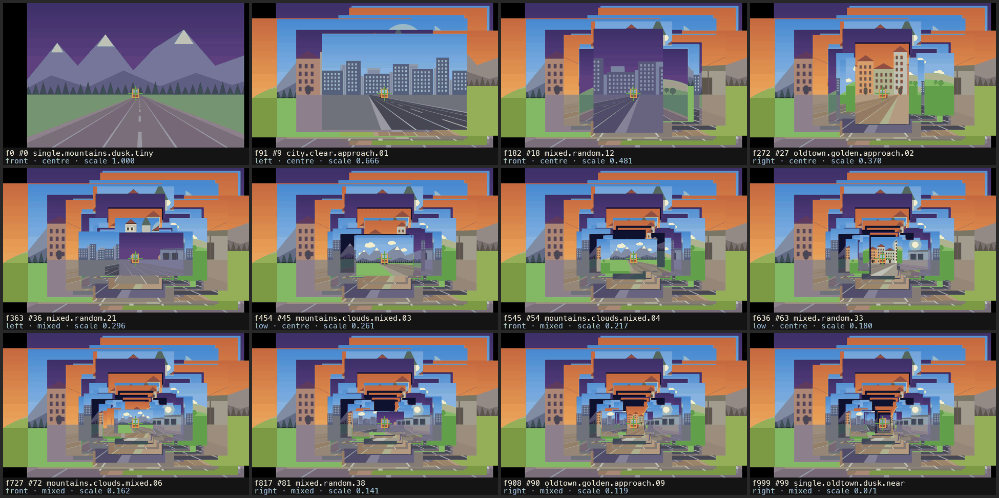
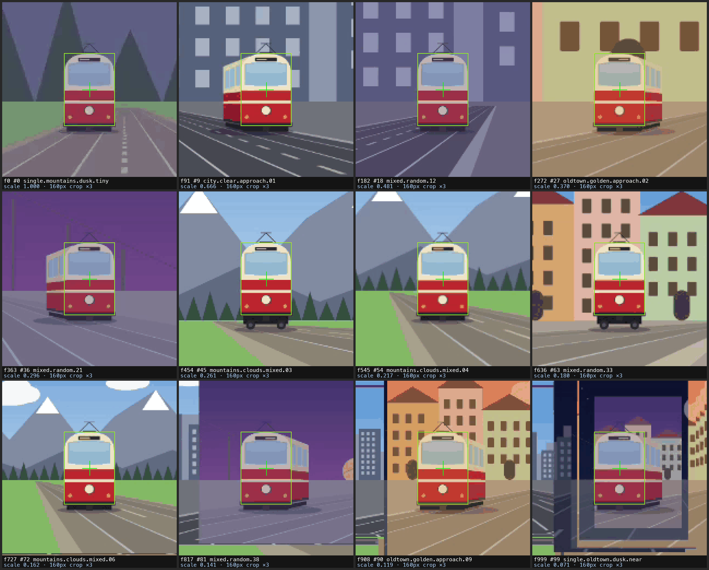
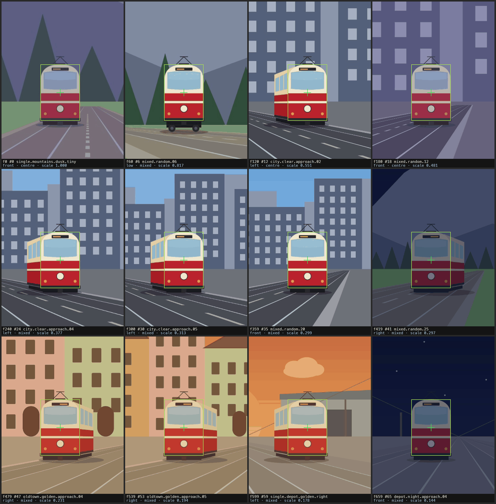
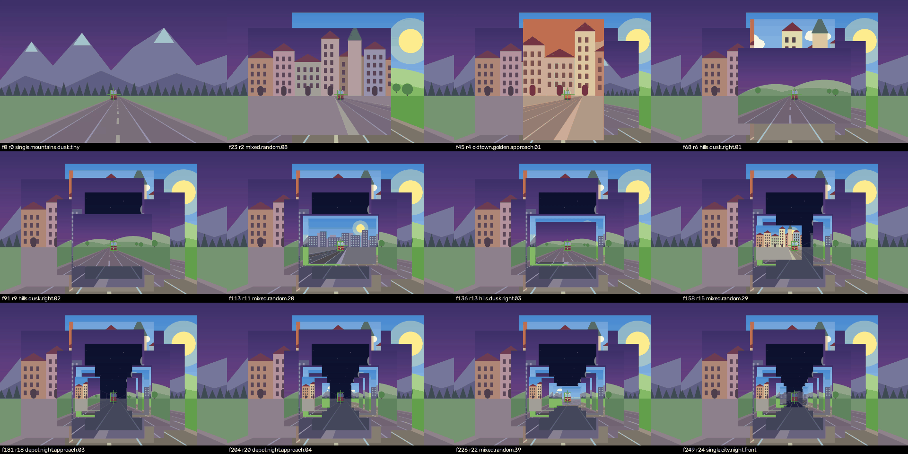
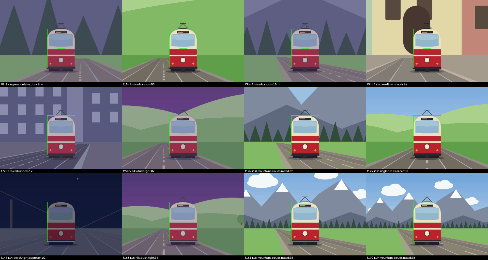
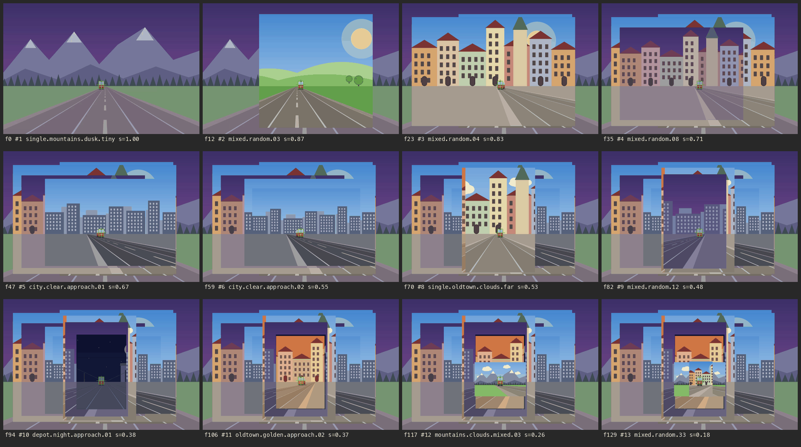
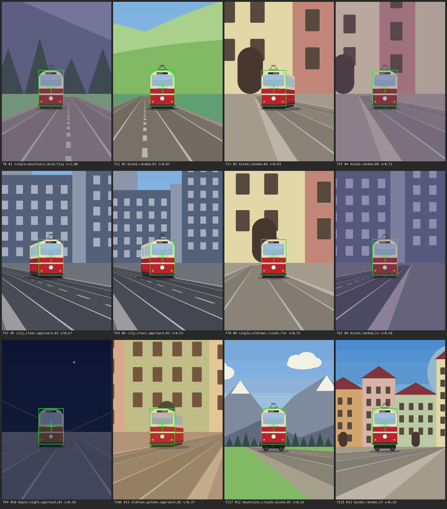
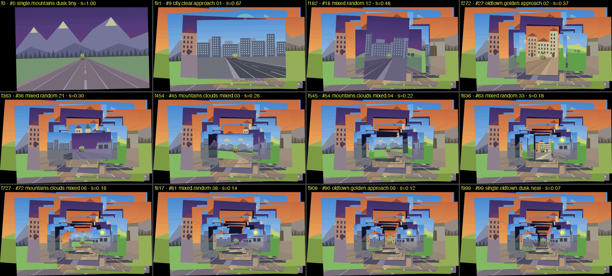
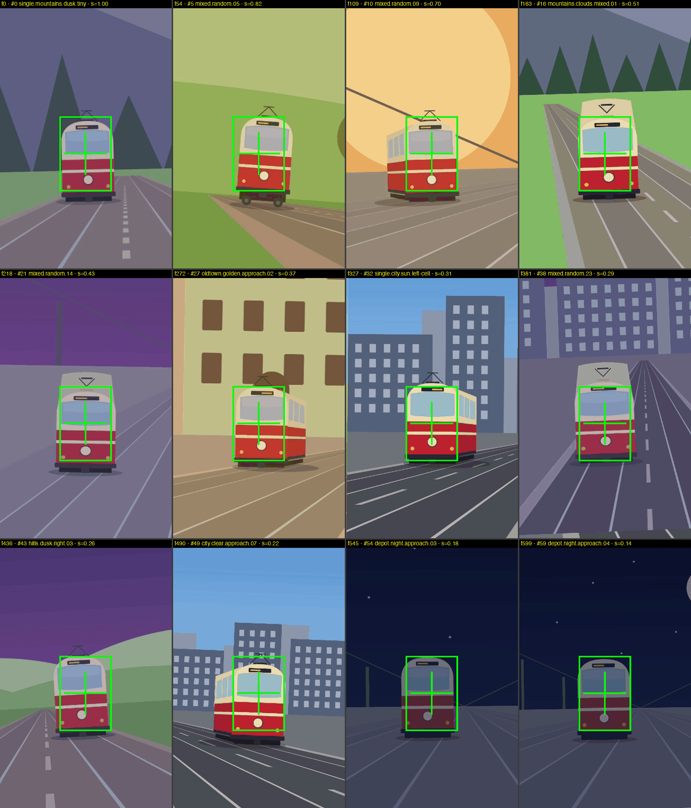

# Shape-mation on mixed scenes — the pooled corpus, 2026-09-19

The single-scene runs in `alignment-report.md` pin a tram that never leaves
its own street. This run pools every scene, sky, tram angle, face size and
face position the kit can draw, sorts by face size, and looks at what the
plan does when the face is the only constant. Everything below is
reproducible from `LetsLapse/` on the uncommitted tree of 2026-09-19
(evening); `$S` is the session scratchpad
`/private/tmp/claude-501/-Users-stevenwright-Documents-dev-letslapse/8811d747-da10-44fd-9345-640c9c4aebd4/scratchpad/mixed`,
and the clips are in `$S/clips/` (not in the repo — eight mp4s, 24 MB):

```
cd Kit && swift build -c release --product lapse && cd ..
tools/.venv/bin/python tools/shapesynth/shapesynth.py recipes --mixed 40 --seed 19          # ONCE, already done: the kit holds mixed.random.01…40 and refuses a second append (exit 1)
tools/.venv/bin/python tools/shapesynth/shapesynth.py selftest                              # selftest: 1489 passed, 0 failed
tools/.venv/bin/python tools/shapesynth/shapesynth.py generate --kit docs/design/kit --out $S/scenes --sequence all --pool mixed-all --scale 2
tools/.venv/bin/python tools/shapesynth/shapesynth.py generate --kit docs/design/kit --out $S/scenes --sequence all --pool mixed-perturbed --scale 2 --sigma-centre 0.05 --sigma-rotation 2 --seed 7
Kit/.build/release/lapse shapemation stage $S/scenes --out $S/projects --project                                                  # 200 projects, every one `rectangle`
ls -d $S/projects/mixed-all/*                                                            > $S/mixed-all/selected.txt        # 100
tools/.venv/bin/python tools/shapesynth/shapesynth.py select $S/projects/mixed-all --where tram=front   > $S/mixed-front/selected.txt     # 25
tools/.venv/bin/python tools/shapesynth/shapesynth.py select $S/projects/mixed-all --where cell=centre  > $S/mixed-centre/selected.txt    # 13
ls -d $S/projects/mixed-perturbed/*                                                      > $S/mixed-perturbed/selected.txt  # 100
# per variant, in its folder — the list MUST be `$(cat …)` inline: zsh does not word-split an unquoted $VAR, and one 100-line argument scores as "0 placed · 1 dropped — register unreadable"
Kit/.build/release/lapse shapemation plan   $(cat selected.txt) --mode stack --family rectangle --sort smallest --json plan.stack.json
Kit/.build/release/lapse shapemation score  $(cat selected.txt)              --family rectangle --sort smallest --json score.stack.json
Kit/.build/release/lapse shapemation render $(cat selected.txt) --mode stack --family rectangle --sort smallest --fps 25 --hold 10f --size 1920 --out stack.mp4
Kit/.build/release/lapse shapemation plan   $(cat selected.txt) --mode crop  --family rectangle --sort smallest --json plan.crop.full.json   # the intersection, never nil in any variant
tools/.venv/bin/python greedy.py plan.stack.json                                        # drops the footprint whose removal grows the intersection most, until ≥ 40 % of the median footprint on both axes → survivors.txt
Kit/.build/release/lapse shapemation render $(cat survivors.txt) --mode crop --family rectangle --sort smallest --fps 25 --hold 10f --size 1920 --out crop.mp4
tools/.venv/bin/python sheet.py plan.stack.json stack.mp4 stack-sheet.png 10             # (plan, clip, out, hold) in every variant — 12 ffmpeg-exact frames (first, last, ten between), anchor crosshair + face box; `-fps_mode passthrough`, this ffmpeg has no -vsync
```

`sheet.py` (one per variant, all four taking `plan clip out hold`),
`zoom.py`/`facestrip.py` and `analyze.py`/`analyse.py` live beside each
variant's plans in `$S/<variant>/`; they read the plan JSON (`shapeSizePx`,
`anchor`, `canvas`, `items[].footprint`) and the clip, nothing else. The
greedy pass is `greedy.py` + `greedy.json` in `mixed-all`, `mixed-front` and
`mixed-centre` (the same script; in `mixed-centre` it reproduces the two-id
exclusion and the 888 × 1323 survivor intersection that `selected-crop11.txt`
and `plan.crop11.json` hold), and `crop-greedy.json` in `mixed-perturbed`,
where the pass ran inline. The sheets they drew are copied into
`mixed-scenes/` beside this file.

## 1. Why

Steven, 2026-09-19: *"a mixture of scenes needs to be used — replicate real
captures, where photos and moments from DIFFERENT scenes make the object (and
by extension its recorded shape) the consistent element in the sequence. The
single-scene approach clips are not a true test."* In a real Shape-mation the
tram is photographed over weeks from whatever kerb the photographer stood on;
the scene, the light, the angle and where the tram sits in the frame all
change, and the only thing the shape register promises is the tram's face.
The approach sequences hold everything else still by construction, so they
can only show that an exact register lands exactly — they cannot show what the
plan does with a hundred framings that share nothing but the face.

## 2. The pool

The kit had 60 compositions in 17 sequences, each sequence one scene, one sky
and (mostly) one angle. `tools/shapesynth/recipes_mixed.py` appends a seeded,
idempotent batch of 40 `mixed.random.<nn>` recipes to Steven's `recipes.json`
(seed 19): aspect, scene, sky, camera and track drawn at random, face size
log-uniform 0.08–0.75 of the frame height, face centre cx 0.15–0.85, the five
tram angles cycled by slot (8 each). Every candidate is composed through the
kit's own `build.js` and refused when the face bbox lies less than 2 % inside
the frame on any side (one `low` 2:3 depot at size 0.717, cx 0.843 went out
with a right margin of −0.118) or when its share duplicates another's. The
batch is numbered by face **share** — the Kit's own sort key,
`ShapemationSort.share` = face major ÷ frame short edge — not by the recipe's
`size`, which is a fraction of frame *height* and ranks a portrait face under
a landscape one. It was built in a scratch copy of the kit and only the 40
new SVGs and the regenerated `manifest.json` copied back; the 60 pre-existing
manifest entries and recipes compare equal to HEAD as JSON, and the 60
checked-in SVGs (with their C2PA block, which `build.js` does not
re-serialise) were not touched. Batch counts (from `recipes.json[60:]`,
`manifest.json` and the staged `scene.json`s, which agree): aspect 3:2 10 ·
4:3 10 · 1:1 9 · 2:3 6 · 16:9 5; scene hills 10 · depot 9 · oldtown 7 ·
city 7 · mountains 7; sky dusk 9 · sun 8 · clear 8 · golden 6 · clouds 6 ·
night 3; tram front/left/right/high/low 8 each; cell mixed 28 · centre 5 ·
mid-left 4 · mid-right 3; size 0.084–0.673, cx 0.176–0.842, smallest face
74 kit px.

**The `tram` label is the drawn flank, not the photographer's position.**
The batch sets `tram` explicitly by slot and `build.js` honours an explicit
`tram` over its own `angleFor(Z)` (the flank the camera/track geometry would
show — Steven's 60 recipes set `tram` only for the four `high`, three `low`
and four `front` compositions and let `angleFor` decide the other 49).
Re-composing the 40 with `tram` removed, the drawn flank contradicts the
geometry in 17 of the 24 ground-level compositions (mixed.random.02, 04, 09,
15, 16, 19, 20, 25, 26, 29, 31, 32, 35, 36, 37, 39, 40): e.g. .36 has the
camera and track on the right, so the rails converge to the viewer's right
while the body extends to the left — a capture no kerb produces. `high`/`low`
are camera-height views and are unaffected. So `viewpoint` in every
`scene.json`, the angle-change counts below, and WP10 d's viewpoint field are
about the drawn label, and the batch is not a physically consistent set of
viewpoints. It stays as drawn: the ids are referenced by the staged corpora
and the kit README says to extend with a new seed and prefix rather than
redraw; the next batch should cycle only `high`/`low` by slot and let the
camera/track draw label the ground views.

`shapesynth.py generate --pool <set>` puts every selected composition in ONE
set, index = rank by share ascending, `approach` = rank ÷ (count − 1), ids
kept; `select <dir> --where key=value[,value]` (keys `tram`/`viewpoint`,
`scene`, `sky`, `family`, `cell`, `aspect`, `set`, `id`) prints project
folders one per line in set + rank order, which is what the `lapse` commands
above eat. Two pools of the 100, staged as Photo projects
(`project.json`, `assets.ndjson`, `shapes.json` with the face bbox as a manual
quad, `scene.json`, `source/frame.jpg`) at 2× (3600 × 2400 landscape):

```
mixed-all        σ = 0                                              index 0…99, approach 0 → 1.0, share 0.059 (single.mountains.dusk.tiny) … 0.826 (single.oldtown.dusk.near)
mixed-perturbed  σ_centre 0.05 · σ_rotation 2° · σ_scale 0 · seed 7   the drawn quad is the perturbed one, truth stays in scene.json; same ids in the same rank order
```

The 100-photo pool's counters (both pools, from each `scene.json`): tram
front 25 · left 26 · right 26 · high 12 · low 11; scene city 22 · depot 19 ·
hills 21 · oldtown 21 · mountains 17; sky clear 22 · clouds 15 · dusk 19 ·
golden 20 · night 13 · sun 11; cell centre 13 · mid-left 4 · mid-right 3 ·
mixed 80; aspect 3:2 46 · 2:3 30 · 4:3 10 · 1:1 9 · 16:9 5. The **front**
selection (25): scene mountains 6 · hills 6 · depot 5 · oldtown 4 · city 4;
sky dusk 8 · clouds 5 · night 5 · sun 3 · clear 3 · golden 1; cell mixed 17 ·
centre 7 · mid-left 1; size 0.080–0.673, cx 0.176–0.842. The **centre-cell**
selection (13): tram front 7 · left 2 · right 2 · low 2; scene oldtown 6 ·
city 3 · mountains 2 · hills 1 · depot 1; size 0.08–0.31, cx 0.37–0.65 — a
face bigger than ~0.31 of the height cannot sit 95 % inside the middle
third, so the cell filter admits no near photo.

## 3. The four variants

Every plan: `--family rectangle --sort smallest` (share ascending, the far
tram first). Working scale = the smallest native face, so `shapeSizePx` is
140.8 px in all four — single.mountains.dusk.tiny (share 0.059) is in every
selection and sets it. "Stamps" = photos placed below scale 0.25. Crop
feasibility is judged twice: the CLI's own rule (nil under 16 px — it never
fired) and the 40 % rule used here (the intersection must reach 40 % of the
median footprint's width AND height). The greedy pass is one script per
variant with the same rule; the excluded lists are in each `greedy.json`.

| | mixed-all | mixed-front | mixed-centre | mixed-perturbed |
|---|---|---|---|---|
| photos | 100 | 25 (`--where tram=front`) | 13 (`--where cell=centre`) | 100 (σ_c 0.05 · σ_r 2°) |
| shapeSizePx | 140.8 | 140.8 | 140.8 | 140.8 |
| stack canvas (= union) | 4077 × 2400 | 3600 × 2400 | 3600 × 2400 | 4122 × 2483 |
| output (`--size 1920`) | 1920 × 1130 · 1000 f · 40 s | 1920 × 1280 · 250 f · 10 s | 1920 × 1280 · 130 f · 5.2 s | 1920 × 1156 · 1000 f · 40 s |
| scale min / max | 0.071 / 1.0 (median 0.231) | 0.107 / 1.0 (median 0.267) | 0.180 / 1.0 | 0.071 / 1.0 (median 0.231) |
| stamps (< 0.25) | 54 | 11 | 1 | 54 |
| consecutive overlap median / min | 0.575 / 0.170 | 0.498 / 0.322 | 0.635 / 0.452 | 0.571 / 0.170 |
| crop, full set: intersection | **128 × 226** — narrower than the 140.8 px face | 205 × 285 — 2.1 × the face | 431 × 627 — feasible (= mixed.random.33's footprint width at 0.18, 19 px shorter than its height) | **146 × 223** |
| crop feasible by the 40 % rule | no (target 304 × 255) | no (target 380 × 287) | short of the bar (512 × 680) but usable | no (target 310 × 264) |
| excluded → survivors, intersection | 34 → 66, 306 × 396 | 5 → 20, 435 × 310 | 0 → 13 rendered; 2 → 11, 888 × 1323 for the bar | 40 → 60, 324 × 507 |
| crop clip | 306 × 394 · 660 f · 26.4 s | 434 × 308 · 200 f · 8 s | 430 × 626 · 130 f (crop11: 888 × 1322 · 110 f) | 324 × 506 · 600 f · 24 s |
| SCORE (stack) | placed 100 · dropped 0 · all residuals 0.000 · corners 0.0 px | placed 25 · dropped 0 · all 0 | placed 13 · dropped 0 · all 0 | placed 100 · dropped 0 · centre median 0.060 p90 0.108 max 0.166 · rotation median 1.3° · corners rms 9.0 px |

Two details the table flattens. `--size 1920` is a ceiling, not a target: the
crop renderer never upscales past its canvas, so every crop clip is the
intersection's own pixel size. And the CLI's crop plan returned a canvas in
all four variants — 128 × 226 px is "feasible" to `Shapemation.swift:150`,
which only refuses under 16 px; the collapse has to be read off the plan
JSON, nothing in the pipeline says it.

## 4. What the frames show

### mixed-all (100, stack) — `mixed-scenes/mixed-all-stack-sheet.png`, `mixed-all-stack-sheet-zoom.png`




The face is in the green box in all twelve tiles (f0 #0 single.mountains.dusk.tiny
… f999 #99 single.oldtown.dusk.near), the placed quad on the box every time
(98 × 141 px on every item). The first photo, the far mountain shot, is the
canvas: at scale 1.000 its 3600 × 2400 frame sits at x 397–3997 of the
4077 × 2400 table (mixed.random.05, face far right, sets the union's left
edge at 0; mixed.random.07 its right edge at 4077), so f0 shows a 397-canvas-px
(187 output px) black bar on the left and an 80-px (38 output px) strip on the
right — 11.6 % of the frame black, measured on the ffmpeg-exact frame. Later
cards cover most of it, never all: f91, f363, f636 and f999 each measure
2.2 % black (a wedge down the left edge and the corners). Every
later photo is a smaller card laid on the pile: 0.666 at f91, 0.481 at f182,
0.370 at f272, 0.296 at f363, then 0.26 → 0.07 through the bottom row. From
f363 on, the visible frame is a concentric tunnel of six to ten earlier
framings around a centre that keeps shrinking; by f817–f999 the card's own
edges sit inside the 160-px zoom crop, and the *nearest* tram — the photo
with the most face detail — is a 171 × 256 px stamp on a 4077-px table.

The angle strobes. In the smallest-first order the viewpoint changes on 75
of 99 consecutive pairs (longest same-angle run 6; the scene changes on 82).
With the face pinned, a front photo shows a flat face, a left/right photo
grows the body out of one side of the box (f91 left, f272 right, f363 left,
f817 right, f908 right, f999 right), and low/high tilt the roof line and show
wheels under the box (f454, f636). It reads as a flip-book of tram bodies
swinging around a fixed face, not as motion. The worst consecutive footprint
overlaps are position cuts, not size steps: single.city.sun.left-cell →
right-cell 0.170 (same share, the face in the left third then the right
third, the two footprints slide two-thirds of a frame past each other),
mixed.random.37 → .38 0.239 (anchor at 87 % then 29 % of the width),
.21 → .22 0.250.

### mixed-all (66 survivors, crop) — `mixed-scenes/mixed-all-crop-sheet.png`



The full-set intersection is 128 × 226 px, narrower than the face. The greedy
pass drops 34 — all of them stamps (scale 0.07–0.24), the far-left, far-right
and bottom-placed faces among them going first (mixed.random.37: scale 0.158,
anchor at 87 % of its width) — to reach 306 × 396; two sub-0.16 stamps whose
faces sit mid-frame survive (oldtown.golden.approach.07 at 0.147,
depot.night.approach.04 at 0.144). The survivors' clip is filled edge to edge, no
black, no print edges, the face in the box in every tile, but it is a 306-px
portrait stamp with the face at 36 % of its height, and the survivors' scale
still runs 1.0 → 0.144, so the near trams render at a seventh of their
pixels; the angle changes on 49 of 65 pairs — cropping does nothing to the
strobe.

### mixed-front (25, stack + crop) — `mixed-scenes/mixed-front-stack-sheet.png`, `mixed-front-crop-sheet.png`




With only front views there is no angle cut at all: the same red face, same
size, same spot, only the scene, sky and time of day swap behind it — this is
the sequence Steven described. In the stack the far photo's 3600 × 2400 frame
is the union canvas, so there is zero black anywhere; the "table" is the
mountain dusk, visible round every later card. The working-scale effect is
the whole look: 0.708 at f23, 0.500 at f68, 0.299 at f113, 0.227 at f158,
0.144 at f204, 0.107 at f249 — the prints shrink toward the anchor like a
Russian doll, 11 of 25 below a quarter, the last seven 256–465 px cards
(133–248 output px) sitting in a well of earlier prints. A 2:3 portrait card
(depot.night.approach.01, r8) stays visible as a tall dark slab above the
anchor for the rest of the clip: mixed aspects leave each other's edges
showing everywhere. The lowest overlaps (depot.night.approach.02 →
mixed.random.29 0.32, mixed.random.08 → .10 0.33) are sideways card jumps
from faces at cx 0.84 / 0.18 — the card moves, the face does not.

The crop clip (20 survivors after five exclusions — four stamps and the
cx 0.842 face) is the right picture: tram pinned at ~45 % of the frame
height, mountains, hills, oldtown, city and the night depot swapping cleanly
behind it, no black, no edges, no cuts. It is 434 px wide, because the far
photo set the scale at 140.8 px and nothing upscales. One verification note:
an early cv2-seek zoom showed an empty box at f204; ffmpeg-exact extraction
of frames 196–213 (`$S/mixed-front/stack-f196-213.png`) shows the night tram
in the box on all 18 — it is just dark (box mean BGR 87/68/87 against
134/131/180 on its neighbours). `cv2.VideoCapture` seeking is not frame-exact
on these mp4s; every sheet here was rebuilt from ffmpeg `select=eq(n,k)`.

### mixed-centre (13, stack + crop) — `mixed-scenes/mixed-centre-stack-sheet.png`, `mixed-centre-crop-sheet.png`




The cell filter fixes the position problem and nothing else. Overlap median
climbs to 0.635 (min 0.452, and that pair is the size step 0.26 → 0.18, not a
position), one stamp instead of 54, and crop-to-fill is feasible on the full
13 with no exclusion: every frame filled, face in the 98 × 140 box in every
tile, the scene swapping behind it. But the filter self-selects distant
photos (size 0.08–0.31), so the far mountain shot still sets 140.8 px and the
crop clip is 430 × 626 — the intersection is mixed.random.33's footprint
width at scale 0.18 (431 px) and 19 px short of its 647-px height, the top
12.8 px and the bottom 6.3 px cut by mountains.clouds.mixed.03. Dropping the
two smallest-scale photos (both
dead-centre faces, both out for scale) gives 888 × 1323 and a natural framing
(`crop11-sheet.png` in `$S/mixed-centre/`). The angle run front → right
(f23, mixed.random.04) → front (f35, mixed.random.08) → left (f47, f59) is a
visible flank flip over three cuts in the stack and reads *stronger* in the
crop, where nothing static surrounds the swinging body.

### mixed-perturbed (100, stack + crop) — `mixed-scenes/mixed-perturbed-stack-sheet.png`, `mixed-perturbed-crop-sheet.png`




Same tunnel, same strobe, same 54 stamps, same lowest pair (left-cell →
right-cell 0.17); the union canvas grows to 4122 × 2483 because rotated
footprints are wider, and the black table is larger than in `mixed-all`:
15.4 % of f0 (the far photo sits at x 400–4055 of 4122, a 186-output-px bar
on the left and 31 px on the right, plus the wedges the rotation correction
leaves along its tilted edges) and 7.1 % of every later sheet frame (f91,
f363, f636, f999), where the tilted cards leave more of the table showing
than the square ones did (2.2 %). The plan pins the DRAWN quad, so the true face rides the box edge
by a few px (f0 ~4 px low, f272 ~3 px right) and leans 1–3° (f363
mixed.random.21 left, f817 mixed.random.38 right) — at 46 × 66 output px
this is a pinned face. The score line says the same: centre median 0.060
face units, p90 0.108, rotation median 1.3°, corners rms 9.0 px, exactly
the c05 twin's reading in `alignment-report.md` — mixing scenes changes
nothing about the residual, which is per photo. The full-set crop is
146 × 223 px (rendered anyway: `crop-full.mp4`, 144 × 222, the face 68 % of
the width, the hand's error visible as a 7-px wobble against an empty frame).
Forty exclusions to reach 324 × 507 (width was the binding axis for 39 of
them — the 2:3 near shots ranked 83–99 at scale 0.07–0.13 leave ~100 canvas
px left of the face); the 60-survivor crop is a tall window ~3.3 faces wide
with "sky + one tram + a strip of road" and no scene variety left.

## 5. The reading

**What holds.** The face is pinned — by construction. σ = 0 puts the truth
bbox in the register and the plan lands the register at float noise, in all
100 photos, across five scenes, six skies and five angles; the perturbed
twin comes back at the dials' values. This is the same statement the
single-scene runs made and the mixture does not weaken it: alignment is a
per-photo transform, and nothing about the *other* photos enters it. What
the mixture tests is everything the plan does *after* alignment — the
canvas, the working scale, the intersection, the order — and there it
exposes three things a single scene hides completely.

**1. Angle jump cuts.** In an approach sequence every photo shares the angle,
so the body swings nowhere. Pooled and sorted by size, the angle changes on
three of every four cuts and the clip is a strobe of tram bodies around a
fixed face. `mixed-front` proves the negative: remove the angle mixture and
the sequence reads as one tram with the world changing behind it. This is
the brief's §10 "subject-angle matching", deferred, and the corpus now shows
it is not a polish item: on real captures the angle will mix by default, and
size sort alone produces the strobe. The cheapest lever is not matching but
*grouping*: a viewpoint/pose field on the register (§2's tilt/yaw, WP10 d)
and a sort tie-break or filter that keeps same-angle runs together. The
corpus labels `viewpoint` in every `scene.json` — the drawn flank, which in
this batch is decoupled from the camera position (§2) — so "angle changes on
N of N−1 pairs" can be a `score` counter today; a real capture's viewpoint
will have to come from the photo, and the strobe it produces is the same.

**2. The crop intersection collapses on mixed positions — and the pipeline
does not say so.** The intersection of 100 framings whose faces sit anywhere
in cx 0.18–0.84 is smaller than the face (128 × 226 vs 140.8), and
`Shapemation.swift:150`'s 16-px floor calls it a plan. The greedy passes show
what a per-photo verdict has to say: the offenders are (a) faces near an
edge (cx ≥ 0.78 or ≤ 0.22, cy ≥ 0.74) and (b) stamps — near photos whose
footprint at the working scale is a 171–450 px card, so their own small
frame becomes the bottleneck. (a) is §5's per-side margin verdict against
the requested framing, flag-and-keep (WP7); (b) is the working scale again,
below. The cell filter (§6, `mixed-centre`) removes (a) entirely — median
overlap 0.635, full-set crop feasible — and leaves (b) untouched.

**3. The smallest face sets the working scale, so far photos dominate the
canvas and near photos become stamps.** One far photo (share 0.059) pins
`shapeSizePx` at 140.8 for every selection; 54 of 100 photos land below a
quarter scale; the nearest tram, the photo with the most face pixels,
renders at 0.071. In stack mode the far photo *is* most of the table — the
black table is nil only when the first photo's footprint is the whole union
(`mixed-front`, `mixed-centre`: 0.0 % in every measured frame); with
off-centre faces widening the union past the first photo it is 11.6 % → 2.2 %
of the frame in `mixed-all` and 15.4 % → 7.1 % in `mixed-perturbed` — and
the clip becomes a receding tunnel of stale framings. In
crop mode the same photo makes every crop clip a 306–435 px stamp because
nothing upscales. In `mixed-front`, dropping the one far photo would raise
the scale only 1.15 × (the next-smallest native face, mixed.random.03, is
162.0 px — the plan scales by the face bbox major in `shapes.json`, not the
recipe's tram height); the native faces then run 198.8, 246.4, 264, 264,
281.6 px, so it takes six drops to double the working scale (hills.dusk.right.01,
281.6 px, 2.0 ×). This is §4's output rectangle: the scale should be chosen by
the *output* (the rect the user keyframes), with photos that cannot fill it
flagged by §5 — not by the minimum of the set. Until WP6, a size-range gate
on share (a window, not a floor — the far end hurts as much as the near end)
in the builder's selection is the one-line mitigation.

**What perturbation adds.** Nothing new: the same residuals as the c05 twin,
a visible 1–3° lean and a few px of wobble at the anchor, a slightly wider
union canvas from rotated footprints, and — because the crop discards all
context — a wobble that reads worse in a face-sized crop than in a stack.
The mixture and the hand's error are orthogonal; the mixture's failures are
all planning failures, present at σ = 0.

**Two smaller things.** Mixed aspects leave each other's edges showing in
stack mode (a portrait card stays as a slab for the rest of a landscape
clip) — this is a stack-bake property and the §4 per-frame evaluator
(decision b, one photo per frame) removes it for free. And the stack's
"black table" is small in these runs (0 % in `mixed-front`/`mixed-centre`,
11.6 % → 2.2 % in `mixed-all`, 15.4 % → 7.1 % in `mixed-perturbed`) because
smallest-first puts the largest-scale photo down first and it covers all of
the union its own footprint spans; capture order or largest-first would show
far more of it, and that was not measured.

## 6. What this changes in the build sequence

The §9 order (alignment + scoring first, tween + feasibility second, UI
last) stands; the corpus puts three concrete items on named work packages
and moves one forward.

- **WP2/WP3 (scoring, alignment sort) — extend the score now, S.** Add to
  `lapse shapemation score`: the intersection of all footprints as a
  fraction of the median footprint and of `shapeSizePx`; the stamp count
  (placed scale < 0.25) and the scale range; and, where `scene.json` carries
  `viewpoint`, the angle-change count over consecutive pairs. Every finding
  above was read off the plan JSON by hand; the score line should say it.
  WP3's alignment sort is unaffected by the mixture (the residual is per
  photo) — its acceptance can run on `mixed-perturbed` as it stands.
- **WP4b (renderer hardening) — the "nothing upscales" rule needs a second
  half.** The native cap refuses upscaling; the pool shows the opposite
  failure, downscaling to 0.07. WP4b should carry the working-scale
  decision explicitly: minimum-face (today), output-rect-driven (WP6), or a
  share window — and refuse, not silently stamp, when the range exceeds
  it. Acceptance: no plan on `mixed-all` places a photo below a named scale
  without a flag.
- **WP6 (framing keys + evaluator) — the output rectangle is what fixes the
  working scale and the aspect slabs.** Decision (b)'s one-photo-per-frame
  evaluator removes the tunnel and the slabs; the keyframed rect gives the
  scale a definition other than "the smallest face". `mixed-front` is the
  acceptance corpus: f(i) at first/last/mid on 25 photos whose faces run
  0.08–0.67 of the frame, no stamps, no edges.
- **WP7 (feasibility + composition) — replace the 16-px floor with the
  verdict, flag-and-keep.** The per-item verdict vs f(i) has to be measured
  against the output rect and the face size, not 16 px; `plan.crop.full.json`
  in all four variants is the counter-example (a "feasible" 128 × 226
  canvas). The greedy passes' files (`greedy.json` in three variants,
  `crop-greedy.json` in `mixed-perturbed`) are the truth set for the
  acceptance ("flagged set == truth-margin set"): 34 / 5 / 2 / 40 ids with
  the edge that bound each. The §6 cell filter is confirmed as the
  position-side fix (`mixed-centre`: feasible with no exclusion) and
  confirmed as blind to scale.
- **WP10 d (pose: tilt/yaw) + §10 angle matching — moved from "deferred" to
  "the first thing the pooled corpus breaks on".** The register needs a
  viewpoint field before any grouping is possible; the corpus's `viewpoint`
  label is the truth for it (the drawn flank — §2; a future batch should let
  the camera/track geometry label the ground views so the label and the
  scene agree). Grouping (keep same-angle runs together in the
  sort, or a chip that filters by angle, as `select --where tram=front`
  does today) is enough to turn the strobe into `mixed-front`'s clip;
  matching proper stays deferred.
- **Open, not decided here.** The `mixed.random` batch is numbered by share
  (the Kit's key); if `size` (fraction of frame height) was meant, renumbering
  is a redraw and the staged corpora reference today's ids.
  `synthetic-corpus.md` does not yet say that `set` = pool name and
  `sequence.index` = share rank for a pooled set (§2 there). The black table
  under largest-first / capture order is unmeasured. The `mixed.random`
  batch's `tram` label contradicts the camera/track geometry in 17 of 24
  ground views (§2) — left as drawn, disclosed.

## Traps, for the next run

- zsh does not word-split an unquoted `$VAR`; a 100-line list becomes one
  argument and `lapse` reports "register unreadable" for the last id. Use
  `$(cat file)` inline or `${=VAR}`.
- This Mac's ffmpeg has no `-vsync`; use `-fps_mode passthrough` with
  `select=eq(n,k)`. `cv2.VideoCapture` seeks are not frame-exact on these
  mp4s and once showed an empty box that ffmpeg-exact frames disproved.
- `--size` on `render` is a ceiling: a crop canvas of 306 px comes out at
  306 px. Look at the plan's `canvas` before judging a clip's size.
- The face box is 46 × 66 output px in a 1920-wide stack of this pool —
  invisible on a 480-px contact tile. Zoom around the anchor
  (`zoom.py`/`facestrip.py`) before deciding the face is not there.
