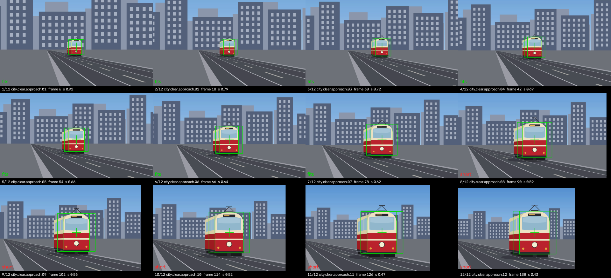
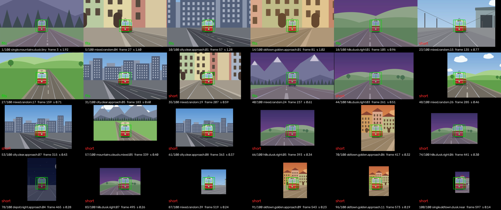
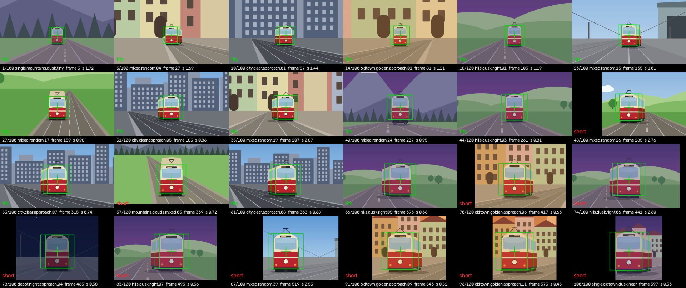
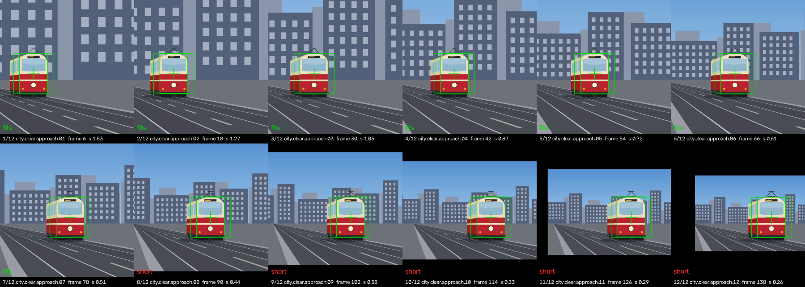

# Shape-mation output frame — CLI + corpus acceptance (2026-09-19)

The `output-frame.md` §5 CLI built and the §7 acceptance run on the synthetic
corpus. Kit half (`ShapemationFraming`, `.frame` plans, the evaluator, the
scorer's tail): see the Kit report in the same unit of work. Everything here
is `Kit/.build/release/lapse` on `tools/shapesynth/work/kit-projects/` and the
staged mixed pool (`mixed-scenes-report.md`); clips and sheets under
`<scratch>/frame/clips/`, the sheets copied into `output-frame/`.

## 1. The CLI (§5)

```
lapse shapemation plan|score|render <project…> --mode frame
    --frame WxH | 1:1|4:5|3:2|16:9|2:3|9:16 [--long 1080|1920|2160]
    [--face x,y@s] [--face-end x,y@s] [--ease linear|inout] [--upscale-cap 2]
```

- `--frame` is required under `--mode frame` (even pixels, or an aspect at
  `--long`'s long edge through `ShapemationFraming.outputSize(aspect:longEdge:)`
  — `4:5 --long 2160` = 1728×2160, `9:16 --long 1920` = 1080×1920). `--face`
  defaults to `0.5,0.55@0.25`; `--face-end` defaults to `--face` (a still).
  The frame options outside `--mode frame` are refused, as is every malformed
  value (each door tested: `exit 1` with its message).
- The header gains one line: `frame 1920×1080 · face (0.50, 0.55) @ 0.18 →
  (0.50, 0.55) @ 0.50 · ease inOut · cap 2.0×`. The plan table gains `target
  (x, y @ px)` and `verdict` columns, the score table `verdict`; a flagged
  verdict carries its numbers (`short r 453`, `upscaled 4.60×`). Both end with
  `flagged: short N · upscaled M` (stack/crop print it too: always 0 · 0).
- JSON: the plan gains `framing {outputSize [w,h], keys [{at, face [x,y],
  size}], ease, upscaleCap}`, `flaggedShort`, `flaggedUpscaled`, and per
  item `target [x,y]`, `targetSizePx`, `feasibility {shortfall {left, top,
  right, bottom}, upscale, verdict}`; the score JSON gains `framing`, the two
  tallies and per item `target`, `targetSizePx`, `verdict`. Under stack/crop
  `target` = `anchor`, `targetSizePx` = `shapeSizePx`, verdict `fits`.
- `render --mode frame` writes at the framing's size; `--size` is ignored
  with a note on stderr. The tally goes to stderr beside the timing line.
- `tools/shapesynth/frame_sheet.py <clip> <plan.json> <sheet.png>` — the
  contact sheet: the middle frame of each hold, the plan's target as a green
  crosshair + square of `targetSizePx`, the register shape through the
  placement, the verdict in red when flagged.

## 2. Acceptance (§7)

### a. city.clear.approach, 18 % → 50 %, eased

```
lapse shapemation plan   kit-projects/city.clear.approach/* --mode frame --family rectangle --frame 1920x1080 --face 0.5,0.55@0.18 --face-end 0.5,0.55@0.5 --ease inout --sort capture --json approach-plan.json
lapse shapemation score  … (same options) --json approach-score.json
lapse shapemation render … (same options) --hold 12f --out clips/approach.mp4
frame_sheet.py clips/approach.mp4 approach-plan.json clips/approach-sheet.png --cols 4
```

`SHAPEMATION SCORE: placed 12 · dropped 0 · centre median 0.000 p90 0.000 max
0.000 · scale median 0.000 · rotation median 0.0° · corners rms 0.0 px ·
flagged: short 5 · upscaled 0`. Every target at (960, 594); the face reads
194 → 202 → 225 → 257 → 298 → 344 → 391 → 436 → 477 → 510 → 532 → 540 px
(the smoothstep), scale 0.92 → 0.43. The clip: 144 frames, 5.76 s, 1920×1080.

| # | scale | verdict |
|---|---|---|
| 1–7 | 0.92 … 0.62 | fits |
| 8 | 0.59 | short r 57 |
| 9 | 0.56 | short r 152 |
| 10 | 0.52 | short r 250 |
| 11 | 0.48 | short r 354 |
| 12 | 0.43 | short t 34 r 453 b 24 |

**The five near photos are short on the right, truthfully**: the generator's
tram drifts right as it approaches (photo 12's truth centre is at x = 0.669 of
its source, 0.53 of the frame tall). Put at x = 0.5 at 50 % of 1080 the source
is scaled to 0.426 — 1533 px wide — and there is no picture right of 1467 px.
§7's "nothing is flagged" assumed a centred subject; this sequence is not,
and the flag is the feature. No x clears it at 50 % (1533 < 1920 px); the
set first goes clean at `--face-end 0.67,0.55@0.65` (the tram at two thirds
of the width, 65 % of the height — checked).



The sheet: the tram grows smoothly, pinned on the crosshair, the background
receding; the black bar on the right of tiles 8–12 is what `short` names.

### b. The mixed pool (100), still 25 % at (0.5, 0.55)

```
lapse shapemation score  mixed-all/* --mode frame --family rectangle --frame 1920x1080 --face 0.5,0.55@0.25 --sort smallest --json mixed-still-score.json
lapse shapemation render … --hold 6f --out clips/mixed-still.mp4 --json mixed-still-plan.json
```

`placed 100 · dropped 0 · centre median 0.000 p90 0.000 max 0.000 · … ·
flagged: short 76 · upscaled 0`.

76 short is more than "the near ones". The pool mixes source aspects, and a
25 % face in a 16:9 frame fixes the scale: a centred source fills the width
only while its share ≤ (W/H) × 0.25 / 1.78 —

| source | n | fits (share) | short (share) | fills the width up to |
|---|---|---|---|---|
| 3840×2160 | 5 | 2 (0.093–0.204) | 3 (0.219–0.412) | 0.250 |
| 3600×2400 | 46 | 14 (0.059–0.196) | 32 (0.136–0.528) | 0.211 |
| 3200×2400 | 10 | 3 (0.072–0.158) | 7 (0.071–0.415) | 0.188 |
| 2400×2400 | 9 | 3 (0.062–0.068) | 6 (0.103–0.472) | 0.141 |
| 2400×3600 | 30 | 2 (0.073) | 28 (0.081–0.550) | 0.094 |

— so every portrait source with a tram over 9 % of its height is short on
both sides, and an off-centre tram goes short on one side sooner (the
overlap of the ranges). Sides: `ltrb` 33, `lr` 14, `lrb` 7, `l` 6, `r` 6.
Nothing upscales: the smallest share (0.059 on 2400 px) meets 270 px at
1.9×, under the cap.

First ten flagged (smallest first): mixed.random.05 share 0.071 cx 0.83
short r 115 · random.10 0.103 cx 0.18 l 497 · random.11 0.111 cx 0.22 l 437 ·
random.12 0.081 cx 0.58 r 22 (portrait) · random.13 0.136 cx 0.24 l 243 ·
random.14 0.136 cx 0.46 l 50 · random.15 0.147 cx 0.55 r 132 ·
depot.night.approach.01 0.103 cx 0.50 l 83 r 83 (portrait) ·
oldtown.golden.approach.02 0.106 cx 0.51 l 92 r 125 (portrait) ·
random.18 0.189 cx 0.60 r 194.



The picture the mixed-scenes report asked for: across a 14× range of source
share every tram is the same size at the same spot, every background
different; the near photos are stamps in a black frame.

**Upscaled — a large still face**: `--face 0.5,0.55@0.6` (score only):
`flagged: short 40 · upscaled 20`, the tiniest first — single.mountains.dusk.tiny
4.60×, mixed.random.01/02 4.38×, .03 4.00×, .04 3.83×, … city.clear.approach.01
3.07×, oldtown.golden.approach.01 2.45×; none both.

**Approach 25 % → 60 %** (`--face-end 0.5,0.55@0.6`, smallest first):
`placed 100 · dropped 0 · centre 0.000 · flagged: short 53 · upscaled 0`
— the far photos get the small face and the near ones the large one, so the
fills improve (76 → 53) and nothing upscales (the tiniest at 289 px is 1.69×).
First ten flagged: #5 random.05 share 0.071 cx 0.83 · #11 random.10 0.103
cx 0.18 · #15 random.11 0.111 cx 0.22 · #20 random.13 0.136 cx 0.24 ·
#32 single.city.sun.left-cell 0.191 cx 0.14 · #33 …right-cell 0.191 cx 0.86 ·
#36 random.21 0.198 cx 0.25 · #37 random.22 0.199 cx 0.81 · #46
depot.night.approach.02 0.159 cx 0.50 (portrait) · #47 random.26 0.245 cx 0.19
— the off-centre and the portrait ones, as the geometry says.



### c. The brief's example: 1080×1080, left → centre → right

```
lapse shapemation render kit-projects/city.clear.approach/* --mode frame --family rectangle --frame 1:1 --long 1080 --face 0.25,0.55@0.3 --face-end 0.75,0.55@0.3 --sort capture --hold 12f --out clips/drift.mp4 --json drift-plan.json
```

12 placed, 144 frames, 1080×1080; targets x = 270 → 810 in 12 equal steps
at 324 px; `flagged: short 5 · upscaled 0` — photos 8–12 short top/bottom
(48 … 258 px): a 3:2 source whose tram is already half the frame is 613 px
tall at a 30 % face in a 1080 square.



### d. mixed-perturbed, still 25 %

`SHAPEMATION SCORE: placed 100 · dropped 0 · centre median 0.060 p90 0.108
max 0.166 · scale median 0.000 · rotation median 1.3° · corners rms 17.2 px ·
flagged: short 74 · upscaled 0` — the same 0.060 / 0.108 / 0.166 the stack
scores (`--mode stack`: corners rms 9.0 px, the same residual at the stack's
smaller shape size). The drawing error is unchanged by the mode.

## 3. Verdict

§7 holds where its assumptions hold: σ = 0 truth on target to 0.000 at every
t in every run (12 + 100 + 12 + 100 placements, 0 dropped); the near photos
are `short` at a small face and the tiniest `upscaled` at a large one; the
approach and the drift render the brief's clips. Two of §7's expectations
were guesses the corpus corrects: "nothing flagged" on city.clear.approach
(its tram drifts right — 5 short), and "short = share > ~0.4" (the true line
is the source aspect × the face's share of the frame, so a portrait source
is short at 9 %). Both are the flag doing its job. Nothing in the plan was
excluded — flag and keep.

## 4. Owed

- The SVG mirrors of the builder's Mode and `.frame` Output steps (§6 —
  built in this same unit of work; ⚠️ rows in both INDEX files), after
  sign-off.
- Review pass 2026-09-20: the verdict is now decided on the photo's convex
  quad, not its axis-aligned box — a levelled oval tilted 5° at a 3:2
  source read `fits` with two black frame corners (55 px outside at face
  0.22 on 1920×1080); the numbers above were all axis-aligned or the
  register's own quads and are unchanged by it.
- A `--frames a,b,…` sheet for ramped holds is in `frame_sheet.py` but
  untested (every clip here used equal holds).
